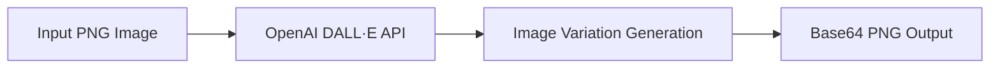

# OpenAI Image Variations Example

This example demonstrates how to use model-compose with OpenAI's Image Variations API to generate creative variations of existing images. OpenAI's DALL·E model can create diverse artistic interpretations and stylistic variations based on an input image.

## Overview

OpenAI's Image Variations API uses DALL·E technology to generate multiple creative variations of a source image. This configuration showcases:

- AI-powered image variation generation
- Support for PNG image format input
- High-quality 1024x1024 output resolution
- Base64 encoded image output for easy integration
- Single variation per request with consistent quality

## Prerequisites

### OpenAI API Setup

1. **Create Account**: Sign up at [OpenAI](https://platform.openai.com/)
2. **Get API Key**: Navigate to API Keys section
3. **Add Billing**: Set up billing information for API usage

### Environment Setup

```bash
# Set your OpenAI API key
export OPENAI_API_KEY="sk-your_api_key_here"

# Install model-compose
pip install -e .
```

### Optional Dependencies
```bash
# For image processing and conversion
pip install Pillow opencv-python
```

## Architecture

### Component Configuration

#### OpenAI Image Variations Component
- **Type**: HTTP client
- **Base URL**: `https://api.openai.com/v1`
- **Endpoint**: `/images/variations`
- **Method**: POST
- **Content Type**: multipart/form-data
- **Output**: Base64 encoded PNG

### API Configuration

| Parameter | Value | Description |
|-----------|-------|-------------|
| `base_url` | `https://api.openai.com/v1` | OpenAI API base URL |
| `path` | `/images/variations` | Image variations endpoint |
| `method` | POST | HTTP method |
| `content_type` | multipart/form-data | Image file upload format |

## Workflow

### Generate Image Variations with OpenAI DALL·E

Creates artistic variations of input images using OpenAI's advanced image generation model.



**Input Parameters:**
| Parameter | Type | Required | Options | Default | Description |
|-----------|------|----------|---------|---------|-------------|
| `image` | image/png | Yes | PNG format | - | Source image for variation generation |

**Fixed Configuration:**
| Parameter | Value | Description |
|-----------|-------|-------------|
| `n` | 1 | Number of variations per request |
| `size` | 1024x1024 | Output image dimensions |
| `response_format` | b64_json | Base64 JSON response format |

**Output:**
| Field | Type | Description |
|-------|------|-------------|
| `image_data` | string | Base64 encoded PNG image data |

## Supported Features

### Image Requirements

| Aspect | Specification | Notes |
|--------|---------------|-------|
| **Format** | PNG | Required for best results |
| **Max Size** | 4MB | File size limit |
| **Dimensions** | Square recommended | Best results with square images |
| **Quality** | High resolution | Better source = better variations |

### Output Specifications

| Aspect | Value | Description |
|--------|-------|-------------|
| **Format** | PNG | High-quality output |
| **Dimensions** | 1024x1024 | Fixed square output |
| **Encoding** | Base64 | JSON-embedded image data |
| **Quality** | High | DALL·E optimized quality |

## How to Run Instructions

### 1. Start the Service

```bash
# Navigate to the example directory
cd examples/openai-image-variations

# Start the controller
model-compose up
```

This starts:
- HTTP API server on port 8080 (base path: `/api`)
- Gradio web interface on port 8081

### 2. Access the Web UI

Open http://localhost:8081 in your browser to interact with the image variation service through a web interface.

### 3. API Usage

#### Basic Image Variation
```bash
curl -X POST http://localhost:8080/api \
  -H "Content-Type: multipart/form-data" \
  -F "image=@source_image.png"
```

#### Using Different Source Images
```bash
# Portrait variation
curl -X POST http://localhost:8080/api \
  -H "Content-Type: multipart/form-data" \
  -F "image=@portrait.png"

# Landscape variation
curl -X POST http://localhost:8080/api \
  -H "Content-Type: multipart/form-data" \
  -F "image=@landscape.png"

# Artwork variation
curl -X POST http://localhost:8080/api \
  -H "Content-Type: multipart/form-data" \
  -F "image=@artwork.png"

# Object variation
curl -X POST http://localhost:8080/api \
  -H "Content-Type: multipart/form-data" \
  -F "image=@product.png"
```

### Sample Response

```json
{
  "image_data": "iVBORw0KGgoAAAANSUhEUgAAAAEAAAABCAYAAAAfFcSJAAAADUlEQVR42mNk+M9QDwADhgGAWjR9awAAAABJRU5ErkJggg=="
}
```

## Example Use Cases

### Artistic Style Exploration
```bash
# Generate artistic variations of a photograph
curl -X POST http://localhost:8080/api \
  -H "Content-Type: multipart/form-data" \
  -F "image=@realistic_photo.png"
```

### Product Design Variations
```bash
# Create design alternatives for products
curl -X POST http://localhost:8080/api \
  -H "Content-Type: multipart/form-data" \
  -F "image=@product_design.png"
```

### Character Design Iterations
```bash
# Generate character design variations
curl -X POST http://localhost:8080/api \
  -H "Content-Type: multipart/form-data" \
  -F "image=@character_concept.png"
```

### Texture and Pattern Variations
```bash
# Create texture variations
curl -X POST http://localhost:8080/api \
  -H "Content-Type: multipart/form-data" \
  -F "image=@texture_sample.png"
```

### Logo and Brand Variations
```bash
# Generate logo variations
curl -X POST http://localhost:8080/api \
  -H "Content-Type: multipart/form-data" \
  -F "image=@logo_concept.png"
```

## Advanced Configuration

### Multiple Variation Generation

```yaml
workflows:
  - id: multiple-variations
    title: Generate Multiple Image Variations
    jobs:
      - id: variation-1
        component: openai-image-variations
        input:
          image: ${input.source_image}

      - id: variation-2
        component: openai-image-variations
        input:
          image: ${input.source_image}

      - id: variation-3
        component: openai-image-variations
        input:
          image: ${input.source_image}

    output:
      variations: [
        ${jobs.variation-1.output.image_data},
        ${jobs.variation-2.output.image_data},
        ${jobs.variation-3.output.image_data}
      ]
```

### Sequential Variation Workflow

```yaml
workflows:
  - id: sequential-variations
    title: Sequential Image Variations
    jobs:
      - id: first-variation
        component: openai-image-variations
        input:
          image: ${input.original_image}

      - id: second-variation
        component: openai-image-variations
        input:
          image: ${jobs.first-variation.output.image_data | base64_to_image}
        depends_on: [first-variation]

      - id: third-variation
        component: openai-image-variations
        input:
          image: ${jobs.second-variation.output.image_data | base64_to_image}
        depends_on: [second-variation]
```

### Batch Processing Pipeline

```yaml
workflows:
  - id: batch-variations
    title: Batch Image Variation Processing
    jobs:
      - id: process-images
        component: openai-image-variations
        input:
          image: ${input.source_images[*]}
        output:
          batch_variations: ${output[*].image_data}
```

### Quality-Controlled Variations

```yaml
workflows:
  - id: quality-controlled-variations
    title: Quality-Controlled Variation Generation
    jobs:
      - id: validate-input
        component: image-validator
        input:
          image: ${input.source_image}
          min_resolution: 256
          max_file_size: 4000000

      - id: generate-variation
        component: openai-image-variations
        input:
          image: ${input.source_image}
        depends_on: [validate-input]

      - id: assess-quality
        component: variation-quality-scorer
        input:
          original: ${input.source_image}
          variation: ${jobs.generate-variation.output.image_data}
        depends_on: [generate-variation]

      - id: regenerate-if-needed
        component: openai-image-variations
        input:
          image: ${input.source_image}
        condition: ${jobs.assess-quality.output.score} < 0.7
        depends_on: [assess-quality]
```

## Pricing and API Limits

### Pricing Structure (as of 2024)

| Image Size | Price per Variation | Quality | Use Case |
|------------|-------------------|---------|----------|
| **1024x1024** | $0.020 | High | Standard variations |

### Rate Limits

- **Requests per minute (RPM)**: 50
- **Images per day**: 500 (varies by plan)
- **Concurrent requests**: 10

### How to Run Optimization

1. **Source Image Quality**: Use high-resolution inputs
2. **Batch Processing**: Generate multiple variations efficiently
3. **Caching**: Store popular variations
4. **Smart Retry**: Handle temporary failures gracefully

## Best Practices

### Image Preparation

#### Format Optimization
```bash
# Convert images to PNG format
convert input.jpg output.png

# Optimize for square format (recommended)
convert input.png -resize 1024x1024^ -gravity center -extent 1024x1024 square.png

# Ensure good quality
convert input.png -quality 95 -strip optimized.png
```

#### Size and Quality
```bash
# Check image dimensions
identify input.png

# Resize if needed (maintain aspect ratio)
convert large_image.png -resize 1024x1024> resized.png

# Compress to meet file size limits
pngquant --quality=70-85 input.png --output compressed.png
```

### Input Image Selection

#### Effective Source Images
- **Clear subjects**: Well-defined objects or scenes
- **Good contrast**: Distinct elements and colors
- **Appropriate composition**: Balanced and focused
- **High resolution**: Better input yields better variations

#### Image Types That Work Well
- Portraits and characters
- Objects and products
- Artwork and illustrations
- Architectural elements
- Natural scenes and landscapes
- Abstract patterns and textures

### Variation Quality Factors

#### Source Image Impact
- **Complexity**: More complex images may yield more interesting variations
- **Style consistency**: Similar artistic styles produce related variations
- **Color palette**: Rich colors often translate well to variations
- **Composition**: Well-composed images generate better variations

## Integration Examples

### Creative Workflow Pipeline

```yaml
workflows:
  - id: creative-exploration
    title: Creative Image Exploration
    jobs:
      - id: analyze-source
        component: image-analyzer
        input:
          image: ${input.source_image}

      - id: generate-variations
        component: openai-image-variations
        input:
          image: ${input.source_image}
        repeat_count: ${input.variation_count | 3}

      - id: select-best
        component: variation-selector
        input:
          variations: ${jobs.generate-variations.output[*].image_data}
          criteria: ${input.selection_criteria}
        depends_on: [generate-variations]

      - id: enhance-selected
        component: image-enhancer
        input:
          image: ${jobs.select-best.output.best_variation}
        depends_on: [select-best]
```

### Product Design Iteration

```yaml
workflows:
  - id: product-design-iteration
    title: Product Design Iteration Workflow
    jobs:
      - id: initial-variation
        component: openai-image-variations
        input:
          image: ${input.concept_design}

      - id: evaluate-design
        component: design-evaluator
        input:
          design: ${jobs.initial-variation.output.image_data}
          criteria: ${input.design_requirements}
        depends_on: [initial-variation]

      - id: iterate-design
        component: openai-image-variations
        input:
          image: ${jobs.initial-variation.output.image_data | base64_to_image}
        condition: ${jobs.evaluate-design.output.needs_iteration}
        depends_on: [evaluate-design]

      - id: finalize-design
        component: design-finalizer
        input:
          design: ${jobs.iterate-design.output.image_data | default(jobs.initial-variation.output.image_data)}
        depends_on: [iterate-design]
```

### Artistic Style Exploration

```yaml
workflows:
  - id: style-exploration
    title: Artistic Style Exploration
    jobs:
      - id: base-variation
        component: openai-image-variations
        input:
          image: ${input.reference_image}

      - id: style-analysis
        component: style-analyzer
        input:
          image: ${jobs.base-variation.output.image_data}
        depends_on: [base-variation]

      - id: style-specific-variations
        component: openai-image-variations
        input:
          image: ${jobs.base-variation.output.image_data | base64_to_image}
        repeat_count: ${input.style_variations | 5}
        depends_on: [style-analysis]

      - id: create-style-gallery
        component: gallery-creator
        input:
          images: ${jobs.style-specific-variations.output[*].image_data}
          metadata: ${jobs.style-analysis.output}
        depends_on: [style-specific-variations]
```

## Error Handling and Troubleshooting

### Common Issues

#### Authentication Errors
```bash
# Verify API key
curl -X GET "https://api.openai.com/v1/models" \
  -H "Authorization: Bearer $OPENAI_API_KEY"
```

#### Image Format Issues
```bash
# Convert to PNG format
convert input.jpg output.png

# Check image format
file input.png
identify input.png
```

#### File Size Issues
```bash
# Check file size (should be < 4MB)
ls -lh image.png

# Compress image
pngquant --quality=60-80 input.png --output compressed.png
```

### Common Error Responses

| Status Code | Error | Solution |
|-------------|--------|----------|
| 400 | Invalid image format | Convert to PNG |
| 400 | Image too large | Compress or resize image |
| 400 | Invalid request | Check request format |
| 401 | Invalid API key | Check OPENAI_API_KEY |
| 429 | Rate limit exceeded | Implement retry with backoff |
| 500 | Server error | Check OpenAI status page |

### Quality Issues

#### Improving Variation Quality
- Use high-resolution source images
- Ensure good contrast and clarity
- Choose images with clear subjects
- Avoid heavily compressed or artifact-laden images

#### Troubleshooting Poor Results

```yaml
# Enhanced workflow with validation
workflows:
  - id: robust-variation-generation
    jobs:
      - id: validate-source
        component: image-validator
        input:
          image: ${input.source_image}
          min_dimensions: [512, 512]
          max_file_size: 4000000
          required_format: png

      - id: enhance-if-needed
        component: image-enhancer
        input:
          image: ${input.source_image}
        condition: ${jobs.validate-source.output.enhancement_needed}
        depends_on: [validate-source]

      - id: generate-variation
        component: openai-image-variations
        input:
          image: ${jobs.enhance-if-needed.output | default(input.source_image)}
        retry_attempts: 3
        depends_on: [enhance-if-needed]
```

## Security Considerations

### API Key Protection
```bash
# Use environment variables
export OPENAI_API_KEY="sk-..."

# For production, use secrets management
# AWS Secrets Manager, Azure Key Vault, etc.
```

### Image Privacy
- Images are processed by OpenAI and may be retained temporarily
- For sensitive content, review OpenAI's data usage policies
- Consider local image generation for confidential images

### Content Filtering
```yaml
# Add content validation
workflows:
  - id: secure-variation-generation
    jobs:
      - id: content-check
        component: content-moderator
        input:
          image: ${input.source_image}

      - id: generate-variation
        component: openai-image-variations
        input:
          image: ${input.source_image}
        condition: ${jobs.content-check.output.safe}
        depends_on: [content-check]
```

## Performance Optimization

### Image Preprocessing
```bash
# Optimize images before processing
convert input.png \
  -resize 1024x1024^ \
  -gravity center \
  -extent 1024x1024 \
  -strip \
  optimized.png
```

### Caching Strategy
```yaml
# Cache variations
workflows:
  - id: cached-variations
    jobs:
      - id: check-cache
        component: variation-cache
        input:
          source_hash: ${input.source_image | hash}

      - id: generate-if-needed
        component: openai-image-variations
        input:
          image: ${input.source_image}
        condition: ${jobs.check-cache.output.cache_miss}
        depends_on: [check-cache]

      - id: store-result
        component: cache-store
        input:
          key: ${input.source_image | hash}
          variation: ${jobs.generate-if-needed.output.image_data}
        depends_on: [generate-if-needed]
```

## Use Cases

### Creative Industries
- **Concept Art**: Generate multiple design concepts
- **Illustration**: Create artistic variations of illustrations
- **Advertising**: Develop campaign visual variations
- **Game Design**: Character and environment variations

### Product Development
- **Industrial Design**: Product variant exploration
- **Fashion Design**: Clothing and accessory variations
- **Logo Design**: Brand identity exploration
- **Packaging Design**: Package design alternatives

### Content Creation
- **Social Media**: Visual content variations
- **Web Design**: Background and element variations
- **Print Media**: Layout and design alternatives
- **Digital Art**: Artistic exploration and experimentation

### Research and Development
- **Style Transfer Studies**: Analyze style variations
- **Design Research**: Explore design possibilities
- **Artistic Analysis**: Study creative variations
- **Visual Communication**: Test visual concepts

### Personal Projects
- **Photo Art**: Transform photos into art variations
- **Digital Art**: Create artistic interpretations
- **Creative Exploration**: Discover new visual styles
- **Portfolio Development**: Generate diverse portfolio pieces