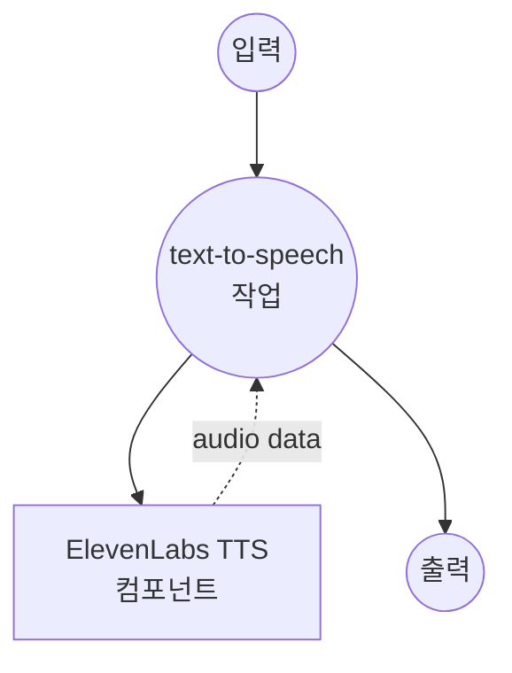

# ElevenLabs Text-to-Speech 예제

이 예제는 ElevenLabs AI를 사용하여 텍스트를 고품질의 자연스러운 음성으로 변환하는 model-compose 사용 방법을 보여줍니다. ElevenLabs는 다국어 지원 및 현실적인 음성 복제 기능을 갖춘 최첨단 음성 합성을 제공합니다.

## 개요

ElevenLabs는 고급 AI 음성 합성을 통한 프리미엄 text-to-speech 서비스를 제공합니다. 이 구성은 다음을 보여줍니다:

- ElevenLabs의 다국어 모델을 사용한 고품질 음성 합성
- 기본 fallback이 있는 사용자 정의 가능한 음성 선택
- 44.1kHz/128kbps의 MP3 오디오 출력
- 대화형 테스트를 위한 Web UI
- 프로덕션 준비 완료된 API 통합

## 준비사항

### 필수 요구사항

- model-compose가 설치되어 PATH에서 사용 가능
- ElevenLabs API 키

### ElevenLabs API 구성

1. **계정 생성**: [ElevenLabs](https://elevenlabs.io/)에서 가입
2. **API 키 받기**: Profile → API Key로 이동
3. **플랜 선택**: 사용 요구에 따라 적절한 구독 선택

### 환경 구성

1. 이 예제 디렉토리로 이동:
   ```bash
   cd examples/elevenlabs-text-to-speech
   ```

2. ElevenLabs API 키 설정:
   ```bash
   export ELEVENLABS_API_KEY=your_actual_elevenlabs_api_key
   ```

## 실행 방법

1. **서비스 시작:**
   ```bash
   model-compose up
   ```

2. **워크플로우 실행:**

   **API 사용:**
   ```bash
   curl -X POST http://localhost:8080/api/workflows/runs \
     -H "Content-Type: application/json" \
     -d '{"input": {"text": "Welcome to our high-quality text-to-speech service."}}'
   ```

   **웹 UI 사용:**
   - Web UI 열기: http://localhost:8081
   - 텍스트 입력
   - "Run Workflow" 버튼 클릭

   **CLI 사용:**
   ```bash
   # 기본 음성 사용 (George)
   model-compose run --input '{"text": "Welcome to our high-quality text-to-speech service."}'

   # 특정 음성 사용
   model-compose run --input '{
     "text": "Thank you for trying our audio generation capabilities.",
     "voice_id": "21m00Tcm4TlvDq8ikWAM"
   }'
   ```

## 컴포넌트 세부사항

### ElevenLabs TTS 컴포넌트 (elevenlabs-text-to-speech)
- **유형**: HTTP client 컴포넌트
- **목적**: ElevenLabs AI를 사용하여 텍스트를 자연스러운 음성으로 변환
- **API**: ElevenLabs Text-to-Speech v1
- **모델**: eleven_multilingual_v2
- **기능**:
  - 고품질 MP3 오디오 출력 (44.1kHz, 128kbps)
  - 기본 fallback이 있는 구성 가능한 음성 선택
  - 다국어 음성 모델 지원
  - 프리미엄 음성 합성 기술

## 워크플로우 세부사항

### "Text to Speech" 워크플로우 (기본)

**설명**: ElevenLabs의 고급 AI 음성 합성 기술을 사용하여 입력 텍스트를 고품질의 자연스러운 음성으로 변환

#### 작업 흐름



#### 입력 매개변수

| 매개변수 | 유형 | 필수 | 기본값 | 설명 |
|---------|------|------|--------|------|
| `text` | string | 예 | - | 음성으로 변환할 텍스트 |
| `voice_id` | string | 아니오 | `JBFqnCBsd6RMkjVDRZzb` | 음성 합성을 위한 ElevenLabs 음성 ID |

#### 출력 형식

| 필드 | 유형 | 설명 |
|-----|------|------|
| - | audio/mp3 (binary) | 44.1kHz/128kbps의 고품질 MP3 오디오 파일 |

## 음성 옵션

### 인기 있는 사전 제작 음성

| Voice ID | 이름 | 성별 | 억양 | 설명 |
|----------|------|------|------|------|
| `JBFqnCBsd6RMkjVDRZzb` | Adam | 남성 | 미국식 | 명확하고 전문적 (기본) |
| `21m00Tcm4TlvDq8ikWAM` | Rachel | 여성 | 미국식 | 따뜻하고 친근함 |
| `AZnzlk1XvdvUeBnXmlld` | Domi | 여성 | 미국식 | 젊고 활기참 |
| `EXAVITQu4vr4xnSDxMaL` | Bella | 여성 | 미국식 | 부드럽고 온화함 |
| `ErXwobaYiN019PkySvjV` | Antoni | 남성 | 미국식 | 깊고 권위적 |
| `MF3mGyEYCl7XYWbV9V6O` | Elli | 여성 | 미국식 | 쾌활하고 경쾌함 |
| `TxGEqnHWrfWFTfGW9XjX` | Josh | 남성 | 미국식 | 캐주얼하고 대화적 |
| `VR6AewLTigWG4xSOukaG` | Arnold | 남성 | 미국식 | 성숙하고 자신감 있음 |
| `pNInz6obpgDQGcFmaJgB` | Adam | 남성 | 영국식 | 영국 억양 |
| `yoZ06aMxZJJ28mfd3POQ` | Sam | 남성 | 미국식 | 내레이터 스타일 |

### 사용 가능한 음성 받기
```bash
# 모든 사용 가능한 음성 목록 조회
curl -X GET "https://api.elevenlabs.io/v1/voices" \
  -H "xi-api-key: $ELEVENLABS_API_KEY"
```

## 사용자 정의

### 음성 모델 선택

#### 표준 모델 (더 빠름)
```yaml
body:
  text: ${input.text}
  model_id: eleven_monolingual_v1  # 영어만, 더 빠름
```

#### 다국어 모델 (기본)
```yaml
body:
  text: ${input.text}
  model_id: eleven_multilingual_v2  # 여러 언어, 더 높은 품질
```

#### Turbo 모델 (가장 빠름)
```yaml
body:
  text: ${input.text}
  model_id: eleven_turbo_v2  # 가장 빠른 생성, 좋은 품질
```

### 오디오 품질 설정

#### 고품질
```yaml
endpoint: https://api.elevenlabs.io/v1/text-to-speech/${input.voice_id | JBFqnCBsd6RMkjVDRZzb}?output_format=mp3_44100_192
```

#### 표준 품질 (기본)
```yaml
endpoint: https://api.elevenlabs.io/v1/text-to-speech/${input.voice_id | JBFqnCBsd6RMkjVDRZzb}?output_format=mp3_44100_128
```

#### 낮은 품질 (더 작은 파일)
```yaml
endpoint: https://api.elevenlabs.io/v1/text-to-speech/${input.voice_id | JBFqnCBsd6RMkjVDRZzb}?output_format=mp3_22050_32
```

### 음성 설정 사용자 정의

```yaml
body:
  text: ${input.text}
  model_id: eleven_multilingual_v2
  voice_settings:
    stability: 0.5          # 0-1, 높을수록 더 안정적
    similarity_boost: 0.8   # 0-1, 높을수록 훈련과 더 유사
    style: 0.2             # 0-1, 스타일 과장
    use_speaker_boost: true # 화자 특성 향상
```

### 여러 음성 지원

```yaml
components:
  - id: elevenlabs-adam
    type: http-client
    endpoint: https://api.elevenlabs.io/v1/text-to-speech/JBFqnCBsd6RMkjVDRZzb
    # ... Adam 음성 구성

  - id: elevenlabs-rachel
    type: http-client
    endpoint: https://api.elevenlabs.io/v1/text-to-speech/21m00Tcm4TlvDq8ikWAM
    # ... Rachel 음성 구성
```
