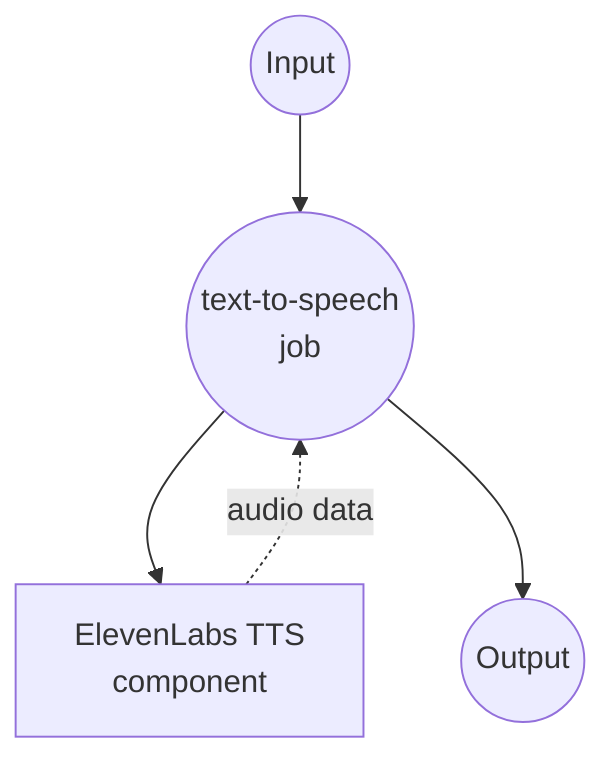

# ElevenLabs Text-to-Speech Example

This example demonstrates how to use model-compose with ElevenLabs AI to convert text into high-quality, natural-sounding speech. ElevenLabs provides state-of-the-art voice synthesis with multilingual support and realistic voice cloning capabilities.

## Overview

ElevenLabs offers premium text-to-speech services with advanced AI voice synthesis. This configuration showcases:

- High-quality voice synthesis using ElevenLabs' multilingual model
- Customizable voice selection with default fallback
- MP3 audio output at 44.1kHz/128kbps
- Web UI for interactive testing
- Production-ready API integration

## Preparation

### Prerequisites

- model-compose installed and available in your PATH
- ElevenLabs API key

### ElevenLabs API Configuration

1. **Create Account**: Sign up at [ElevenLabs](https://elevenlabs.io/)
2. **Get API Key**: Navigate to Profile → API Key
3. **Choose Plan**: Select appropriate subscription based on usage needs

### Environment Configuration

1. Navigate to this example directory:
   ```bash
   cd examples/elevenlabs-text-to-speech
   ```

2. Set your ElevenLabs API key:
   ```bash
   export ELEVENLABS_API_KEY=your_actual_elevenlabs_api_key
   ```
## How to Run

1. **Start the service:**
   ```bash
   model-compose up
   ```

2. **Run the workflow:**

   **Using API:**
   ```bash
   curl -X POST http://localhost:8080/api/workflows/runs \
     -H "Content-Type: application/json" \
     -d '{"input": {"text": "Welcome to our high-quality text-to-speech service."}}'
   ```

   **Using Web UI:**
   - Open the Web UI: http://localhost:8081
   - Enter your text
   - Click the "Run Workflow" button

   **Using CLI:**
   ```bash
   # Use default voice (George)
   model-compose run --input '{"text": "Welcome to our high-quality text-to-speech service."}'
   
   # Use specific voice
   model-compose run --input '{
     "text": "Thank you for trying our audio generation capabilities.",
     "voice_id": "21m00Tcm4TlvDq8ikWAM"
   }'
   ```

## Component Details

### ElevenLabs TTS Component (elevenlabs-text-to-speech)
- **Type**: HTTP client component
- **Purpose**: Convert text to natural-sounding speech using ElevenLabs AI
- **API**: ElevenLabs Text-to-Speech v1
- **Model**: eleven_multilingual_v2
- **Features**:
  - High-quality MP3 audio output (44.1kHz, 128kbps)
  - Configurable voice selection with default fallback
  - Multilingual voice model support
  - Premium voice synthesis technology

## Workflow Details

### "Text to Speech" Workflow (Default)

**Description**: Convert input text into high-quality, natural-sounding speech using ElevenLabs' advanced AI voice synthesis technology.

#### Job Flow



#### Input Parameters

| Parameter | Type | Required | Default | Description |
|-----------|------|----------|---------|-------------|
| `text` | string | Yes | - | Text to convert to speech |
| `voice_id` | string | No | `JBFqnCBsd6RMkjVDRZzb` | ElevenLabs voice ID for speech synthesis |

#### Output Format

| Field | Type | Description |
|-------|------|-------------|
| - | audio/mp3 (binary) | High-quality MP3 audio file at 44.1kHz/128kbps |

## Voice Options

### Popular Pre-built Voices

| Voice ID | Name | Gender | Accent | Description |
|----------|------|--------|--------|-------------|
| `JBFqnCBsd6RMkjVDRZzb` | Adam | Male | American | Clear, professional (default) |
| `21m00Tcm4TlvDq8ikWAM` | Rachel | Female | American | Warm, friendly |
| `AZnzlk1XvdvUeBnXmlld` | Domi | Female | American | Young, energetic |
| `EXAVITQu4vr4xnSDxMaL` | Bella | Female | American | Soft, gentle |
| `ErXwobaYiN019PkySvjV` | Antoni | Male | American | Deep, authoritative |
| `MF3mGyEYCl7XYWbV9V6O` | Elli | Female | American | Cheerful, upbeat |
| `TxGEqnHWrfWFTfGW9XjX` | Josh | Male | American | Casual, conversational |
| `VR6AewLTigWG4xSOukaG` | Arnold | Male | American | Mature, confident |
| `pNInz6obpgDQGcFmaJgB` | Adam | Male | British | British accent |
| `yoZ06aMxZJJ28mfd3POQ` | Sam | Male | American | Narrator style |

### Getting Available Voices
```bash
# List all available voices
curl -X GET "https://api.elevenlabs.io/v1/voices" \
  -H "xi-api-key: $ELEVENLABS_API_KEY"
```

## Customization

### Voice Model Selection

#### Standard Model (Faster)
```yaml
body:
  text: ${input.text}
  model_id: eleven_monolingual_v1  # English only, faster
```

#### Multilingual Model (Default)
```yaml
body:
  text: ${input.text}
  model_id: eleven_multilingual_v2  # Multiple languages, higher quality
```

#### Turbo Model (Fastest)
```yaml
body:
  text: ${input.text}
  model_id: eleven_turbo_v2  # Fastest generation, good quality
```

### Audio Quality Settings

#### High Quality
```yaml
endpoint: https://api.elevenlabs.io/v1/text-to-speech/${input.voice_id | JBFqnCBsd6RMkjVDRZzb}?output_format=mp3_44100_192
```

#### Standard Quality (Default)
```yaml
endpoint: https://api.elevenlabs.io/v1/text-to-speech/${input.voice_id | JBFqnCBsd6RMkjVDRZzb}?output_format=mp3_44100_128
```

#### Lower Quality (Smaller Files)
```yaml
endpoint: https://api.elevenlabs.io/v1/text-to-speech/${input.voice_id | JBFqnCBsd6RMkjVDRZzb}?output_format=mp3_22050_32
```

### Voice Settings Customization

```yaml
body:
  text: ${input.text}
  model_id: eleven_multilingual_v2
  voice_settings:
    stability: 0.5          # 0-1, higher = more stable
    similarity_boost: 0.8   # 0-1, higher = more similar to training
    style: 0.2             # 0-1, style exaggeration
    use_speaker_boost: true # Enhance speaker characteristics
```

### Multiple Voice Support

```yaml
components:
  - id: elevenlabs-adam
    type: http-client
    endpoint: https://api.elevenlabs.io/v1/text-to-speech/JBFqnCBsd6RMkjVDRZzb
    # ... Adam voice configuration

  - id: elevenlabs-rachel
    type: http-client
    endpoint: https://api.elevenlabs.io/v1/text-to-speech/21m00Tcm4TlvDq8ikWAM
    # ... Rachel voice configuration
```
