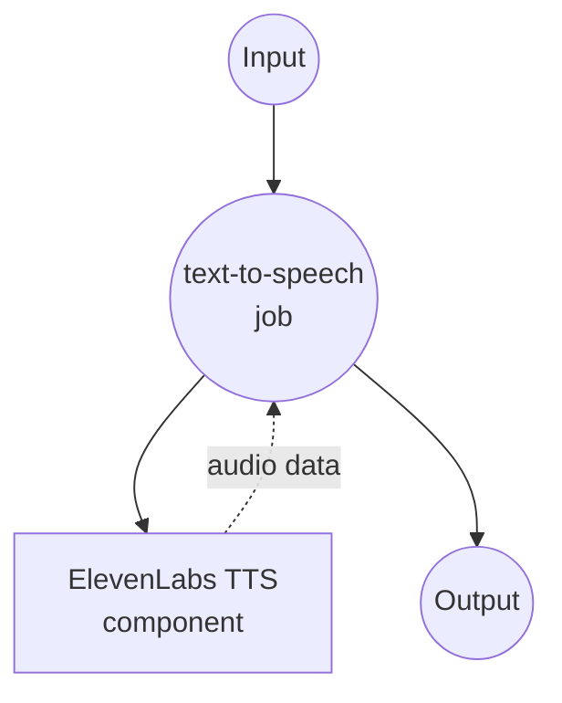

# ElevenLabs 文本转语音示例

此示例演示如何使用 model-compose 与 ElevenLabs AI 将文本转换为高质量、自然发音的语音。ElevenLabs 提供最先进的语音合成技术，支持多语言和逼真的语音克隆能力。

## 概述

ElevenLabs 提供具有高级 AI 语音合成的优质文本转语音服务。此配置展示：

- 使用 ElevenLabs 多语言模型的高质量语音合成
- 可自定义的语音选择和默认回退
- 44.1kHz/128kbps 的 MP3 音频输出
- 用于交互式测试的 Web UI
- 生产就绪的 API 集成

## 准备工作

### 前置条件

- 已安装 model-compose 并在 PATH 中可用
- ElevenLabs API 密钥

### ElevenLabs API 配置

1. **创建账户**：在 [ElevenLabs](https://elevenlabs.io/) 注册
2. **获取 API 密钥**：导航到个人资料 → API 密钥
3. **选择计划**：根据使用需求选择适当的订阅

### 环境配置

1. 导航到此示例目录：
   ```bash
   cd examples/elevenlabs-text-to-speech
   ```

2. 设置您的 ElevenLabs API 密钥：
   ```bash
   export ELEVENLABS_API_KEY=your_actual_elevenlabs_api_key
   ```
## 如何运行

1. **启动服务：**
   ```bash
   model-compose up
   ```

2. **运行工作流：**

   **使用 API：**
   ```bash
   curl -X POST http://localhost:8080/api/workflows/runs \
     -H "Content-Type: application/json" \
     -d '{"input": {"text": "Welcome to our high-quality text-to-speech service."}}'
   ```

   **使用 Web UI：**
   - 打开 Web UI：http://localhost:8081
   - 输入您的文本
   - 点击"运行工作流"按钮

   **使用 CLI：**
   ```bash
   # 使用默认语音 (George)
   model-compose run --input '{"text": "Welcome to our high-quality text-to-speech service."}'

   # 使用特定语音
   model-compose run --input '{
     "text": "Thank you for trying our audio generation capabilities.",
     "voice_id": "21m00Tcm4TlvDq8ikWAM"
   }'
   ```

## 组件详情

### ElevenLabs TTS 组件 (elevenlabs-text-to-speech)
- **类型**：HTTP client 组件
- **用途**：使用 ElevenLabs AI 将文本转换为自然发音的语音
- **API**：ElevenLabs Text-to-Speech v1
- **模型**：eleven_multilingual_v2
- **特性**：
  - 高质量 MP3 音频输出（44.1kHz，128kbps）
  - 可配置的语音选择和默认回退
  - 多语言语音模型支持
  - 高级语音合成技术

## 工作流详情

### "文本转语音"工作流（默认）

**描述**：使用 ElevenLabs 先进的 AI 语音合成技术将输入文本转换为高质量、自然发音的语音。

#### 作业流程



#### 输入参数

| 参数 | 类型 | 必需 | 默认值 | 描述 |
|-----------|------|----------|---------|-------------|
| `text` | string | 是 | - | 要转换为语音的文本 |
| `voice_id` | string | 否 | `JBFqnCBsd6RMkjVDRZzb` | 用于语音合成的 ElevenLabs 语音 ID |

#### 输出格式

| 字段 | 类型 | 描述 |
|-------|------|-------------|
| - | audio/mp3 (binary) | 44.1kHz/128kbps 的高质量 MP3 音频文件 |

## 语音选项

### 流行的预建语音

| 语音 ID | 名称 | 性别 | 口音 | 描述 |
|----------|------|--------|--------|-------------|
| `JBFqnCBsd6RMkjVDRZzb` | Adam | 男 | 美国 | 清晰、专业（默认） |
| `21m00Tcm4TlvDq8ikWAM` | Rachel | 女 | 美国 | 温暖、友好 |
| `AZnzlk1XvdvUeBnXmlld` | Domi | 女 | 美国 | 年轻、充满活力 |
| `EXAVITQu4vr4xnSDxMaL` | Bella | 女 | 美国 | 柔和、温柔 |
| `ErXwobaYiN019PkySvjV` | Antoni | 男 | 美国 | 低沉、权威 |
| `MF3mGyEYCl7XYWbV9V6O` | Elli | 女 | 美国 | 欢快、乐观 |
| `TxGEqnHWrfWFTfGW9XjX` | Josh | 男 | 美国 | 随意、对话式 |
| `VR6AewLTigWG4xSOukaG` | Arnold | 男 | 美国 | 成熟、自信 |
| `pNInz6obpgDQGcFmaJgB` | Adam | 男 | 英国 | 英国口音 |
| `yoZ06aMxZJJ28mfd3POQ` | Sam | 男 | 美国 | 叙述风格 |

### 获取可用语音
```bash
# 列出所有可用语音
curl -X GET "https://api.elevenlabs.io/v1/voices" \
  -H "xi-api-key: $ELEVENLABS_API_KEY"
```

## 自定义

### 语音模型选择

#### 标准模型（更快）
```yaml
body:
  text: ${input.text}
  model_id: eleven_monolingual_v1  # 仅英语，更快
```

#### 多语言模型（默认）
```yaml
body:
  text: ${input.text}
  model_id: eleven_multilingual_v2  # 多种语言，更高质量
```

#### Turbo 模型（最快）
```yaml
body:
  text: ${input.text}
  model_id: eleven_turbo_v2  # 最快生成，良好质量
```

### 音频质量设置

#### 高质量
```yaml
endpoint: https://api.elevenlabs.io/v1/text-to-speech/${input.voice_id | JBFqnCBsd6RMkjVDRZzb}?output_format=mp3_44100_192
```

#### 标准质量（默认）
```yaml
endpoint: https://api.elevenlabs.io/v1/text-to-speech/${input.voice_id | JBFqnCBsd6RMkjVDRZzb}?output_format=mp3_44100_128
```

#### 较低质量（较小文件）
```yaml
endpoint: https://api.elevenlabs.io/v1/text-to-speech/${input.voice_id | JBFqnCBsd6RMkjVDRZzb}?output_format=mp3_22050_32
```

### 语音设置自定义

```yaml
body:
  text: ${input.text}
  model_id: eleven_multilingual_v2
  voice_settings:
    stability: 0.5          # 0-1，更高 = 更稳定
    similarity_boost: 0.8   # 0-1，更高 = 更接近训练
    style: 0.2             # 0-1，风格夸张度
    use_speaker_boost: true # 增强说话者特征
```

### 多语音支持

```yaml
components:
  - id: elevenlabs-adam
    type: http-client
    endpoint: https://api.elevenlabs.io/v1/text-to-speech/JBFqnCBsd6RMkjVDRZzb
    # ... Adam 语音配置

  - id: elevenlabs-rachel
    type: http-client
    endpoint: https://api.elevenlabs.io/v1/text-to-speech/21m00Tcm4TlvDq8ikWAM
    # ... Rachel 语音配置
```
