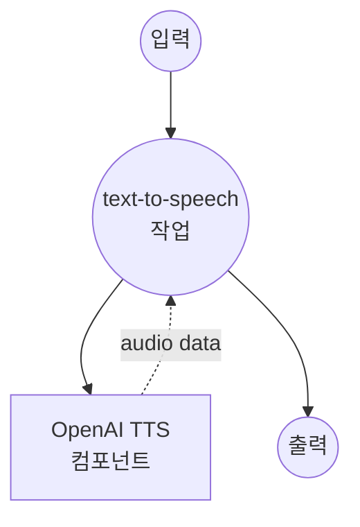

# OpenAI Text-to-Speech 예제

이 예제는 OpenAI의 Text-to-Speech (TTS) API를 사용하여 다양한 고품질 음성과 모델로 텍스트를 자연스러운 음성으로 변환하는 방법을 보여줍니다.

## 개요

이 워크플로우는 다음과 같은 고급 음성 합성 기능을 제공합니다:

1. **텍스트 음성 변환**: OpenAI의 TTS 모델을 사용하여 입력 텍스트를 고품질 MP3 오디오로 변환
2. **다양한 음성 옵션**: 다양한 특성을 가진 11가지 음성 지원
3. **품질 제어**: 속도 대 품질 최적화를 위한 다양한 모델 옵션 제공
4. **프로덕션 준비**: 적절한 오류 처리 및 API 통합 포함

## 준비사항

### 필수 요구사항

- model-compose가 설치되어 PATH에서 사용 가능
- TTS 액세스가 가능한 OpenAI API 키

### OpenAI API 구성

1. **계정 생성**: [OpenAI](https://platform.openai.com/)에서 가입
2. **API 키 발급**: API Keys 섹션으로 이동
3. **결제 정보 추가**: API 사용을 위한 결제 정보 설정

### 환경 구성

1. 이 예제 디렉토리로 이동:
   ```bash
   cd examples/openai-audio-speech
   ```

2. 샘플 환경 파일 복사:
   ```bash
   cp .env.sample .env
   ```

3. `.env` 파일을 편집하여 OpenAI API 키 추가:
   ```env
   OPENAI_API_KEY=your-actual-openai-api-key
   ```

## 실행 방법

1. **서비스 시작:**
   ```bash
   model-compose up
   ```

2. **워크플로우 실행:**

   **API 사용:**
   ```bash
   curl -X POST http://localhost:8080/api/workflows/runs \
     -H "Content-Type: application/json" \
     -d '{
       "input": {
         "text": "Hello, this is a test of text to speech conversion",
         "model": "tts-1",
         "voice": "nova"
       }
     }'
   ```

   **웹 UI 사용:**
   - 웹 UI 열기: http://localhost:8081
   - 텍스트 및 음성 설정 입력
   - "Run Workflow" 버튼 클릭

   **CLI 사용:**
   ```bash
   model-compose run --input '{
     "text": "Hello, this is a test of text to speech conversion",
     "model": "tts-1",
     "voice": "nova"
   }'
   ```

## 컴포넌트 세부사항

### OpenAI TTS 컴포넌트 (기본)
- **유형**: HTTP client 컴포넌트
- **목적**: OpenAI의 TTS API를 사용하여 텍스트를 자연스러운 음성으로 변환
- **API**: OpenAI Text-to-Speech v1
- **모델**: tts-1, tts-1-hd, gpt-4o-mini-tts
- **기능**:
  - 고품질 MP3 오디오 출력
  - 11가지 음성 옵션
  - 다양한 품질/속도 모델
  - 프로덕션 준비 API 통합

## 워크플로우 세부사항

### "Text to Speech" 워크플로우 (기본)

**설명**: OpenAI의 고급 TTS 모델을 사용하여 입력 텍스트를 고품질의 자연스러운 음성으로 변환합니다.

#### 작업 흐름



#### 입력 매개변수

| 매개변수 | 유형 | 필수 | 기본값 | 설명 |
|---------|------|------|--------|------|
| `text` | string | 예 | - | 음성으로 변환할 텍스트 |
| `model` | string | 아니오 | `tts-1` | TTS 모델 선택 (tts-1, tts-1-hd, gpt-4o-mini-tts) |
| `voice` | string | 아니오 | `nova` | 음성 선택 (11가지 사용 가능) |

#### 출력 형식

| 필드 | 유형 | 설명 |
|-----|------|------|
| `audio` | audio/mp3 (binary) | 고품질 MP3 오디오 파일 |

## 모델 옵션

### 사용 가능한 TTS 모델

| 모델 | 품질 | 속도 | 사용 사례 | 가격 |
|-----|------|------|----------|-----|
| **tts-1** | 표준 | 빠름 | 실시간 애플리케이션 | 저렴 |
| **tts-1-hd** | 고품질 | 느림 | 고품질 콘텐츠 | 높음 |
| **gpt-4o-mini-tts** | 표준 | 빠름 | 비용 효율적 합성 | 가장 저렴 |

## 음성 옵션

### 사용 가능한 음성

OpenAI는 각각 고유한 특성을 가진 11가지 음성을 제공합니다:

| 음성 | 성별 | 특징 | 적합한 용도 |
|-----|------|------|-----------|
| **alloy** | 중립 | 균형잡힌, 전문적 | 비즈니스, 문서 |
| **ash** | 중립 | 따뜻한, 대화형 | 팟캐스트, 스토리텔링 |
| **ballad** | 중립 | 부드러운, 선율적 | 오디오북, 내레이션 |
| **coral** | 여성 | 밝은, 활기찬 | 마케팅, 안내방송 |
| **echo** | 남성 | 깊은, 권위있는 | 뉴스, 공식 콘텐츠 |
| **fable** | 중립 | 표현력 있는, 극적인 | 창작 콘텐츠, 이야기 |
| **onyx** | 남성 | 풍부한, 자신감있는 | 프레젠테이션, 교육 |
| **nova** | 여성 | 명확한, 친근한 | 범용 (기본값) |
| **sage** | 중립 | 차분한, 현명한 | 교육 콘텐츠 |
| **shimmer** | 여성 | 가벼운, 쾌적한 | 고객 서비스, 튜토리얼 |
| **verse** | 중립 | 역동적인, 다재다능 | 엔터테인먼트, 미디어 |

## 사용자 정의

### 모델 선택

#### 표준 품질 (기본값)
```yaml
body:
  model: tts-1
  input: ${input.text}
  voice: ${input.voice | nova}
  response_format: mp3
```

#### 고화질 품질
```yaml
body:
  model: tts-1-hd
  input: ${input.text}
  voice: ${input.voice | nova}
  response_format: mp3
```

#### 비용 최적화
```yaml
body:
  model: gpt-4o-mini-tts
  input: ${input.text}
  voice: ${input.voice | nova}
  response_format: mp3
```

### 음성 설정

특정 콘텐츠에 대해 다양한 음성 사용:

```yaml
body:
  model: ${input.model | tts-1}
  input: ${input.text}
  voice: ${input.voice as select/alloy,ash,ballad,coral,echo,fable,onyx,nova,sage,shimmer,verse | nova}
  response_format: mp3
```

### 고급 구성

```yaml
body:
  model: ${input.model | tts-1}
  input: ${input.text}
  voice: ${input.voice | nova}
  response_format: ${input.format | mp3}
  speed: ${input.speed | 1.0}  # 음성 속도 (0.25-4.0)
```
