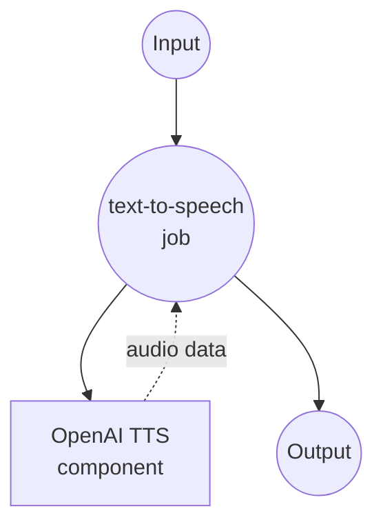

# OpenAI 文本转语音示例

此示例演示如何使用 model-compose 与 OpenAI 的文本转语音 (TTS) API，使用多种高质量语音和模型将文本转换为自然发音的语音。

## 概述

此工作流提供高级语音合成功能：

1. **文本转语音转换**：使用 OpenAI 的 TTS 模型将输入文本转换为高质量 MP3 音频
2. **多种语音选项**：支持 11 种不同特性的语音
3. **质量控制**：提供不同的模型选项以优化速度与质量
4. **生产就绪**：包含适当的错误处理和 API 集成

## 准备工作

### 前置条件

- 已安装 model-compose 并在 PATH 中可用
- 具有 TTS 访问权限的 OpenAI API 密钥

### OpenAI API 配置

1. **创建账户**：在 [OpenAI](https://platform.openai.com/) 注册
2. **获取 API 密钥**：导航到 API 密钥部分
3. **添加账单**：设置 API 使用的账单信息

### 环境配置

1. 导航到此示例目录：
   ```bash
   cd examples/openai-audio-speech
   ```

2. 复制示例环境文件：
   ```bash
   cp .env.sample .env
   ```

3. 编辑 `.env` 并添加您的 OpenAI API 密钥：
   ```env
   OPENAI_API_KEY=your-actual-openai-api-key
   ```

## 如何运行

1. **启动服务：**
   ```bash
   model-compose up
   ```

2. **运行工作流：**

   **使用 API：**
   ```bash
   curl -X POST http://localhost:8080/api/workflows/runs \
     -H "Content-Type: application/json" \
     -d '{
       "input": {
         "text": "Hello, this is a test of text to speech conversion",
         "model": "tts-1",
         "voice": "nova"
       }
     }'
   ```

   **使用 Web UI：**
   - 打开 Web UI：http://localhost:8081
   - 输入您的文本和语音设置
   - 点击"运行工作流"按钮

   **使用 CLI：**
   ```bash
   model-compose run --input '{
     "text": "Hello, this is a test of text to speech conversion",
     "model": "tts-1",
     "voice": "nova"
   }'
   ```

## 组件详情

### OpenAI TTS 组件（默认）
- **类型**：HTTP client 组件
- **用途**：使用 OpenAI 的 TTS API 将文本转换为自然发音的语音
- **API**：OpenAI Text-to-Speech v1
- **模型**：tts-1、tts-1-hd、gpt-4o-mini-tts
- **特性**：
  - 高质量 MP3 音频输出
  - 11 种不同的语音选项
  - 多种质量/速度模型
  - 生产就绪的 API 集成

## 工作流详情

### "文本转语音"工作流（默认）

**描述**：使用 OpenAI 先进的 TTS 模型将输入文本转换为高质量、自然发音的语音。

#### 作业流程



#### 输入参数

| 参数 | 类型 | 必需 | 默认值 | 描述 |
|-----------|------|----------|---------|-------------|
| `text` | string | 是 | - | 要转换为语音的文本 |
| `model` | string | 否 | `tts-1` | TTS 模型选择（tts-1、tts-1-hd、gpt-4o-mini-tts） |
| `voice` | string | 否 | `nova` | 语音选择（11 种可用语音） |

#### 输出格式

| 字段 | 类型 | 描述 |
|-------|------|-------------|
| `audio` | audio/mp3 (binary) | 高质量 MP3 音频文件 |

## 模型选项

### 可用的 TTS 模型

| 模型 | 质量 | 速度 | 用例 | 定价 |
|-------|---------|-------|----------|---------|
| **tts-1** | 标准 | 快速 | 实时应用 | 较低成本 |
| **tts-1-hd** | 高 | 较慢 | 高质量内容 | 较高成本 |
| **gpt-4o-mini-tts** | 标准 | 快速 | 成本效益合成 | 最低成本 |

## 语音选项

### 可用语音

OpenAI 提供 11 种独特的语音，每种都有独特的特征：

| 语音 | 性别 | 特征 | 最适合 |
|-------|--------|----------------|----------|
| **alloy** | 中性 | 平衡、专业 | 商务、文档 |
| **ash** | 中性 | 温暖、对话式 | 播客、讲故事 |
| **ballad** | 中性 | 流畅、悦耳 | 有声读物、叙述 |
| **coral** | 女 | 明亮、充满活力 | 营销、公告 |
| **echo** | 男 | 低沉、权威 | 新闻、正式内容 |
| **fable** | 中性 | 富有表现力、戏剧性 | 创意内容、故事 |
| **onyx** | 男 | 丰富、自信 | 演示、培训 |
| **nova** | 女 | 清晰、友好 | 通用（默认） |
| **sage** | 中性 | 平静、智慧 | 教育内容 |
| **shimmer** | 女 | 轻快、愉悦 | 客户服务、教程 |
| **verse** | 中性 | 动态、多功能 | 娱乐、媒体 |

## 自定义

### 模型选择

#### 标准质量（默认）
```yaml
body:
  model: tts-1
  input: ${input.text}
  voice: ${input.voice | nova}
  response_format: mp3
```

#### 高清质量
```yaml
body:
  model: tts-1-hd
  input: ${input.text}
  voice: ${input.voice | nova}
  response_format: mp3
```

#### 成本优化
```yaml
body:
  model: gpt-4o-mini-tts
  input: ${input.text}
  voice: ${input.voice | nova}
  response_format: mp3
```

### 语音设置

为特定内容使用不同的语音：

```yaml
body:
  model: ${input.model | tts-1}
  input: ${input.text}
  voice: ${input.voice as select/alloy,ash,ballad,coral,echo,fable,onyx,nova,sage,shimmer,verse | nova}
  response_format: mp3
```

### 高级配置

```yaml
body:
  model: ${input.model | tts-1}
  input: ${input.text}
  voice: ${input.voice | nova}
  response_format: ${input.format | mp3}
  speed: ${input.speed | 1.0}  # 语音速度（0.25-4.0）
```
