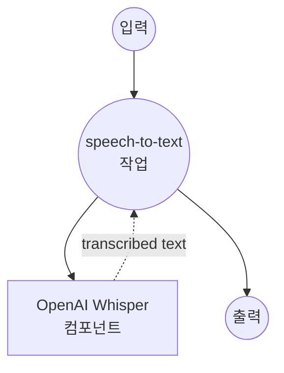

# OpenAI 오디오 전사 예제

이 예제는 OpenAI의 Speech-to-Text (STT) API를 고급 Whisper 모델 제품군과 함께 사용하여 오디오 파일을 텍스트로 전사하는 방법을 보여줍니다.

## 개요

이 워크플로우는 다음과 같은 고급 음성-텍스트 변환 기능을 제공합니다:

1. **오디오-텍스트 변환**: OpenAI의 Whisper 모델을 사용하여 오디오 파일을 정확한 텍스트로 전사
2. **다양한 형식 지원**: 다양한 오디오 형식 지원 (MP3, WAV, M4A 등)
3. **품질 옵션**: 정확도와 비용 최적화를 위한 다양한 모델 옵션 제공
4. **사용량 추적**: 청구 및 모니터링을 위한 지속 시간 정보 제공

## 준비사항

### 필수 요구사항

- model-compose가 설치되어 PATH에서 사용 가능
- 오디오 전사 액세스 권한이 있는 OpenAI API 키

### OpenAI API 구성

1. **계정 생성**: [OpenAI](https://platform.openai.com/)에서 가입
2. **API 키 가져오기**: API Keys 섹션으로 이동
3. **결제 정보 추가**: API 사용을 위한 결제 정보 설정

### 환경 구성

1. 이 예제 디렉토리로 이동:
   ```bash
   cd examples/openai-audio-transciptions
   ```

2. 샘플 환경 파일 복사:
   ```bash
   cp .env.sample .env
   ```

3. `.env`를 편집하고 OpenAI API 키 추가:
   ```env
   OPENAI_API_KEY=your-actual-openai-api-key
   ```

## 실행 방법

1. **서비스 시작:**
   ```bash
   model-compose up
   ```

2. **워크플로우 실행:**

   **API 사용:**
   ```bash
   curl -X POST http://localhost:8080/api/workflows/runs \
     -H "Content-Type: multipart/form-data" \
     -F "input={\"file\": \"@audio\"}" \
     -F "audio=@sample_audio.mp3"
   ```

   **웹 UI 사용:**
   - 웹 UI 열기: http://localhost:8081
   - 오디오 파일 업로드
   - 모델 옵션 선택
   - "Run Workflow" 버튼 클릭

   **CLI 사용:**
   ```bash
   # 기본 전사
   model-compose run --input '{"file": "/path/to/audio.mp3"}'

   # 특정 모델 사용
   model-compose run --input '{
     "file": "/path/to/audio.wav",
     "model": "whisper-1"
   }'
   ```

## 컴포넌트 세부사항

### OpenAI Whisper 컴포넌트 (기본)
- **유형**: HTTP client 컴포넌트
- **목적**: OpenAI의 Whisper 모델을 사용하여 오디오 파일을 텍스트로 변환
- **API**: OpenAI Audio Transcriptions v1
- **모델**: whisper-1, gpt-4o-transcribe, gpt-4o-mini-transcribe
- **기능**:
  - 고정확도 음성 인식
  - 다양한 오디오 형식 지원
  - 지속 시간 메트릭을 사용한 사용량 추적
  - 다국어 지원

## 워크플로우 세부사항

### "Audio to Text" 워크플로우 (기본)

**설명**: OpenAI의 고급 Whisper 모델을 사용하여 오디오 파일을 정확한 텍스트 전사로 변환합니다.

#### 작업 흐름



#### 입력 매개변수

| 매개변수 | 유형 | 필수 | 기본값 | 설명 |
|---------|------|------|--------|------|
| `file` | audio | 예 | - | 전사할 오디오 파일 |
| `model` | string | 아니오 | `whisper-1` | STT 모델 선택 (whisper-1, gpt-4o-transcribe, gpt-4o-mini-transcribe) |

#### 출력 형식

| 필드 | 유형 | 설명 |
|-----|------|------|
| `text` | string | 오디오에서 전사된 텍스트 |
| `seconds` | float | 처리된 오디오 지속 시간 (청구용) |

## 모델 옵션

### 사용 가능한 STT 모델

| 모델 | 품질 | 속도 | 사용 사례 | 가격 |
|-----|------|------|----------|------|
| **whisper-1** | 높음 | 표준 | 일반 전사 | 표준 비용 |
| **gpt-4o-transcribe** | 최고 | 느림 | 고정확도 요구 | 높은 비용 |
| **gpt-4o-mini-transcribe** | 양호 | 빠름 | 비용 효율적 전사 | 낮은 비용 |

## 지원되는 오디오 형식

### 호환 가능한 파일 유형

| 형식 | 확장자 | 품질 | 참고 |
|-----|-------|------|------|
| **MP3** | .mp3 | 양호 | 가장 일반적인 형식 |
| **MP4** | .mp4 | 높음 | 비디오 파일 (오디오 추출) |
| **MPEG** | .mpeg | 높음 | 비디오 파일 (오디오 추출) |
| **MPGA** | .mpga | 양호 | MPEG 오디오 형식 |
| **M4A** | .m4a | 높음 | Apple 오디오 형식 |
| **WAV** | .wav | 우수 | 무손실, 최상의 품질 |
| **WEBM** | .webm | 양호 | 웹 최적화 형식 |

### 파일 크기 제한

- **최대 파일 크기**: 25 MB
- **최대 지속 시간**: 특정 제한 없음
- **권장 사항**: 대용량 파일에는 압축 형식 사용

## 사용자 정의

### 모델 선택

#### 표준 품질 (기본)
```yaml
body:
  model: whisper-1
  file: ${input.file as audio}
```

#### 고정확도
```yaml
body:
  model: gpt-4o-transcribe
  file: ${input.file as audio}
```

#### 비용 최적화
```yaml
body:
  model: gpt-4o-mini-transcribe
  file: ${input.file as audio}
```

### 고급 구성

```yaml
body:
  model: ${input.model | whisper-1}
  file: ${input.file as audio}
  language: ${input.language | auto}  # 선택적 언어 힌트
  prompt: ${input.prompt}  # 선택적 컨텍스트 프롬프트
  response_format: json
  temperature: 0  # 결정론적 출력
```

### 다국어 지원

```yaml
body:
  model: ${input.model | whisper-1}
  file: ${input.file as audio}
  language: ${input.language as select/en,es,fr,de,it,pt,ru,ja,ko,zh | auto}
```
