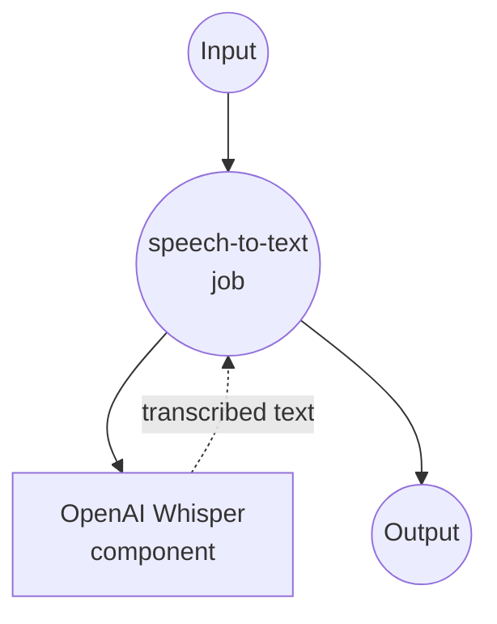

# OpenAI 音频转录示例

此示例演示如何使用 model-compose 与 OpenAI 的语音转文本 (STT) API，使用高级 Whisper 模型系列将音频文件转录为文本。

## 概述

此工作流提供高级语音转文本功能：

1. **音频转文本转换**：使用 OpenAI 的 Whisper 模型将音频文件转录为准确的文本
2. **多种格式支持**：支持各种音频格式（MP3、WAV、M4A 等）
3. **质量选项**：提供不同的模型选项以优化准确性与成本
4. **使用跟踪**：提供持续时间信息以用于计费和监控

## 准备工作

### 前置条件

- 已安装 model-compose 并在 PATH 中可用
- 具有音频转录访问权限的 OpenAI API 密钥

### OpenAI API 配置

1. **创建账户**：在 [OpenAI](https://platform.openai.com/) 注册
2. **获取 API 密钥**：导航到 API 密钥部分
3. **添加账单**：设置 API 使用的账单信息

### 环境配置

1. 导航到此示例目录：
   ```bash
   cd examples/openai-audio-transciptions
   ```

2. 复制示例环境文件：
   ```bash
   cp .env.sample .env
   ```

3. 编辑 `.env` 并添加您的 OpenAI API 密钥：
   ```env
   OPENAI_API_KEY=your-actual-openai-api-key
   ```

## 如何运行

1. **启动服务：**
   ```bash
   model-compose up
   ```

2. **运行工作流：**

   **使用 API：**
   ```bash
   curl -X POST http://localhost:8080/api/workflows/runs \
     -H "Content-Type: multipart/form-data" \
     -F "input={\"file\": \"@audio\"}" \
     -F "audio=@sample_audio.mp3"
   ```

   **使用 Web UI：**
   - 打开 Web UI：http://localhost:8081
   - 上传音频文件
   - 选择模型选项
   - 点击"运行工作流"按钮

   **使用 CLI：**
   ```bash
   # 基本转录
   model-compose run --input '{"file": "/path/to/audio.mp3"}'

   # 使用特定模型
   model-compose run --input '{
     "file": "/path/to/audio.wav",
     "model": "whisper-1"
   }'
   ```

## 组件详情

### OpenAI Whisper 组件（默认）
- **类型**：HTTP client 组件
- **用途**：使用 OpenAI 的 Whisper 模型将音频文件转换为文本
- **API**：OpenAI Audio Transcriptions v1
- **模型**：whisper-1、gpt-4o-transcribe、gpt-4o-mini-transcribe
- **特性**：
  - 高准确度语音识别
  - 多种音频格式支持
  - 带有持续时间指标的使用跟踪
  - 多语言支持

## 工作流详情

### "音频转文本"工作流（默认）

**描述**：使用 OpenAI 先进的 Whisper 模型将音频文件转换为准确的文本转录。

#### 作业流程



#### 输入参数

| 参数 | 类型 | 必需 | 默认值 | 描述 |
|-----------|------|----------|---------|-------------|
| `file` | audio | 是 | - | 要转录的音频文件 |
| `model` | string | 否 | `whisper-1` | STT 模型选择（whisper-1、gpt-4o-transcribe、gpt-4o-mini-transcribe） |

#### 输出格式

| 字段 | 类型 | 描述 |
|-------|------|-------------|
| `text` | string | 音频转录的文本 |
| `seconds` | float | 处理的音频持续时间（用于计费） |

## 模型选项

### 可用的 STT 模型

| 模型 | 质量 | 速度 | 用例 | 定价 |
|-------|---------|-------|----------|---------|
| **whisper-1** | 高 | 标准 | 通用转录 | 标准成本 |
| **gpt-4o-transcribe** | 最高 | 较慢 | 高准确度需求 | 较高成本 |
| **gpt-4o-mini-transcribe** | 良好 | 快速 | 成本效益转录 | 较低成本 |

## 支持的音频格式

### 兼容的文件类型

| 格式 | 扩展名 | 质量 | 注意事项 |
|--------|-----------|---------|-------|
| **MP3** | .mp3 | 良好 | 最常见格式 |
| **MP4** | .mp4 | 高 | 视频文件（提取音频） |
| **MPEG** | .mpeg | 高 | 视频文件（提取音频） |
| **MPGA** | .mpga | 良好 | MPEG 音频格式 |
| **M4A** | .m4a | 高 | Apple 音频格式 |
| **WAV** | .wav | 优秀 | 未压缩，最佳质量 |
| **WEBM** | .webm | 良好 | Web 优化格式 |

### 文件大小限制

- **最大文件大小**：25 MB
- **最大持续时间**：无特定限制
- **推荐**：对于大文件使用压缩格式

## 自定义

### 模型选择

#### 标准质量（默认）
```yaml
body:
  model: whisper-1
  file: ${input.file as audio}
```

#### 高准确度
```yaml
body:
  model: gpt-4o-transcribe
  file: ${input.file as audio}
```

#### 成本优化
```yaml
body:
  model: gpt-4o-mini-transcribe
  file: ${input.file as audio}
```

### 高级配置

```yaml
body:
  model: ${input.model | whisper-1}
  file: ${input.file as audio}
  language: ${input.language | auto}  # 可选的语言提示
  prompt: ${input.prompt}  # 可选的上下文提示
  response_format: json
  temperature: 0  # 确定性输出
```

### 多语言支持

```yaml
body:
  model: ${input.model | whisper-1}
  file: ${input.file as audio}
  language: ${input.language as select/en,es,fr,de,it,pt,ru,ja,ko,zh | auto}
```
