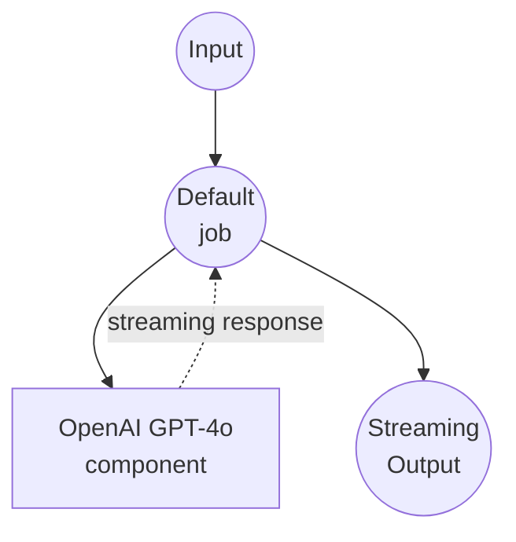

# OpenAI Chat Completions Stream 示例

本示例演示如何使用 OpenAI 的 GPT-4o 模型通过聊天完成 API 创建流式聊天界面，实现实时流式响应。

## 概述

此工作流提供了一个流式聊天界面，具有以下功能：

1. **流式聊天完成**：接受用户提示并使用 OpenAI 的 GPT-4o 模型生成实时流式响应
2. **服务器发送事件**：以 SSE（服务器发送事件）的形式传递响应，提供实时用户体验
3. **温度控制**：允许通过温度参数自定义响应的创造性

## 准备工作

### 前置要求

- 已安装 model-compose 并在 PATH 中可用
- OpenAI API 密钥

### 环境配置

1. 导航到此示例目录：
   ```bash
   cd examples/openai-chat-completions-stream
   ```

2. 复制示例环境文件：
   ```bash
   cp .env.sample .env
   ```

3. 编辑 `.env` 并添加你的 OpenAI API 密钥：
   ```env
   OPENAI_API_KEY=your-actual-openai-api-key
   ```

## 如何运行

1. **启动服务：**
  ```bash
  model-compose up
  ```

2. **运行工作流：**

  **使用 API：**
  ```bash
  curl -X POST http://localhost:8080/api/workflows/runs \
    -H "Content-Type: application/json" \
    -d '{
      "input": {
        "prompt": "用简单的术语解释机器学习",
        "temperature": 0.7
      }
    }'
  ```

  **使用 Web UI：**
  - 打开 Web UI：http://localhost:8081
  - 输入你的提示和设置
  - 点击"运行工作流"按钮

  **使用 CLI：**
  ```bash
  model-compose run --input '{
    "prompt": "用简单的术语解释机器学习",
    "temperature": 0.7
  }'
  ```

## 组件详情

### OpenAI HTTP Client 组件（默认）
- **类型**：HTTP 客户端组件
- **用途**：支持流式聊天完成的 AI 驱动文本生成
- **API**：OpenAI GPT-4o 聊天完成
- **端点**：`https://api.openai.com/v1/chat/completions`
- **特性**：
  - 使用 `stream: true` 的实时流式响应
  - 可配置温度以控制响应创造性
  - 用于 Web 应用程序的服务器发送事件输出格式
  - 用于增量内容提取的 JSON 流解析

## 工作流详情

### "使用 OpenAI GPT-4o 聊天"工作流（默认）

**描述**：使用 OpenAI 的 GPT-4o 生成流式文本响应

#### 作业流程

此示例使用简化的单组件配置，无需显式作业。



#### 输入参数

| 参数 | 类型 | 必需 | 默认值 | 描述 |
|-----------|------|----------|---------|-------------|
| `prompt` | text | 是 | - | 发送给 AI 的用户消息 |
| `temperature` | number | 否 | 0.7 | 控制响应的随机性（0.0-1.0）<br/>• 较低值（例如 0.2）：更聚焦和确定性<br/>• 较高值（例如 0.8）：更有创造性和多样性 |

#### 输出格式

| 字段 | 类型 | 描述 |
|-------|------|-------------|
| - | text (sse-text) | 以服务器发送事件流形式传递的 AI 生成响应文本 |

## 流式特性

此示例与标准聊天完成的不同之处在于提供：

- **实时流式传输**：响应在生成时增量传递
- **SSE 格式**：输出格式化为服务器发送事件，以兼容 Web 浏览器
- **增量处理**：使用 `${response[].choices[0].delta.content}` 从流式 JSON 块中提取内容
- **增强用户体验**：用户可以实时看到逐字符出现的响应

## 自定义

- **模型**：将 `gpt-4o` 更改为其他可用模型，如 `gpt-3.5-turbo`、`gpt-4` 等
- **流格式**：修改 `stream_format` 和输出提取逻辑以实现不同的响应处理
- **系统提示**：添加系统消息以定义 AI 的行为和个性
- **其他参数**：包括其他 OpenAI 参数，如 `max_tokens`、`presence_penalty` 等
- **输出格式**：从 `sse-text` 更改为 `sse-json` 以实现结构化流式数据

## 高级配置

添加系统提示和带流式传输的对话历史：

```yaml
body:
  model: gpt-4o
  messages:
    - role: system
      content: "你是一个专门从事技术解释的有用助手。"
    - role: user
      content: ${input.prompt as text}
  temperature: ${input.temperature as number | 0.7}
  max_tokens: ${input.max_tokens as number | 1000}
  streaming: true
stream_format: json
output: ${response[].choices[0].delta.content}
```

## 与标准聊天完成的比较

| 特性 | 标准 | 流式 |
|---------|----------|--------|
| 响应传递 | 一次性完整响应 | 实时增量传递 |
| 用户体验 | 等待完整响应 | 边生成边查看响应 |
| 输出格式 | 单个消息对象 | 服务器发送事件流 |
| Web 集成 | 简单的 JSON 处理 | 需要 SSE 客户端支持 |
| 延迟 | 感知延迟较高 | 感知延迟较低 |
