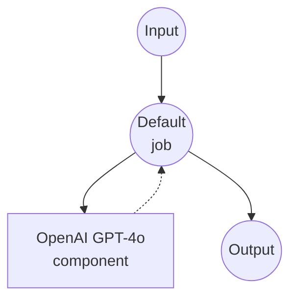

# OpenAI Chat Completions 示例

本示例演示如何使用 OpenAI 的 GPT-4o 模型通过聊天完成 API 创建简单的聊天界面。

## 概述

此工作流提供了一个简单的聊天界面，具有以下功能：

1. **聊天完成**：接受用户提示并使用 OpenAI 的 GPT-4o 模型生成响应
2. **温度控制**：允许通过温度参数自定义响应的创造性

## 准备工作

### 前置要求

- 已安装 model-compose 并在 PATH 中可用
- OpenAI API 密钥

### 环境配置

1. 导航到此示例目录：
   ```bash
   cd examples/openai-chat-completions
   ```

2. 复制示例环境文件：
   ```bash
   cp .env.sample .env
   ```

3. 编辑 `.env` 并添加你的 OpenAI API 密钥：
   ```env
   OPENAI_API_KEY=your-actual-openai-api-key
   ```

## 如何运行

1. **启动服务：**
   ```bash
   model-compose up
   ```

2. **运行工作流：**

   **使用 API：**
   ```bash
   curl -X POST http://localhost:8080/api/workflows/runs \
     -H "Content-Type: application/json" \
     -d '{
       "input": {
         "prompt": "解释可再生能源的重要性",
         "temperature": 0.7
       }
     }'
   ```

   **使用 Web UI：**
   - 打开 Web UI：http://localhost:8081
   - 输入你的提示和设置
   - 点击"运行工作流"按钮

   **使用 CLI：**
   ```bash
   model-compose run --input '{
     "prompt": "解释可再生能源的重要性",
     "temperature": 0.7
   }'
   ```

## 组件详情

### OpenAI HTTP Client 组件（默认）
- **类型**：HTTP 客户端组件
- **用途**：AI 驱动的文本生成和聊天完成
- **API**：OpenAI GPT-4o 聊天完成
- **端点**：`https://api.openai.com/v1/chat/completions`
- **特性**：
  - 可配置温度以控制响应创造性
  - 支持各种提示类型和对话风格

## 工作流详情

### "使用 OpenAI GPT-4o 聊天"工作流（默认）

**描述**：使用 OpenAI 的 GPT-4o 生成文本响应

#### 作业流程

此示例使用简化的单组件配置，无需显式作业。



#### 输入参数

| 参数 | 类型 | 必需 | 默认值 | 描述 |
|-----------|------|----------|---------|-------------|
| `prompt` | text | 是 | - | 发送给 AI 的用户消息 |
| `temperature` | number | 否 | 0.7 | 控制响应的随机性（0.0-1.0）<br/>• 较低值（例如 0.2）：更聚焦和确定性<br/>• 较高值（例如 0.8）：更有创造性和多样性 |

#### 输出格式

| 字段 | 类型 | 描述 |
|-------|------|-------------|
| `message` | text | AI 生成的响应文本 |

## 自定义

- **模型**：将 `gpt-4o` 更改为其他可用模型，如 `gpt-3.5-turbo`、`gpt-4` 等
- **系统提示**：添加系统消息以定义 AI 的行为和个性
- **其他参数**：包括其他 OpenAI 参数，如 `max_tokens`、`presence_penalty` 等
- **多条消息**：扩展以支持通过接受消息数组来实现对话历史

## 高级配置

添加系统提示和对话历史：

```yaml
body:
  model: gpt-4o
  messages:
    - role: system
      content: "你是一个专门从事技术解释的有用助手。"
    - role: user
      content: ${input.prompt as text}
  temperature: ${input.temperature as number | 0.7}
  max_tokens: ${input.max_tokens as number | 1000}
```
