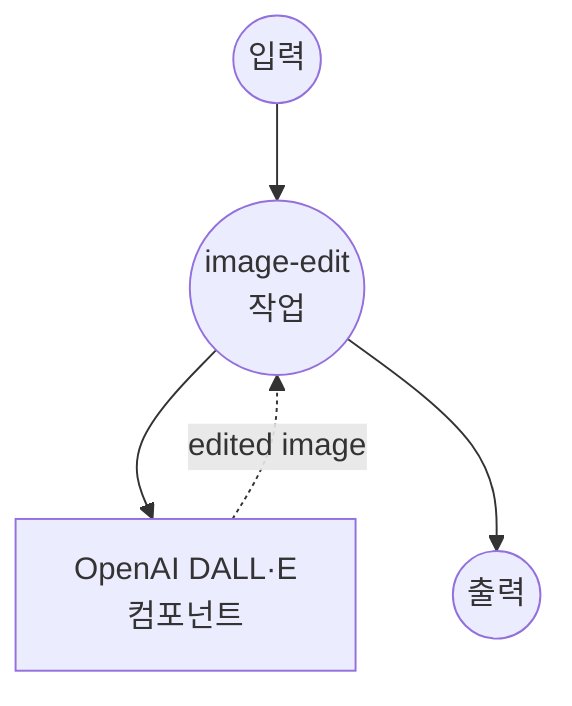

# OpenAI 이미지 편집 예제

이 예제는 OpenAI의 이미지 편집 API와 model-compose를 사용하여 텍스트 프롬프트와 AI 기반 이미지 조작을 통해 이미지를 수정하는 방법을 보여줍니다.

## 개요

이 워크플로우는 다음과 같은 고급 이미지 편집 기능을 제공합니다:

1. **AI 기반 이미지 편집**: 자연어 설명을 사용하여 이미지 수정
2. **마스크 기반 편집**: 편집 영역에 대한 정밀한 제어를 위한 선택적 마스크 지원
3. **유연한 출력 크기**: 다양한 사용 사례를 위한 여러 크기 옵션 제공
4. **PNG 형식 지원**: 투명도 및 고품질 출력 유지

## 준비사항

### 필수 요구사항

- model-compose가 설치되어 PATH에서 사용 가능
- 이미지 편집 접근 권한이 있는 OpenAI API 키

### OpenAI API 구성

1. **계정 생성**: [OpenAI](https://platform.openai.com/)에서 가입
2. **API 키 받기**: API 키 섹션으로 이동
3. **결제 추가**: API 사용을 위한 결제 정보 설정

### 환경 구성

1. 이 예제 디렉토리로 이동:
   ```bash
   cd examples/openai-image-edits
   ```

2. 샘플 환경 파일 복사:
   ```bash
   cp .env.sample .env
   ```

3. `.env` 파일을 편집하여 OpenAI API 키 추가:
   ```env
   OPENAI_API_KEY=your-actual-openai-api-key
   ```

## 실행 방법

1. **서비스 시작:**
   ```bash
   model-compose up
   ```

2. **워크플로우 실행:**

   **API 사용:**
   ```bash
   curl -X POST http://localhost:8080/api/workflows/runs \
     -H "Content-Type: multipart/form-data" \
     -F "input={\"prompt\": \"Add a sunset background\", \"image\": \"@image\"}" \
     -F "image=@original.png"
   ```

   **웹 UI 사용:**
   - 웹 UI 열기: http://localhost:8081
   - 이미지 파일 업로드 (PNG 형식)
   - 편집 프롬프트 입력
   - 선택적으로 마스크 파일 업로드
   - "Run Workflow" 버튼 클릭

   **CLI 사용:**
   ```bash
   # 기본 이미지 편집
   model-compose run --input '{
     "prompt": "Add a sunset background to this image",
     "image": "/path/to/image.png"
   }'

   # 크기 지정과 함께
   model-compose run --input '{
     "prompt": "Change the background to a beach scene",
     "image": "/path/to/image.png",
     "size": "1024x1024"
   }'
   ```

## 컴포넌트 세부사항

### OpenAI 이미지 편집기 컴포넌트 (기본)
- **유형**: HTTP client 컴포넌트
- **목적**: 텍스트 프롬프트를 사용한 AI 기반 편집으로 이미지 수정
- **API**: OpenAI Image Edits v1
- **모델**: gpt-image-1
- **기능**:
  - 자연어 이미지 편집
  - 투명도를 지원하는 PNG 형식
  - 선택적 마스크 기반 정밀 편집
  - 여러 출력 크기 옵션

## 워크플로우 세부사항

### "Image Editing" 워크플로우 (기본)

**설명**: 선택적 마스크 지원과 함께 텍스트 프롬프트를 기반으로 AI 기반 편집을 사용하여 이미지를 수정합니다.

#### 작업 흐름



#### 입력 매개변수

| 매개변수 | 유형 | 필수 | 기본값 | 설명 |
|---------|------|------|--------|------|
| `prompt` | string | 예 | - | 원하는 변경 사항에 대한 텍스트 설명 |
| `image` | image/png | 예 | - | 편집할 원본 이미지 (PNG 형식) |
| `mask` | image/png | 아니오 | - | 목표 편집을 위한 선택적 마스크 |
| `size` | string | 아니오 | `auto` | 출력 이미지 크기 (auto, 1024x1024, 1536x1024, 1024x1536) |

#### 출력 형식

| 필드 | 유형 | 설명 |
|-----|------|------|
| `image_data` | string | Base64 인코딩된 PNG 이미지 데이터 |

## 이미지 요구사항

### 형식 사양

| 항목 | 사양 | 참고사항 |
|-----|------|---------|
| **형식** | PNG | 투명도 지원에 필요 |
| **최대 크기** | 4MB | 파일 크기 제한 |
| **크기** | 최대 1024x1024 | 최상의 결과를 위해 권장 |
| **투명도** | 지원됨 | 알파 채널 유지 |

### 크기 옵션

| 크기 옵션 | 크기 | 종횡비 | 사용 사례 |
|---------|------|--------|---------|
| **auto** | 원본 크기 | 유지 | 입력 크기 유지 |
| **1024x1024** | 정사각형 | 1:1 | 소셜 미디어, 아바타 |
| **1536x1024** | 가로 | 3:2 | 배너, 헤더 |
| **1024x1536** | 세로 | 2:3 | 모바일 화면, 포스터 |

## 맞춤화

### 기본 구성

```yaml
body:
  model: gpt-image-1
  image: ${input.image as image}
  prompt: ${input.prompt}
  size: ${input.size | auto}
```

### 마스크 지원과 함께

```yaml
body:
  model: gpt-image-1
  image: ${input.image as image}
  mask: ${input.mask as image}
  prompt: ${input.prompt}
  size: ${input.size | auto}
```

### 고급 구성

```yaml
body:
  model: gpt-image-1
  image: ${input.image as image}
  mask: ${input.mask as image}
  prompt: ${input.prompt}
  size: ${input.size as select/auto,1024x1024,1536x1024,1024x1536 | auto}
  response_format: b64_json
```
