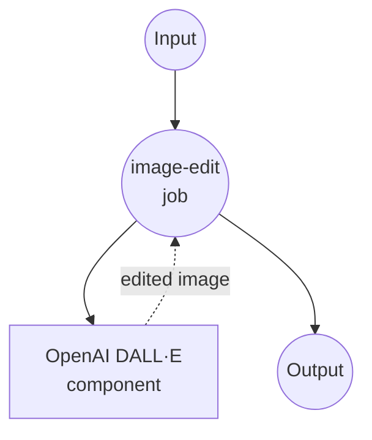

# OpenAI Image Edits 示例

本示例演示如何使用 model-compose 与 OpenAI 的图像编辑 API 结合，通过文本提示和 AI 驱动的图像处理来修改图像。

## 概述

此工作流提供了高级图像编辑功能，具有以下特性：

1. **AI 驱动的图像编辑**：使用自然语言描述修改图像
2. **基于蒙版的编辑**：支持可选蒙版以精确控制编辑区域
3. **灵活的输出尺寸**：为不同用例提供多种尺寸选项
4. **PNG 格式支持**：保持透明度和高质量输出

## 准备工作

### 前置要求

- 已安装 model-compose 并在 PATH 中可用
- 具有图像编辑访问权限的 OpenAI API 密钥

### OpenAI API 配置

1. **创建账户**：在 [OpenAI](https://platform.openai.com/) 注册
2. **获取 API 密钥**：导航到 API 密钥部分
3. **添加计费信息**：为 API 使用设置计费信息

### 环境配置

1. 导航到此示例目录：
   ```bash
   cd examples/openai-image-edits
   ```

2. 复制示例环境文件：
   ```bash
   cp .env.sample .env
   ```

3. 编辑 `.env` 并添加你的 OpenAI API 密钥：
   ```env
   OPENAI_API_KEY=your-actual-openai-api-key
   ```

## 如何运行

1. **启动服务：**
   ```bash
   model-compose up
   ```

2. **运行工作流：**

   **使用 API：**
   ```bash
   curl -X POST http://localhost:8080/api/workflows/runs \
     -H "Content-Type: multipart/form-data" \
     -F "input={\"prompt\": \"添加日落背景\", \"image\": \"@image\"}" \
     -F "image=@original.png"
   ```

   **使用 Web UI：**
   - 打开 Web UI：http://localhost:8081
   - 上传图像文件（PNG 格式）
   - 输入你的编辑提示
   - 可选择上传蒙版文件
   - 点击"运行工作流"按钮

   **使用 CLI：**
   ```bash
   # 基本图像编辑
   model-compose run --input '{
     "prompt": "为此图像添加日落背景",
     "image": "/path/to/image.png"
   }'

   # 指定尺寸
   model-compose run --input '{
     "prompt": "将背景更改为海滩场景",
     "image": "/path/to/image.png",
     "size": "1024x1024"
   }'
   ```

## 组件详情

### OpenAI Image Editor 组件（默认）
- **类型**：HTTP 客户端组件
- **用途**：使用带文本提示的 AI 驱动编辑修改图像
- **API**：OpenAI 图像编辑 v1
- **模型**：gpt-image-1
- **特性**：
  - 自然语言图像编辑
  - 支持透明度的 PNG 格式
  - 可选的基于蒙版的精确编辑
  - 多种输出尺寸选项

## 工作流详情

### "图像编辑"工作流（默认）

**描述**：使用基于文本提示的 AI 驱动编辑修改图像，支持可选蒙版。

#### 作业流程



#### 输入参数

| 参数 | 类型 | 必需 | 默认值 | 描述 |
|-----------|------|----------|---------|-------------|
| `prompt` | string | 是 | - | 所需更改的文本描述 |
| `image` | image/png | 是 | - | 要编辑的原始图像（PNG 格式）|
| `mask` | image/png | 否 | - | 用于定向编辑的可选蒙版 |
| `size` | string | 否 | `auto` | 输出图像尺寸（auto、1024x1024、1536x1024、1024x1536）|

#### 输出格式

| 字段 | 类型 | 描述 |
|-------|------|-------------|
| `image_data` | string | Base64 编码的 PNG 图像数据 |

## 图像要求

### 格式规范

| 方面 | 规范 | 注释 |
|--------|---------------|-------|
| **格式** | PNG | 支持透明度所需 |
| **最大尺寸** | 4MB | 文件大小限制 |
| **尺寸** | 最大 1024x1024 | 建议获得最佳结果 |
| **透明度** | 支持 | 保留 Alpha 通道 |

### 尺寸选项

| 尺寸选项 | 尺寸 | 纵横比 | 用例 |
|-------------|------------|--------------|----------|
| **auto** | 原始尺寸 | 保留 | 保持输入尺寸 |
| **1024x1024** | 正方形 | 1:1 | 社交媒体、头像 |
| **1536x1024** | 横向 | 3:2 | 横幅、标题 |
| **1024x1536** | 纵向 | 2:3 | 移动屏幕、海报 |

## 自定义

### 基本配置

```yaml
body:
  model: gpt-image-1
  image: ${input.image as image}
  prompt: ${input.prompt}
  size: ${input.size | auto}
```

### 支持蒙版

```yaml
body:
  model: gpt-image-1
  image: ${input.image as image}
  mask: ${input.mask as image}
  prompt: ${input.prompt}
  size: ${input.size | auto}
```

### 高级配置

```yaml
body:
  model: gpt-image-1
  image: ${input.image as image}
  mask: ${input.mask as image}
  prompt: ${input.prompt}
  size: ${input.size as select/auto,1024x1024,1536x1024,1024x1536 | auto}
  response_format: b64_json
```
