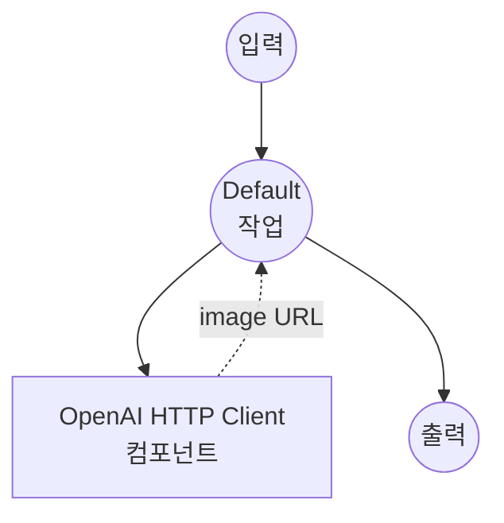
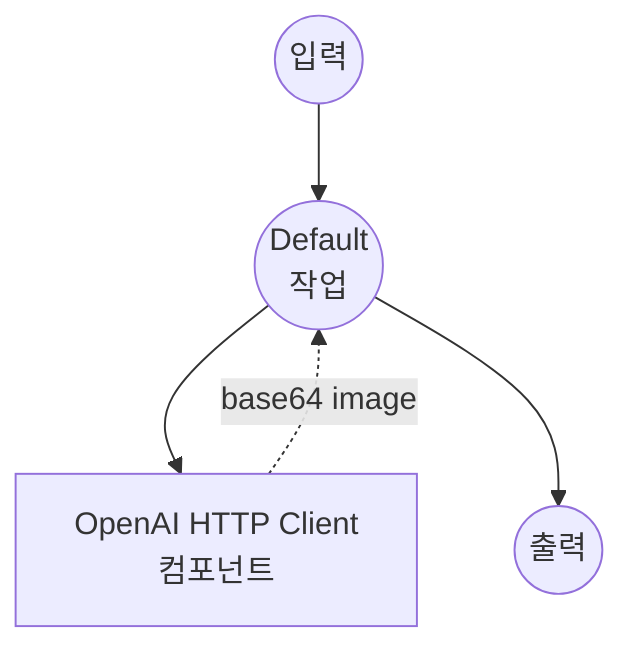

# OpenAI 이미지 생성 예제

이 예제는 DALL-E 및 GPT 이미지 모델을 포함한 OpenAI의 이미지 생성 모델을 사용하여 텍스트 프롬프트로부터 이미지를 생성하는 방법을 보여줍니다.

## 개요

이 다중 워크플로우 예제는 AI 이미지 생성을 위한 두 가지 접근 방식을 제공합니다:

1. **DALL-E 워크플로우**: OpenAI의 전문 DALL-E 모델을 사용하여 URL 기반 출력으로 이미지 생성
2. **GPT 이미지 워크플로우**: OpenAI의 GPT 이미지 모델을 사용하여 base64 인코딩된 출력으로 이미지 생성

두 워크플로우 모두 동일한 OpenAI Images API를 사용하지만 다른 모델과 출력 형식을 사용하여 특정 사용 사례에 가장 적합한 접근 방식을 선택할 수 있습니다.

## 준비사항

### 필수 요구사항

- model-compose가 설치되어 PATH에서 사용 가능
- 이미지 생성 모델에 대한 액세스 권한이 있는 OpenAI API 키

### API 액세스 요구사항

**필수 OpenAI API 액세스:**
- Image Generation API 액세스
- DALL-E 2 및/또는 DALL-E 3 모델 액세스
- GPT 이미지 모델 액세스 (gpt-image-1)

### 환경 구성

1. 이 예제 디렉토리로 이동:
   ```bash
   cd examples/openai-image-generations
   ```

2. OpenAI API 키를 환경 변수로 설정:
   ```bash
   export OPENAI_API_KEY=your-actual-openai-api-key
   ```

   또는 `.env` 파일 생성:
   ```env
   OPENAI_API_KEY=your-actual-openai-api-key
   ```

## 실행 방법

1. **서비스 시작:**
   ```bash
   model-compose up
   ```

2. **워크플로우 실행:**

   **API 사용:**
   ```bash
   # DALL-E로 이미지 생성 (URL 형식) - 기본 워크플로우
   curl -X POST http://localhost:8080/api/workflows/runs \
     -H "Content-Type: application/json" \
     -d '{"workflow_id": "dall-e", "input": {"prompt": "A serene mountain landscape at sunset", "model": "dall-e-3"}}'

   # GPT 이미지로 이미지 생성 (Base64 형식)
   curl -X POST http://localhost:8080/api/workflows/runs \
     -H "Content-Type: application/json" \
     -d '{"workflow_id": "gpt-image-1", "input": {"prompt": "A futuristic city skyline"}}'
   ```

   **웹 UI 사용:**
   - 웹 UI 열기: http://localhost:8081
   - 탭에서 워크플로우 선택
   - 프롬프트 및 설정 입력
   - "Run Workflow" 버튼 클릭

   **CLI 사용:**
   ```bash
   # DALL-E로 이미지 생성 (URL 형식)
   model-compose run dall-e --input '{
     "prompt": "A serene mountain landscape at sunset",
     "model": "dall-e-3"
   }'

   # GPT 이미지로 이미지 생성 (Base64 형식)
   model-compose run gpt-image-1 --input '{"prompt": "A futuristic city skyline"}'
   ```

## 컴포넌트 세부사항

### OpenAI HTTP Client 컴포넌트 (기본)
- **유형**: HTTP client 컴포넌트
- **목적**: OpenAI Images API와의 인터페이스
- **기본 URL**: https://api.openai.com/v1
- **인증**: OpenAI API 키를 사용한 Bearer 토큰
- **액션**: DALL-E 및 GPT 이미지 생성 엔드포인트 모두 지원

#### 사용 가능한 액션:

**1. DALL-E 액션 (dall-e)**
- **엔드포인트**: `/images/generations`
- **모델**: DALL-E 2, DALL-E 3
- **출력 형식**: 생성된 이미지에 대한 URL
- **이미지 크기**: 1024x1024 (고정)

**2. GPT 이미지 액션 (gpt-image-1)**
- **엔드포인트**: `/images/generations`
- **모델**: gpt-image-1
- **출력 형식**: Base64 인코딩된 이미지 데이터
- **이미지 크기**: 1024x1024 (고정)

## 워크플로우 세부사항

### 1. "Generate Images with OpenAI DALL·E" 워크플로우 (기본)

**설명**: 쉬운 공유 및 임베딩을 위한 URL 기반 출력으로 OpenAI의 DALL-E 모델을 사용하여 텍스트 프롬프트에서 고품질 이미지를 생성합니다.

#### 작업 흐름

이 워크플로우는 단순화된 단일 컴포넌트 구성을 사용합니다.



#### 입력 매개변수

| 매개변수 | 유형 | 필수 | 옵션 | 기본값 | 설명 |
|---------|------|------|------|--------|------|
| `prompt` | string | 예 | - | - | 생성할 이미지에 대한 텍스트 설명 |
| `model` | string | 아니오 | `dall-e-2`, `dall-e-3` | `dall-e-2` | 사용할 DALL-E 모델 버전 |

#### 출력 형식

| 필드 | 유형 | 설명 |
|-----|------|------|
| `image_url` | string (URL) | OpenAI가 호스팅하는 생성된 이미지에 대한 직접 URL |

### 2. "Generate Images with OpenAI GPT" 워크플로우

**설명**: 애플리케이션에 직접 임베딩하기 위한 base64 인코딩된 출력으로 OpenAI의 GPT 이미지 모델을 사용하여 이미지를 생성합니다.

#### 작업 흐름



#### 입력 매개변수

| 매개변수 | 유형 | 필수 | 옵션 | 기본값 | 설명 |
|---------|------|------|------|--------|------|
| `prompt` | string | 예 | - | - | 생성할 이미지에 대한 텍스트 설명 |

#### 출력 형식

| 필드 | 유형 | 설명 |
|-----|------|------|
| `image_data` | string (base64) | Base64 인코딩된 PNG 이미지 데이터 |

## 모델 비교

### DALL-E 2 vs DALL-E 3

| 기능 | DALL-E 2 | DALL-E 3 |
|------|----------|----------|
| 이미지 품질 | 높음 | 매우 높음 |
| 프롬프트 준수 | 양호 | 우수 |
| 세부 사항 | 양호 | 뛰어남 |
| 창의적 해석 | 표준 | 향상됨 |
| 이미지당 비용 | 낮음 | 높음 |
| 생성 속도 | 빠름 | 느림 |

### DALL-E vs GPT Image

| 기능 | DALL-E | GPT Image |
|------|--------|-----------|
| 출력 형식 | URL | Base64 |
| 모델 옵션 | 2개 버전 | 단일 모델 |
| 일반적인 사용 사례 | 웹 디스플레이 | 앱 임베딩 |
| 저장소 | OpenAI 호스팅 | 자체 관리 |
| URL 만료 | 예 (임시) | 해당 없음 |

## 사용자 정의

### 다른 모델 사용

워크플로우에서 모델 선택 수정:

```yaml
body:
  model: ${input.model as select/dall-e-2,dall-e-3 | dall-e-3}  # 기본값을 DALL-E 3으로
```

### 크기 옵션 추가

다양한 이미지 크기를 지원하도록 구성 확장:

```yaml
body:
  model: ${input.model as select/dall-e-2,dall-e-3 | dall-e-2}
  prompt: ${input.prompt}
  size: ${input.size as select/1024x1024,1792x1024,1024x1792 | 1024x1024}
  n: ${input.count as integer | 1}
```

### 사용자 정의 출력 처리

생성된 이미지에 대한 후처리 추가:

```yaml
workflows:
  - id: dall-e-with-metadata
    title: Generate Image with Metadata
    jobs:
      - id: generate-image
        component: dall-e
        input: ${input}
        output:
          image_url: ${output.image_url}

      - id: analyze-image
        component: gpt-4-vision
        input:
          image_url: ${jobs.generate-image.output.image_url}
          prompt: "Analyze this generated image and provide a detailed description"
```

### 여러 이미지 생성

여러 변형 생성:

```yaml
body:
  model: ${input.model as select/dall-e-2,dall-e-3 | dall-e-2}
  prompt: ${input.prompt}
  n: ${input.count as integer | 3}
  size: 1024x1024
```
