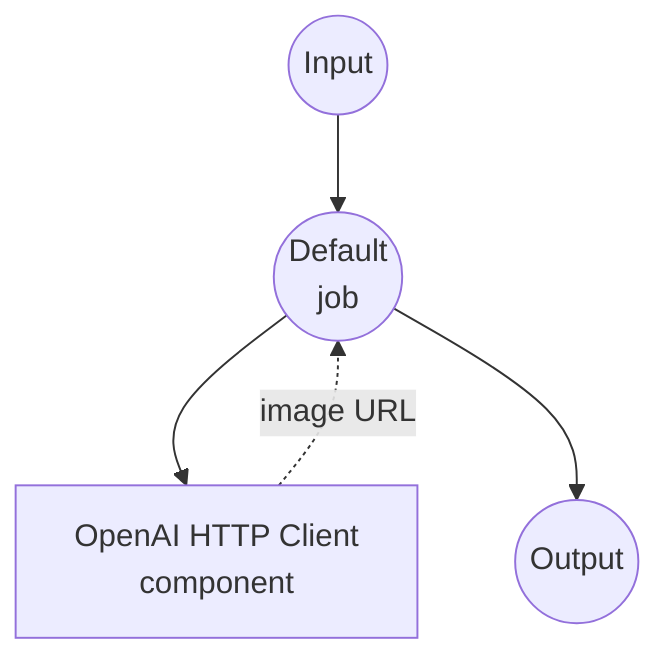
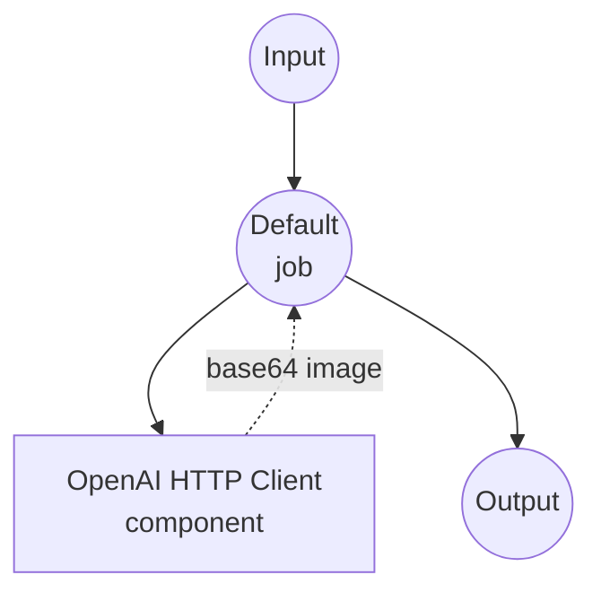

# OpenAI Image Generation 示例

本示例演示如何使用 OpenAI 的图像生成模型从文本提示生成图像，包括 DALL-E 和 GPT 图像模型。

## 概述

此多工作流示例提供了两种不同的 AI 图像生成方法：

1. **DALL-E 工作流**：使用 OpenAI 的专用 DALL-E 模型生成图像，输出基于 URL
2. **GPT 图像工作流**：使用 OpenAI 的 GPT 图像模型生成图像，输出为 base64 编码

两个工作流都使用相同的底层 OpenAI Images API，但使用不同的模型和输出格式，允许你为特定用例选择最佳方法。

## 准备工作

### 前置要求

- 已安装 model-compose 并在 PATH 中可用
- 具有图像生成模型访问权限的 OpenAI API 密钥

### API 访问要求

**所需的 OpenAI API 访问：**
- 图像生成 API 访问
- DALL-E 2 和/或 DALL-E 3 模型访问
- GPT 图像模型访问（gpt-image-1）

### 环境配置

1. 导航到此示例目录：
   ```bash
   cd examples/openai-image-generations
   ```

2. 将 OpenAI API 密钥设置为环境变量：
   ```bash
   export OPENAI_API_KEY=your-actual-openai-api-key
   ```

   或创建 `.env` 文件：
   ```env
   OPENAI_API_KEY=your-actual-openai-api-key
   ```

## 如何运行

1. **启动服务：**
   ```bash
   model-compose up
   ```

2. **运行工作流：**

   **使用 API：**
   ```bash
   # 使用 DALL-E 生成图像（URL 格式）- 默认工作流
   curl -X POST http://localhost:8080/api/workflows/runs \
     -H "Content-Type: application/json" \
     -d '{"workflow_id": "dall-e", "input": {"prompt": "日落时宁静的山景", "model": "dall-e-3"}}'

   # 使用 GPT Image 生成图像（Base64 格式）
   curl -X POST http://localhost:8080/api/workflows/runs \
     -H "Content-Type: application/json" \
     -d '{"workflow_id": "gpt-image-1", "input": {"prompt": "未来主义城市天际线"}}'
   ```

   **使用 Web UI：**
   - 打开 Web UI：http://localhost:8081
   - 从选项卡中选择工作流
   - 输入你的提示和设置
   - 点击"运行工作流"按钮

   **使用 CLI：**
   ```bash
   # 使用 DALL-E 生成图像（URL 格式）
   model-compose run dall-e --input '{
     "prompt": "日落时宁静的山景",
     "model": "dall-e-3"
   }'

   # 使用 GPT Image 生成图像（Base64 格式）
   model-compose run gpt-image-1 --input '{"prompt": "未来主义城市天际线"}'
   ```

## 组件详情

### OpenAI HTTP Client 组件（默认）
- **类型**：HTTP 客户端组件
- **用途**：与 OpenAI 的 Images API 交互
- **基础 URL**：https://api.openai.com/v1
- **身份验证**：使用 OpenAI API 密钥的 Bearer 令牌
- **操作**：支持 DALL-E 和 GPT 图像生成端点

#### 可用操作：

**1. DALL-E 操作（dall-e）**
- **端点**：`/images/generations`
- **模型**：DALL-E 2、DALL-E 3
- **输出格式**：生成图像的 URL
- **图像尺寸**：1024x1024（固定）

**2. GPT 图像操作（gpt-image-1）**
- **端点**：`/images/generations`
- **模型**：gpt-image-1
- **输出格式**：Base64 编码的图像数据
- **图像尺寸**：1024x1024（固定）

## 工作流详情

### 1. "使用 OpenAI DALL·E 生成图像"工作流（默认）

**描述**：使用 OpenAI 的 DALL-E 模型从文本提示生成高质量图像，输出基于 URL，便于分享和嵌入。

#### 作业流程

此工作流使用简化的单组件配置。



#### 输入参数

| 参数 | 类型 | 必需 | 选项 | 默认值 | 描述 |
|-----------|------|----------|---------|---------|-------------|
| `prompt` | string | 是 | - | - | 要生成的图像的文本描述 |
| `model` | string | 否 | `dall-e-2`、`dall-e-3` | `dall-e-2` | 要使用的 DALL-E 模型版本 |

#### 输出格式

| 字段 | 类型 | 描述 |
|-------|------|-------------|
| `image_url` | string (URL) | OpenAI 托管的生成图像的直接 URL |

### 2. "使用 OpenAI GPT 生成图像"工作流

**描述**：使用 OpenAI 的 GPT 图像模型生成图像，输出为 base64 编码，便于直接嵌入应用程序。

#### 作业流程



#### 输入参数

| 参数 | 类型 | 必需 | 选项 | 默认值 | 描述 |
|-----------|------|----------|---------|---------|-------------|
| `prompt` | string | 是 | - | - | 要生成的图像的文本描述 |

#### 输出格式

| 字段 | 类型 | 描述 |
|-------|------|-------------|
| `image_data` | string (base64) | Base64 编码的 PNG 图像数据 |

## 模型比较

### DALL-E 2 vs DALL-E 3

| 特性 | DALL-E 2 | DALL-E 3 |
|---------|----------|----------|
| 图像质量 | 高 | 非常高 |
| 提示遵循度 | 良好 | 优秀 |
| 精细细节 | 良好 | 卓越 |
| 创意解释 | 标准 | 增强 |
| 每张图像成本 | 较低 | 较高 |
| 生成速度 | 更快 | 较慢 |

### DALL-E vs GPT Image

| 特性 | DALL-E | GPT Image |
|---------|--------|-----------|
| 输出格式 | URL | Base64 |
| 模型选项 | 2 个版本 | 单个模型 |
| 典型用例 | Web 显示 | 应用嵌入 |
| 存储 | OpenAI 托管 | 自行管理 |
| URL 过期 | 是（临时）| 不适用 |

## 自定义

### 使用不同模型

修改工作流中的模型选择：

```yaml
body:
  model: ${input.model as select/dall-e-2,dall-e-3 | dall-e-3}  # 默认为 DALL-E 3
```

### 添加尺寸选项

扩展配置以支持不同的图像尺寸：

```yaml
body:
  model: ${input.model as select/dall-e-2,dall-e-3 | dall-e-2}
  prompt: ${input.prompt}
  size: ${input.size as select/1024x1024,1792x1024,1024x1792 | 1024x1024}
  n: ${input.count as integer | 1}
```

### 自定义输出处理

为生成的图像添加后处理：

```yaml
workflows:
  - id: dall-e-with-metadata
    title: 生成带元数据的图像
    jobs:
      - id: generate-image
        component: dall-e
        input: ${input}
        output:
          image_url: ${output.image_url}

      - id: analyze-image
        component: gpt-4-vision
        input:
          image_url: ${jobs.generate-image.output.image_url}
          prompt: "分析此生成的图像并提供详细描述"
```

### 多图像生成

生成多个变体：

```yaml
body:
  model: ${input.model as select/dall-e-2,dall-e-3 | dall-e-2}
  prompt: ${input.prompt}
  n: ${input.count as integer | 3}
  size: 1024x1024
```
