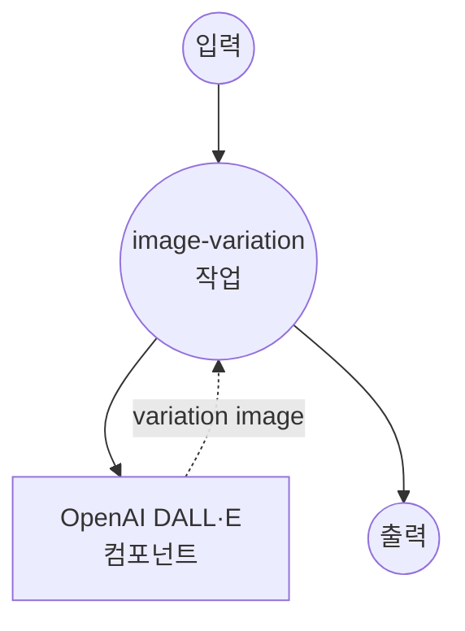

# OpenAI 이미지 변형 예제

이 예제는 OpenAI의 Image Variations API를 DALL·E 기술과 함께 사용하여 기존 이미지의 창의적인 변형을 생성하는 방법을 보여줍니다.

## 개요

이 워크플로우는 다음과 같은 AI 기반 이미지 변형 기능을 제공합니다:

1. **창의적 이미지 변형**: 원본 이미지의 예술적 해석 생성
2. **고품질 출력**: 1024x1024 해상도 변형 생성
3. **PNG 형식 지원**: PNG 입력 및 출력에 최적화
4. **단일 변형 초점**: 요청당 하나의 고품질 변형 생성

## 준비사항

### 필수 요구사항

- model-compose가 설치되어 PATH에서 사용 가능
- 이미지 생성 액세스 권한이 있는 OpenAI API 키

### OpenAI API 구성

1. **계정 생성**: [OpenAI](https://platform.openai.com/)에서 가입
2. **API 키 가져오기**: API Keys 섹션으로 이동
3. **결제 정보 추가**: API 사용을 위한 결제 정보 설정

### 환경 구성

1. 이 예제 디렉토리로 이동:
   ```bash
   cd examples/openai-image-variations
   ```

2. 샘플 환경 파일 복사:
   ```bash
   cp .env.sample .env
   ```

3. `.env`를 편집하고 OpenAI API 키 추가:
   ```env
   OPENAI_API_KEY=your-actual-openai-api-key
   ```

## 실행 방법

1. **서비스 시작:**
   ```bash
   model-compose up
   ```

2. **워크플로우 실행:**

   **API 사용:**
   ```bash
   curl -X POST http://localhost:8080/api/workflows/runs \
     -H "Content-Type: multipart/form-data" \
     -F "input={\"image\": \"@image\"}" \
     -F "image=@source_image.png"
   ```

   **웹 UI 사용:**
   - 웹 UI 열기: http://localhost:8081
   - PNG 이미지 파일 업로드
   - "Run Workflow" 버튼 클릭

   **CLI 사용:**
   ```bash
   # 기본 이미지 변형
   model-compose run --input '{"image": "/path/to/image.png"}'
   ```

## 컴포넌트 세부사항

### OpenAI DALL·E 컴포넌트 (기본)
- **유형**: HTTP client 컴포넌트
- **목적**: DALL·E를 사용하여 입력 이미지의 창의적 변형 생성
- **API**: OpenAI Image Variations v1
- **모델**: DALL·E
- **기능**:
  - 원본 이미지의 예술적 해석
  - 1024x1024 고해상도 출력
  - Base64 인코딩된 PNG 형식
  - 요청당 단일 변형

## 워크플로우 세부사항

### "Image Variations" 워크플로우 (기본)

**설명**: OpenAI의 DALL·E 모델을 사용하여 입력 이미지의 창의적 변형을 생성합니다.

#### 작업 흐름



#### 입력 매개변수

| 매개변수 | 유형 | 필수 | 기본값 | 설명 |
|---------|------|------|--------|------|
| `image` | image/png | 예 | - | 변형 생성을 위한 원본 이미지 |

#### 출력 형식

| 필드 | 유형 | 설명 |
|-----|------|------|
| - | string | Base64 인코딩된 PNG 이미지 데이터 |

## 이미지 요구사항

### 형식 사양

| 항목 | 사양 | 참고 |
|------|------|------|
| **형식** | PNG | 최상의 결과를 위해 필수 |
| **최대 크기** | 4MB | 파일 크기 제한 |
| **치수** | 정사각형 권장 | 정사각형 이미지로 최상의 결과 |
| **품질** | 고해상도 | 더 나은 소스가 더 나은 변형을 생성 |

### 출력 사양

| 항목 | 값 | 설명 |
|------|-----|------|
| **형식** | PNG | 고품질 출력 |
| **치수** | 1024x1024 | 고정 정사각형 출력 |
| **인코딩** | Base64 | JSON 임베디드 이미지 데이터 |

## 사용자 정의

### 기본 구성

```yaml
body:
  image: ${input.image as image}
  n: 1
  size: "1024x1024"
  response_format: "b64_json"
```

### 여러 변형 (순차 요청)

```yaml
workflows:
  - id: multiple-variations
    jobs:
      - id: variation-1
        component: image-variations
        input:
          image: ${input.source_image}

      - id: variation-2
        component: image-variations
        input:
          image: ${input.source_image}

      - id: variation-3
        component: image-variations
        input:
          image: ${input.source_image}
```
