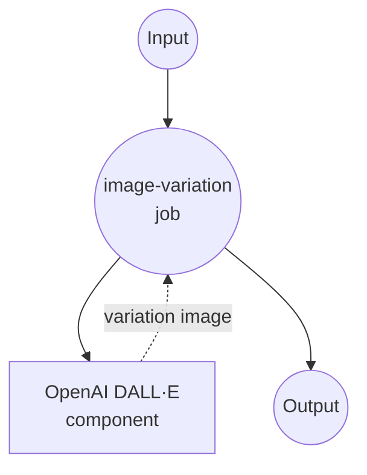

# OpenAI Image Variations Example

This example demonstrates how to use model-compose with OpenAI's Image Variations API to generate creative variations of existing images using DALL·E technology.

## Overview

This workflow provides AI-powered image variation capabilities that:

1. **Creative Image Variations**: Generate artistic interpretations of source images
2. **High-Quality Output**: Produces 1024x1024 resolution variations
3. **PNG Format Support**: Optimized for PNG input and output
4. **Single Variation Focus**: Generates one high-quality variation per request

## Preparation

### Prerequisites

- model-compose installed and available in your PATH
- OpenAI API key with image generation access

### OpenAI API Configuration

1. **Create Account**: Sign up at [OpenAI](https://platform.openai.com/)
2. **Get API Key**: Navigate to API Keys section
3. **Add Billing**: Set up billing information for API usage

### Environment Configuration

1. Navigate to this example directory:
   ```bash
   cd examples/openai-image-variations
   ```

2. Copy the sample environment file:
   ```bash
   cp .env.sample .env
   ```

3. Edit `.env` and add your OpenAI API key:
   ```env
   OPENAI_API_KEY=your-actual-openai-api-key
   ```

## How to Run

1. **Start the service:**
   ```bash
   model-compose up
   ```

2. **Run the workflow:**

   **Using API:**
   ```bash
   curl -X POST http://localhost:8080/api/workflows/runs \
     -H "Content-Type: multipart/form-data" \
     -F "input={\"image\": \"@image\"}" \
     -F "image=@source_image.png"
   ```

   **Using Web UI:**
   - Open the Web UI: http://localhost:8081
   - Upload a PNG image file
   - Click the "Run Workflow" button

   **Using CLI:**
   ```bash
   # Basic image variation
   model-compose run --input '{"image": "/path/to/image.png"}'
   ```

## Component Details

### OpenAI DALL·E Component (Default)
- **Type**: HTTP client component
- **Purpose**: Generate creative variations of input images using DALL·E
- **API**: OpenAI Image Variations v1
- **Model**: DALL·E
- **Features**:
  - Artistic interpretation of source images
  - 1024x1024 high-resolution output
  - Base64 encoded PNG format
  - Single variation per request

## Workflow Details

### "Image Variations" Workflow (Default)

**Description**: Generate creative variations of input images using OpenAI's DALL·E model.

#### Job Flow



#### Input Parameters

| Parameter | Type | Required | Default | Description |
|-----------|------|----------|---------|-------------|
| `image` | image/png | Yes | - | Source image for variation generation |

#### Output Format

| Field | Type | Description |
|-------|------|-------------|
| - | string | Base64 encoded PNG image data |

## Image Requirements

### Format Specifications

| Aspect | Specification | Notes |
|--------|---------------|-------|
| **Format** | PNG | Required for best results |
| **Max Size** | 4MB | File size limit |
| **Dimensions** | Square recommended | Best results with square images |
| **Quality** | High resolution | Better source yields better variations |

### Output Specifications

| Aspect | Value | Description |
|--------|-------|-------------|
| **Format** | PNG | High-quality output |
| **Dimensions** | 1024x1024 | Fixed square output |
| **Encoding** | Base64 | JSON-embedded image data |

## Customization

### Basic Configuration

```yaml
body:
  image: ${input.image as image}
  n: 1
  size: "1024x1024"
  response_format: "b64_json"
```

### Multiple Variations (Sequential Requests)

```yaml
workflows:
  - id: multiple-variations
    jobs:
      - id: variation-1
        component: image-variations
        input:
          image: ${input.source_image}

      - id: variation-2
        component: image-variations
        input:
          image: ${input.source_image}

      - id: variation-3
        component: image-variations
        input:
          image: ${input.source_image}
```
