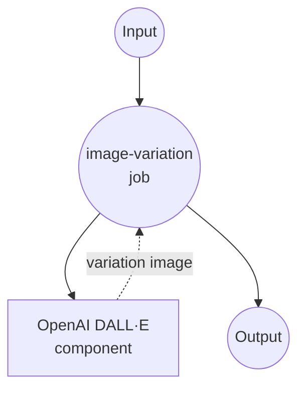

# OpenAI Image Variations 示例

本示例演示如何使用 model-compose 与 OpenAI 的图像变体 API 结合，利用 DALL·E 技术生成现有图像的创意变体。

## 概述

此工作流提供了 AI 驱动的图像变体功能，具有以下特性：

1. **创意图像变体**：生成源图像的艺术化解释
2. **高质量输出**：生成 1024x1024 分辨率的变体
3. **PNG 格式支持**：针对 PNG 输入和输出进行优化
4. **单一变体重点**：每次请求生成一个高质量变体

## 准备工作

### 前置要求

- 已安装 model-compose 并在 PATH 中可用
- 具有图像生成访问权限的 OpenAI API 密钥

### OpenAI API 配置

1. **创建账户**：在 [OpenAI](https://platform.openai.com/) 注册
2. **获取 API 密钥**：导航到 API 密钥部分
3. **添加计费信息**：为 API 使用设置计费信息

### 环境配置

1. 导航到此示例目录：
   ```bash
   cd examples/openai-image-variations
   ```

2. 复制示例环境文件：
   ```bash
   cp .env.sample .env
   ```

3. 编辑 `.env` 并添加你的 OpenAI API 密钥：
   ```env
   OPENAI_API_KEY=your-actual-openai-api-key
   ```

## 如何运行

1. **启动服务：**
   ```bash
   model-compose up
   ```

2. **运行工作流：**

   **使用 API：**
   ```bash
   curl -X POST http://localhost:8080/api/workflows/runs \
     -H "Content-Type: multipart/form-data" \
     -F "input={\"image\": \"@image\"}" \
     -F "image=@source_image.png"
   ```

   **使用 Web UI：**
   - 打开 Web UI：http://localhost:8081
   - 上传 PNG 图像文件
   - 点击"运行工作流"按钮

   **使用 CLI：**
   ```bash
   # 基本图像变体
   model-compose run --input '{"image": "/path/to/image.png"}'
   ```

## 组件详情

### OpenAI DALL·E 组件（默认）
- **类型**：HTTP 客户端组件
- **用途**：使用 DALL·E 生成输入图像的创意变体
- **API**：OpenAI 图像变体 v1
- **模型**：DALL·E
- **特性**：
  - 源图像的艺术化解释
  - 1024x1024 高分辨率输出
  - Base64 编码的 PNG 格式
  - 每次请求单个变体

## 工作流详情

### "图像变体"工作流（默认）

**描述**：使用 OpenAI 的 DALL·E 模型生成输入图像的创意变体。

#### 作业流程



#### 输入参数

| 参数 | 类型 | 必需 | 默认值 | 描述 |
|-----------|------|----------|---------|-------------|
| `image` | image/png | 是 | - | 用于生成变体的源图像 |

#### 输出格式

| 字段 | 类型 | 描述 |
|-------|------|-------------|
| - | string | Base64 编码的 PNG 图像数据 |

## 图像要求

### 格式规范

| 方面 | 规范 | 注释 |
|--------|---------------|-------|
| **格式** | PNG | 获得最佳结果所需 |
| **最大尺寸** | 4MB | 文件大小限制 |
| **尺寸** | 建议正方形 | 正方形图像效果最佳 |
| **质量** | 高分辨率 | 更好的源产生更好的变体 |

### 输出规范

| 方面 | 值 | 描述 |
|--------|-------|-------------|
| **格式** | PNG | 高质量输出 |
| **尺寸** | 1024x1024 | 固定正方形输出 |
| **编码** | Base64 | JSON 嵌入的图像数据 |

## 自定义

### 基本配置

```yaml
body:
  image: ${input.image as image}
  n: 1
  size: "1024x1024"
  response_format: "b64_json"
```

### 多个变体（顺序请求）

```yaml
workflows:
  - id: multiple-variations
    jobs:
      - id: variation-1
        component: image-variations
        input:
          image: ${input.source_image}

      - id: variation-2
        component: image-variations
        input:
          image: ${input.source_image}

      - id: variation-3
        component: image-variations
        input:
          image: ${input.source_image}
```
