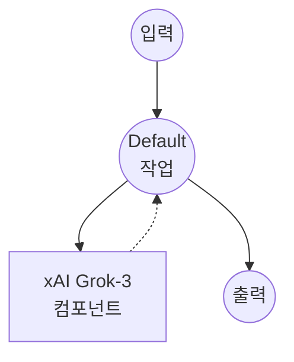

# xAI Chat Completion 예제

이 예제는 Chat Completions API를 통해 xAI의 Grok 모델을 사용하여 간단한 채팅 인터페이스를 만드는 방법을 보여줍니다.

## 개요

이 워크플로우는 다음과 같은 간단한 채팅 인터페이스를 제공합니다:

1. **Chat Completion**: 사용자 프롬프트를 받아 xAI의 Grok-3 모델을 사용하여 응답 생성
2. **Temperature 제어**: temperature 매개변수를 통한 응답 창의성 사용자 정의 가능

## 준비사항

### 필수 요구사항

- model-compose가 설치되어 PATH에서 사용 가능
- xAI API 키

### 환경 구성

1. 이 예제 디렉토리로 이동:
   ```bash
   cd examples/providers/xai/xai-chat-completion
   ```

2. 샘플 환경 파일 복사:
   ```bash
   cp .env.sample .env
   ```

3. `.env` 파일을 편집하여 xAI API 키 추가:
   ```env
   XAI_API_KEY=your-actual-xai-api-key
   ```

## 실행 방법

1. **서비스 시작:**
   ```bash
   model-compose up
   ```

2. **워크플로우 실행:**

   **API 사용:**
   ```bash
   curl -X POST http://localhost:8080/api/workflows/runs \
     -H "Content-Type: application/json" \
     -d '{
       "input": {
         "prompt": "Explain the importance of renewable energy",
         "temperature": 0.7
       }
     }'
   ```

   **웹 UI 사용:**
   - 웹 UI 열기: http://localhost:8081
   - 프롬프트 및 설정 입력
   - "Run Workflow" 버튼 클릭

   **CLI 사용:**
   ```bash
   model-compose run --input '{
     "prompt": "Explain the importance of renewable energy",
     "temperature": 0.7
   }'
   ```

## 컴포넌트 세부사항

### xAI HTTP Client 컴포넌트 (기본)
- **유형**: HTTP client 컴포넌트
- **목적**: AI 기반 텍스트 생성 및 chat completion
- **API**: xAI Grok Chat Completions
- **엔드포인트**: `https://api.x.ai/v1/chat/completions`
- **기능**:
  - 응답 창의성을 위한 구성 가능한 temperature
  - 다양한 프롬프트 유형 및 대화 스타일 지원

## 워크플로우 세부사항

### "Chat with Grok" 워크플로우 (기본)

**설명**: Grok을 사용하여 텍스트 응답 생성

#### 작업 흐름

이 예제는 명시적인 작업 없이 단순화된 단일 컴포넌트 구성을 사용합니다.



#### 입력 매개변수

| 매개변수 | 유형 | 필수 | 기본값 | 설명 |
|---------|------|------|--------|------|
| `prompt` | text | 예 | - | AI에 전송할 사용자 메시지 |
| `temperature` | number | 아니오 | 0.7 | 응답의 무작위성 제어 (0.0-1.0)<br/>• 낮은 값 (예: 0.2): 더 집중적이고 결정적<br/>• 높은 값 (예: 0.8): 더 창의적이고 다양함 |

#### 출력 형식

| 필드 | 유형 | 설명 |
|-----|------|------|
| `message` | text | AI가 생성한 응답 텍스트 |

## 사용자 정의

- **모델**: `grok-3`를 다른 사용 가능한 Grok 모델로 변경
- **System Prompt**: AI의 동작 및 성격을 정의하기 위한 system 메시지 추가
- **추가 매개변수**: `max_tokens`, `presence_penalty` 등의 다른 API 매개변수 포함
- **여러 메시지**: 메시지 배열을 받아 대화 기록 지원으로 확장

## 고급 구성

시스템 프롬프트와 대화 기록을 추가하려면:

```yaml
body:
  model: grok-3
  messages:
    - role: system
      content: "You are a helpful assistant specialized in technical explanations."
    - role: user
      content: ${input.prompt as text}
  temperature: ${input.temperature as number | 0.7}
  max_tokens: ${input.max_tokens as number | 1000}
```
