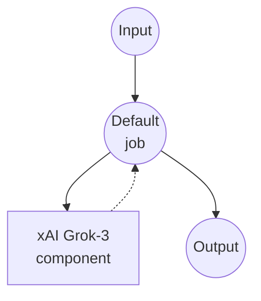

# xAI Chat Completion Example

This example demonstrates how to create a simple chat interface using xAI's Grok model through the Chat Completions API.

## Overview

This workflow provides a straightforward chat interface that:

1. **Chat Completion**: Accepts user prompts and generates responses using xAI's Grok-3 model
2. **Temperature Control**: Allows customization of response creativity through temperature parameter

## Preparation

### Prerequisites

- model-compose installed and available in your PATH
- xAI API key

### Environment Configuration

1. Navigate to this example directory:
   ```bash
   cd examples/providers/xai/xai-chat-completion
   ```

2. Copy the sample environment file:
   ```bash
   cp .env.sample .env
   ```

3. Edit `.env` and add your xAI API key:
   ```env
   XAI_API_KEY=your-actual-xai-api-key
   ```

## How to Run

1. **Start the service:**
   ```bash
   model-compose up
   ```

2. **Run the workflow:**

   **Using API:**
   ```bash
   curl -X POST http://localhost:8080/api/workflows/runs \
     -H "Content-Type: application/json" \
     -d '{
       "input": {
         "prompt": "Explain the importance of renewable energy",
         "temperature": 0.7
       }
     }'
   ```

   **Using Web UI:**
   - Open the Web UI: http://localhost:8081
   - Enter your prompt and settings
   - Click the "Run Workflow" button

   **Using CLI:**
   ```bash
   model-compose run --input '{
     "prompt": "Explain the importance of renewable energy",
     "temperature": 0.7
   }'
   ```

## Component Details

### xAI HTTP Client Component (Default)
- **Type**: HTTP client component
- **Purpose**: AI-powered text generation and chat completion
- **API**: xAI Grok Chat Completions
- **Endpoint**: `https://api.x.ai/v1/chat/completions`
- **Features**:
  - Configurable temperature for response creativity
  - Supports various prompt types and conversation styles

## Workflow Details

### "Chat with Grok" Workflow (Default)

**Description**: Generate text responses using Grok

#### Job Flow

This example uses a simplified single-component configuration without explicit jobs.



#### Input Parameters

| Parameter | Type | Required | Default | Description |
|-----------|------|----------|---------|-------------|
| `prompt` | text | Yes | - | The user message to send to the AI |
| `temperature` | number | No | 0.7 | Controls randomness in responses (0.0-1.0)<br/>• Lower values (e.g., 0.2): more focused and deterministic<br/>• Higher values (e.g., 0.8): more creative and varied |

#### Output Format

| Field | Type | Description |
|-------|------|-------------|
| `message` | text | The AI-generated response text |

## Customization

- **Model**: Change `grok-3` to other available Grok models
- **System Prompt**: Add a system message to define the AI's behavior and personality
- **Additional Parameters**: Include other API parameters like `max_tokens`, `presence_penalty`, etc.
- **Multiple Messages**: Extend to support conversation history by accepting an array of messages

## Advanced Configuration

To add a system prompt and conversation history:

```yaml
body:
  model: grok-3
  messages:
    - role: system
      content: "You are a helpful assistant specialized in technical explanations."
    - role: user
      content: ${input.prompt as text}
  temperature: ${input.temperature as number | 0.7}
  max_tokens: ${input.max_tokens as number | 1000}
```
