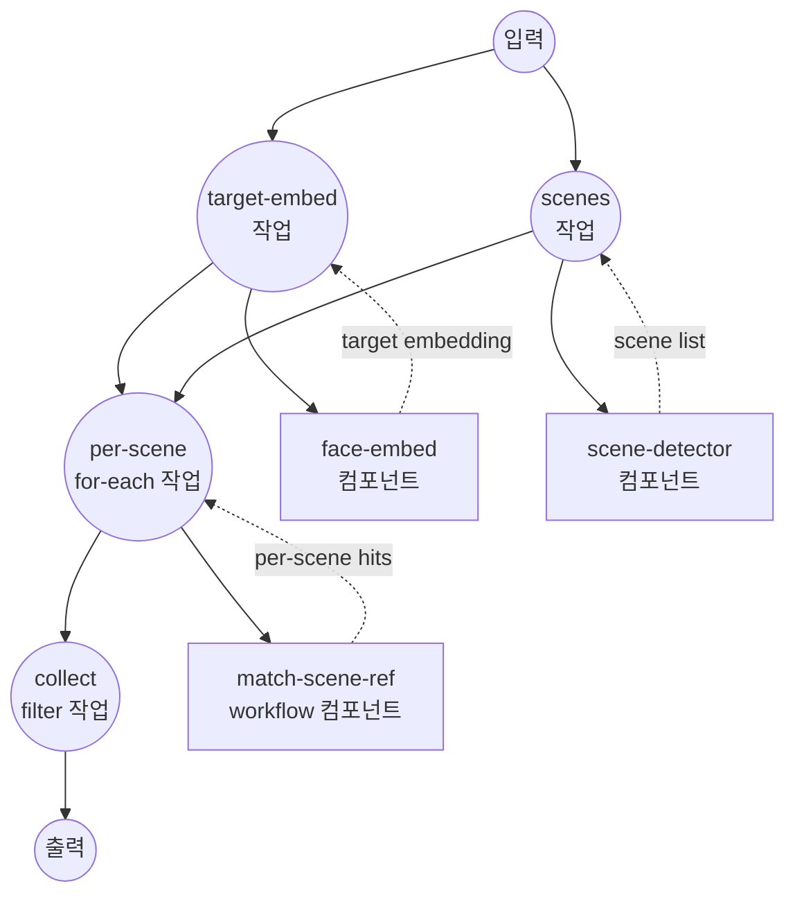

# 특정 인물 장면 찾기 예제

이 예제는 얼굴 임베딩, 장면 감지, 장면별 프레임 샘플링을 사용해 영상에서 대상 인물이 등장하는 모든 장면을 찾아내는 워크플로우를 보여줍니다.

## 개요

대상 얼굴 이미지와 영상이 주어지면, 이 워크플로우는 해당 인물이 등장하는 장면 목록(시작/종료 타임코드)과 각 히트에 대한 매칭 프레임 타임스탬프 및 얼굴 바운딩 박스를 반환합니다.

전략은 다음과 같습니다:

1. **대상 얼굴 임베딩**을 InsightFace 모델로 생성.
2. PySceneDetect로 **영상을 장면으로 분할**.
3. **각 장면마다** 고정 간격으로 프레임을 샘플링하고, 샘플링된 모든 프레임에 대해 얼굴 임베딩을 실행한 뒤, 각 (프레임, 얼굴) 쌍을 코사인 유사도로 대상과 랭킹.
4. 상위 매칭이 유사도 임계값을 충족하는 **장면을 필터링**하고 살아남은 항목을 최종 출력 형태로 정형화.

## 준비사항

### 필수 요구사항

- model-compose가 설치되어 PATH에서 사용 가능
- FFmpeg가 설치되어 PATH에서 사용 가능
- 얼굴 임베딩 및 장면 감지를 위한 Python 의존성:
  ```bash
  pip install insightface onnxruntime scenedetect opencv-python
  ```
- 이 예제 디렉토리의 `./models/antelopev2/` 아래에 배치된 InsightFace `antelopev2` 모델 파일

### 설정

1. 이 예제 디렉토리로 이동:
   ```bash
   cd examples/showcase/find-person-scenes
   ```

2. 대상 얼굴 이미지(찾고자 하는 인물의 선명한 정면 사진)와 검색할 영상을 준비합니다.

## 실행 방법

1. **서비스 시작:**
   ```bash
   model-compose up
   ```

2. **워크플로우 실행:**

   **웹 UI 사용:**
   - Web UI 열기: http://localhost:8081
   - 대상 얼굴 이미지와 영상 업로드
   - 필요한 경우 `similarity_threshold`와 `frame_interval` 조정
   - "Run Workflow" 클릭

   **API 사용:**
   ```bash
   curl -X POST http://localhost:8080/api/workflows/runs \
     -H "Content-Type: multipart/form-data" \
     -F 'input={"similarity_threshold": 0.4, "frame_interval": 15};type=application/json' \
     -F 'target_face=@./target.jpg' \
     -F 'video=@./video.mp4'
   ```

   **CLI 사용:**
   ```bash
   model-compose run --input '{
     "target_face": "./target.jpg",
     "video": "./video.mp4",
     "similarity_threshold": 0.4,
     "frame_interval": 15
   }'
   ```

## 컴포넌트 세부사항

### Face Embedding 컴포넌트 (`face-embed`)
- **유형**: `model` — face-embedding task
- **드라이버**: `custom` (InsightFace 계열)
- **모델**: `./models/antelopev2`
- **기능**: 이미지에서 얼굴을 감지하고 정렬한 뒤, 바운딩 박스 및 감지 스코어와 함께 L2 정규화된 임베딩을 반환합니다 (이미지당 최대 5개의 얼굴).

### Scene Detector 컴포넌트 (`scene-detector`)
- **유형**: `video-scene-detector`
- **드라이버**: `pyscenedetect`
- **감지기**: 임계값 `27.0`의 `adaptive`
- **기능**: 입력 영상을 시작/종료 타임코드가 있는 장면 리스트로 분할합니다.

### Frame Extractor 컴포넌트 (`frame-extractor`)
- **유형**: `video-frame-extractor`
- **드라이버**: `ffmpeg`
- **기능**: 주어진 시간 범위에서 고정 간격으로 프레임을 추출합니다 (`for-each` job이 프레임 리스트를 반복할 수 있도록 non-streaming).

### Vector Processor 컴포넌트 (`vector-processor`)
- **유형**: `vector-processor`
- **드라이버**: `native`
- **액션**:
  - `top-k` (k=1, 코사인 메트릭) — 후보 임베딩을 쿼리 임베딩에 대해 랭킹
  - `similarity` (코사인 메트릭)

### 서브 워크플로우 래퍼 (`match-scene-ref`)
- **유형**: `workflow`
- **목적**: 메인 워크플로우가 장면당 한 번씩 `match-one-scene` 서브 워크플로우를 호출할 수 있도록 합니다.

## 워크플로우 세부사항

### 메인 워크플로우: `find-person-scenes`

**설명**: 대상 얼굴 + 영상에서 매칭 장면 목록까지의 엔드투엔드 파이프라인.

#### 작업 흐름



### 서브 워크플로우: `match-one-scene` (private)

장면당 한 번씩 실행됩니다:

1. **frames** — 장면의 시간 범위에서 `frame_interval` 간격으로 프레임을 추출합니다.
2. **embed-frames** — 프레임에 대해 `for-each`로 반복하며 각 프레임에서 `face-embed`를 호출합니다. `after` hook이 (프레임 × 얼굴) 결과를 하나의 선형 리스트로 평탄화하며, 각 항목에 `timestamp`, `frame_index`, `face_index`를 담습니다.
3. **rank** — 대상 임베딩에 대한 코사인 유사도로 `vector-processor` `top-k`를 호출합니다.

장면, 평탄화된 얼굴 리스트, top-1 히트를 반환합니다.

#### 입력 매개변수 (메인 워크플로우)

| 매개변수 | 유형 | 필수 | 기본값 | 설명 |
|---------|------|------|--------|------|
| `target_face` | image | 예 | - | 찾고자 하는 인물의 참조 사진 |
| `video` | file | 예 | - | 검색할 영상 파일 |
| `similarity_threshold` | number | 아니오 | `0.4` | 장면을 매칭으로 간주할 최소 코사인 유사도 |
| `frame_interval` | number | 아니오 | `15` | 장면 내에서 N 프레임마다 하나씩 샘플링 |

#### 출력 형식

| 필드 | 유형 | 설명 |
|-----|------|------|
| `matched_scenes` | array | 상위 히트가 임계값을 충족하는 장면들. 각각 `scene`, `score`, `timestamp`, `bounding_box`를 포함 |
| `all_scenes` | array | 감지된 모든 장면 (시작/종료 타임코드) — 매칭이 없어도 컨텍스트로 유용 |

`matched_scenes`의 각 항목은 다음을 포함합니다:

| 필드 | 설명 |
|-----|------|
| `scene` | 시작/종료 타임코드가 있는 원본 장면 객체 |
| `score` | 장면 내 최고 (프레임, 얼굴) 매칭의 코사인 유사도 |
| `timestamp` | 매칭된 얼굴을 포함하는 프레임의 타임스탬프 |
| `bounding_box` | 해당 프레임에서 매칭된 얼굴의 바운딩 박스 |

## 예제 출력

30개의 감지된 장면 중 대상 인물이 4개 장면에 등장하는 영상의 경우:

```json
{
  "matched_scenes": [
    {
      "scene": { "start": "00:00:12.500", "end": "00:00:18.200" },
      "score": 0.72,
      "timestamp": 14.0,
      "bounding_box": [420, 180, 560, 340]
    },
    ...
  ],
  "all_scenes": [
    { "start": "00:00:00.000", "end": "00:00:04.100" },
    ...
  ]
}
```

## 사용자 정의

- **임계값**: 더 엄격한 매칭을 위해 `similarity_threshold`를 올리거나, 더 많은 후보를 잡기 위해 낮추세요.
- **샘플링 밀도**: 장면당 더 많은 프레임을 샘플링하려면 `frame_interval`을 줄이세요 (재현율 상승, 속도 감소).
- **얼굴 감지기**: 더 나은 정확도를 위해 InsightFace 모델 디렉토리를 교체하세요 (예: 더 큰 antelopev2 변형).
- **장면 감지기**: 다른 컷 스타일에 맞게 `scene-detector`의 `threshold`를 튜닝하거나 `content` / `threshold` 감지기로 전환하세요.
- **랭킹**: 장면당 더 많은 후보 히트를 유지하려면 `vector-processor`의 `k`를 1에서 변경하세요.
