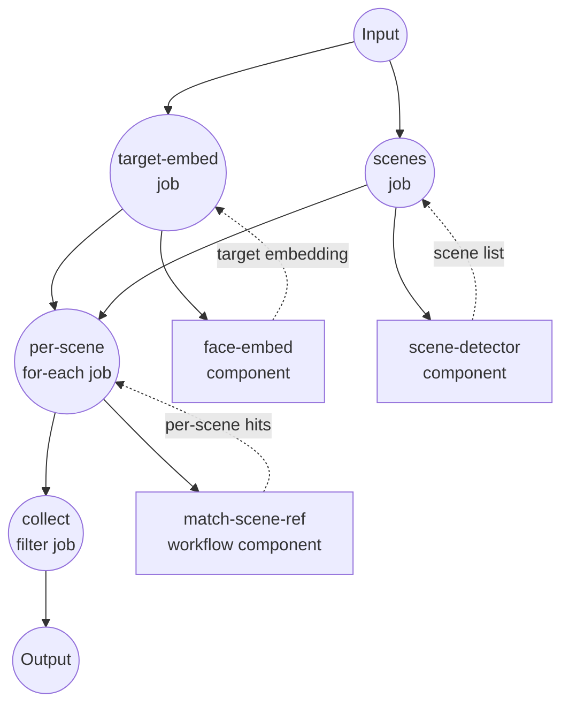

# Find Person Scenes Example

This example demonstrates a workflow that locates every scene in a video where a target person appears, using face embeddings, scene detection, and per-scene frame sampling.

## Overview

Given a target face image and a video, the workflow returns the list of scenes (start/end timecodes) in which that person appears, along with the matching frame timestamp and face bounding box for each hit.

The strategy is:

1. **Embed the target face** using an InsightFace model.
2. **Split the video into scenes** with PySceneDetect.
3. **For each scene**, sample frames at a fixed interval, run face embedding on every sampled frame, and rank each (frame, face) pair against the target by cosine similarity.
4. **Filter scenes** whose top match meets the similarity threshold and shape the surviving items into the final output.

## Preparation

### Prerequisites

- model-compose installed and available in your PATH
- FFmpeg installed and available in your PATH
- Python dependencies for face embedding and scene detection:
  ```bash
  pip install insightface onnxruntime scenedetect opencv-python
  ```
- InsightFace `antelopev2` model files placed under `./models/antelopev2/` in this example directory

### Setup

1. Navigate to this example directory:
   ```bash
   cd examples/showcase/find-person-scenes
   ```

2. Prepare a target face image (a clear, front-facing photo of the person you want to find) and the video you want to search.

## How to Run

1. **Start the service:**
   ```bash
   model-compose up
   ```

2. **Run the workflow:**

   **Using Web UI:**
   - Open the Web UI: http://localhost:8081
   - Upload the target face image and the video
   - Adjust `similarity_threshold` and `frame_interval` if desired
   - Click "Run Workflow"

   **Using API:**
   ```bash
   curl -X POST http://localhost:8080/api/workflows/runs \
     -H "Content-Type: multipart/form-data" \
     -F 'input={"similarity_threshold": 0.4, "frame_interval": 15};type=application/json' \
     -F 'target_face=@./target.jpg' \
     -F 'video=@./video.mp4'
   ```

   **Using CLI:**
   ```bash
   model-compose run --input '{
     "target_face": "./target.jpg",
     "video": "./video.mp4",
     "similarity_threshold": 0.4,
     "frame_interval": 15
   }'
   ```

## Component Details

### Face Embedding Component (`face-embed`)
- **Type**: `model` — face-embedding task
- **Driver**: `custom` (InsightFace family)
- **Model**: `./models/antelopev2`
- **Function**: Detects and aligns faces in an image, then returns L2-normalized embeddings along with bounding boxes and detection scores (up to 5 faces per image).

### Scene Detector Component (`scene-detector`)
- **Type**: `video-scene-detector`
- **Driver**: `pyscenedetect`
- **Detector**: `adaptive` with threshold `27.0`
- **Function**: Splits the input video into a list of scenes with start/end timecodes.

### Frame Extractor Component (`frame-extractor`)
- **Type**: `video-frame-extractor`
- **Driver**: `ffmpeg`
- **Function**: Extracts frames from a given time range at a fixed interval (non-streaming so the `for-each` job can iterate over the frame list).

### Vector Processor Component (`vector-processor`)
- **Type**: `vector-processor`
- **Driver**: `native`
- **Actions**:
  - `top-k` (k=1, cosine metric) — ranks candidate embeddings against a query embedding
  - `similarity` (cosine metric)

### Sub-workflow Wrapper (`match-scene-ref`)
- **Type**: `workflow`
- **Purpose**: Lets the main workflow invoke the `match-one-scene` sub-workflow once per scene.

## Workflow Details

### Main Workflow: `find-person-scenes`

**Description**: End-to-end pipeline from a target face + video to a list of matching scenes.

#### Job Flow



### Sub-workflow: `match-one-scene` (private)

Runs once per scene:

1. **frames** — extract frames from the scene's time range at `frame_interval`.
2. **embed-frames** — `for-each` over frames, invoking `face-embed` on each. An `after` hook flattens (frame × face) results into a single linear list, carrying `timestamp`, `frame_index`, and `face_index` on each item.
3. **rank** — call `vector-processor` `top-k` with cosine similarity against the target embedding.

Returns the scene, the flat face list, and the top-1 hit.

#### Input Parameters (main workflow)

| Parameter | Type | Required | Default | Description |
|-----------|------|----------|---------|-------------|
| `target_face` | image | Yes | - | Reference photo of the person to find |
| `video` | file | Yes | - | Video file to search |
| `similarity_threshold` | number | No | `0.4` | Minimum cosine similarity to consider a scene a match |
| `frame_interval` | number | No | `15` | Sample one frame every N frames within a scene |

#### Output Format

| Field | Type | Description |
|-------|------|-------------|
| `matched_scenes` | array | Scenes whose top hit meets the threshold, each with `scene`, `score`, `timestamp`, and `bounding_box` |
| `all_scenes` | array | All detected scenes (start/end timecodes) — useful as context even when no match was found |

Each item in `matched_scenes` contains:

| Field | Description |
|-------|-------------|
| `scene` | Original scene object with start/end timecodes |
| `score` | Cosine similarity of the best (frame, face) match in the scene |
| `timestamp` | Timestamp of the frame containing the matched face |
| `bounding_box` | Bounding box of the matched face on that frame |

## Example Output

For a video with 30 detected scenes where the target person appears in 4 of them:

```json
{
  "matched_scenes": [
    {
      "scene": { "start": "00:00:12.500", "end": "00:00:18.200" },
      "score": 0.72,
      "timestamp": 14.0,
      "bounding_box": [420, 180, 560, 340]
    },
    ...
  ],
  "all_scenes": [
    { "start": "00:00:00.000", "end": "00:00:04.100" },
    ...
  ]
}
```

## Customization

- **Threshold**: raise `similarity_threshold` for stricter matches, lower it to catch more candidates.
- **Sampling density**: decrease `frame_interval` to sample more frames per scene (higher recall, slower).
- **Face detector**: swap the InsightFace model directory (e.g. a larger antelopev2 variant) for better accuracy.
- **Scene detector**: tune `scene-detector` `threshold` or switch to `content` / `threshold` detectors for different cut styles.
- **Ranking**: change `vector-processor` `k` from 1 to keep more candidate hits per scene.
