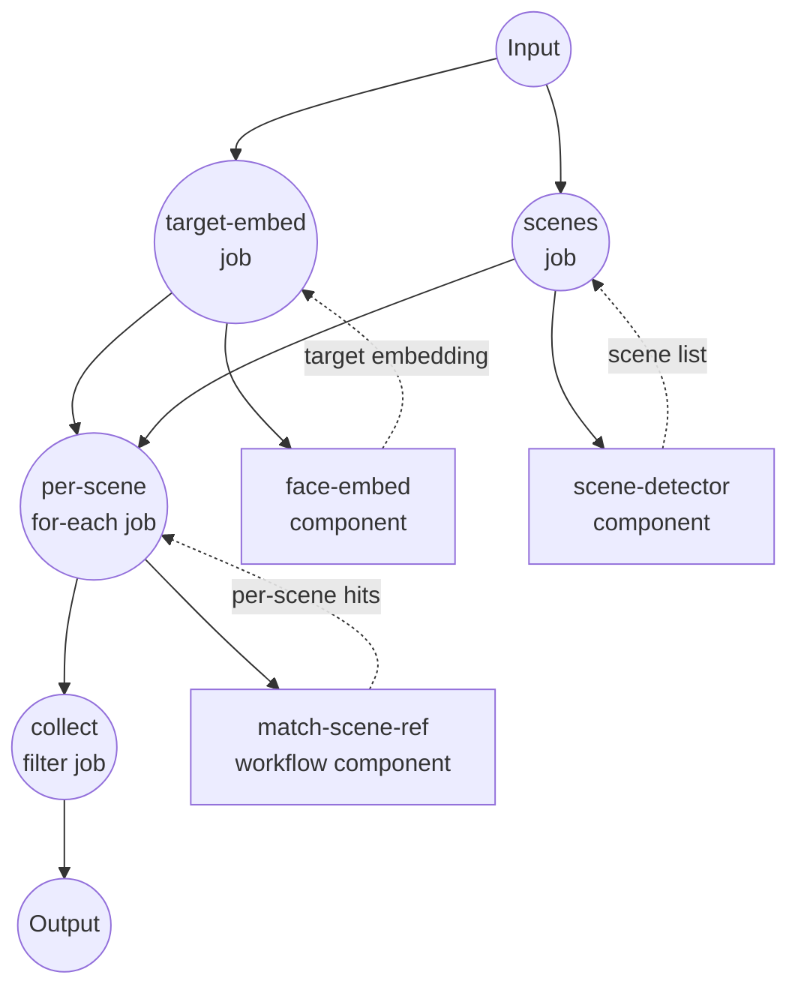

# 查找人物场景示例

此示例演示了一个使用人脸嵌入、场景检测和每场景帧采样，来定位视频中目标人物出现的每个场景的工作流。

## 概述

给定一个目标人脸图像和一段视频，该工作流会返回该人物出现的场景列表（开始/结束时间码），以及每次命中的匹配帧时间戳和人脸边界框。

策略如下：

1. 使用 InsightFace 模型 **嵌入目标人脸**。
2. 使用 PySceneDetect **将视频分割为场景**。
3. **对每个场景**，以固定间隔采样帧，对每个采样帧运行人脸嵌入，并通过余弦相似度将每个（帧、人脸）对与目标进行排名。
4. **过滤场景**，其顶部匹配达到相似度阈值，并将幸存项目塑造成最终输出。

## 准备工作

### 前置条件

- 已安装 model-compose 并在您的 PATH 中可用
- 已安装 FFmpeg 并在您的 PATH 中可用
- 人脸嵌入和场景检测的 Python 依赖：
  ```bash
  pip install insightface onnxruntime scenedetect opencv-python
  ```
- InsightFace `antelopev2` 模型文件放置在此示例目录下的 `./models/antelopev2/`

### 设置

1. 导航到此示例目录：
   ```bash
   cd examples/showcase/find-person-scenes
   ```

2. 准备目标人脸图像（您要查找的人物的清晰正面照片）和要搜索的视频。

## 运行方式

1. **启动服务：**
   ```bash
   model-compose up
   ```

2. **运行工作流：**

   **使用 Web UI：**
   - 打开 Web UI：http://localhost:8081
   - 上传目标人脸图像和视频
   - 如需要，调整 `similarity_threshold` 和 `frame_interval`
   - 点击"运行工作流"

   **使用 API：**
   ```bash
   curl -X POST http://localhost:8080/api/workflows/runs \
     -H "Content-Type: multipart/form-data" \
     -F 'input={"similarity_threshold": 0.4, "frame_interval": 15};type=application/json' \
     -F 'target_face=@./target.jpg' \
     -F 'video=@./video.mp4'
   ```

   **使用 CLI：**
   ```bash
   model-compose run --input '{
     "target_face": "./target.jpg",
     "video": "./video.mp4",
     "similarity_threshold": 0.4,
     "frame_interval": 15
   }'
   ```

## 组件详情

### Face Embedding 组件 (`face-embed`)
- **类型**：`model` — face-embedding task
- **驱动**：`custom`（InsightFace 系列）
- **模型**：`./models/antelopev2`
- **功能**：在图像中检测并对齐人脸，然后返回 L2 归一化的嵌入，以及边界框和检测分数（每个图像最多 5 张人脸）。

### Scene Detector 组件 (`scene-detector`)
- **类型**：`video-scene-detector`
- **驱动**：`pyscenedetect`
- **检测器**：阈值为 `27.0` 的 `adaptive`
- **功能**：将输入视频拆分为具有开始/结束时间码的场景列表。

### Frame Extractor 组件 (`frame-extractor`)
- **类型**：`video-frame-extractor`
- **驱动**：`ffmpeg`
- **功能**：从给定时间范围内以固定间隔提取帧（非流式，以便 `for-each` 作业可以遍历帧列表）。

### Vector Processor 组件 (`vector-processor`)
- **类型**：`vector-processor`
- **驱动**：`native`
- **操作**：
  - `top-k`（k=1，余弦度量）— 针对查询嵌入对候选嵌入进行排名
  - `similarity`（余弦度量）

### 子工作流包装器 (`match-scene-ref`)
- **类型**：`workflow`
- **用途**：让主工作流每个场景调用一次 `match-one-scene` 子工作流。

## 工作流详情

### 主工作流：`find-person-scenes`

**描述**：从目标人脸 + 视频到匹配场景列表的端到端管道。

#### 作业流程



### 子工作流：`match-one-scene`（私有）

每个场景运行一次：

1. **frames** — 在场景的时间范围内以 `frame_interval` 提取帧。
2. **embed-frames** — 对帧进行 `for-each`，在每一帧上调用 `face-embed`。`after` hook 将（帧 × 人脸）结果扁平化为一个线性列表，每个项目携带 `timestamp`、`frame_index` 和 `face_index`。
3. **rank** — 使用余弦相似度针对目标嵌入调用 `vector-processor` `top-k`。

返回场景、扁平化的人脸列表和 top-1 命中。

#### 输入参数（主工作流）

| 参数 | 类型 | 必需 | 默认值 | 描述 |
|------|------|------|--------|------|
| `target_face` | image | 是 | - | 要查找的人物的参考照片 |
| `video` | file | 是 | - | 要搜索的视频文件 |
| `similarity_threshold` | number | 否 | `0.4` | 将场景视为匹配的最小余弦相似度 |
| `frame_interval` | number | 否 | `15` | 场景内每 N 帧采样一帧 |

#### 输出格式

| 字段 | 类型 | 描述 |
|------|------|------|
| `matched_scenes` | array | 顶部命中达到阈值的场景，每个包含 `scene`、`score`、`timestamp` 和 `bounding_box` |
| `all_scenes` | array | 所有检测到的场景（开始/结束时间码）— 即使没有匹配也可用作上下文 |

`matched_scenes` 中的每个项目包含：

| 字段 | 描述 |
|------|------|
| `scene` | 具有开始/结束时间码的原始场景对象 |
| `score` | 场景中最佳（帧、人脸）匹配的余弦相似度 |
| `timestamp` | 包含匹配人脸的帧的时间戳 |
| `bounding_box` | 该帧上匹配人脸的边界框 |

## 示例输出

对于检测到 30 个场景且目标人物出现在其中 4 个场景的视频：

```json
{
  "matched_scenes": [
    {
      "scene": { "start": "00:00:12.500", "end": "00:00:18.200" },
      "score": 0.72,
      "timestamp": 14.0,
      "bounding_box": [420, 180, 560, 340]
    },
    ...
  ],
  "all_scenes": [
    { "start": "00:00:00.000", "end": "00:00:04.100" },
    ...
  ]
}
```

## 自定义

- **阈值**：提高 `similarity_threshold` 以获得更严格的匹配，降低以捕获更多候选。
- **采样密度**：减少 `frame_interval` 以每个场景采样更多帧（更高的召回率，更慢）。
- **人脸检测器**：更换 InsightFace 模型目录（例如更大的 antelopev2 变体）以获得更好的准确性。
- **场景检测器**：调整 `scene-detector` `threshold` 或切换到 `content` / `threshold` 检测器以适应不同的剪辑风格。
- **排名**：将 `vector-processor` `k` 从 1 更改为其他值以保留每个场景更多候选命中。
