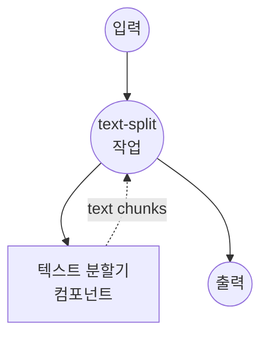

# 텍스트 분할기 예제

이 예제는 model-compose와 텍스트 분할기 컴포넌트를 사용하여 대용량 텍스트 문서를 AI 처리 및 분석을 위한 더 작고 관리하기 쉬운 청크로 나누는 방법을 보여줍니다.

## 개요

이 워크플로우는 다음과 같은 지능형 텍스트 분할 기능을 제공합니다:

1. **지능형 텍스트 청킹**: 구성 가능한 매개변수로 대용량 문서를 더 작은 청크로 분할
2. **컨텍스트 보존**: 청크 간 오버랩을 유지하여 컨텍스트 보존
3. **AI 모델 호환성**: 다양한 AI 모델 토큰 제한에 맞게 청크 크기 최적화
4. **유연한 분할**: 지능형 구분 기호 기반 분할 전략 사용

## 준비사항

### 필수 요구사항

- model-compose가 설치되어 PATH에서 사용 가능
- 추가 API 키 불필요 (로컬 처리)

### 환경 구성

1. 이 예제 디렉토리로 이동:
   ```bash
   cd examples/split-text
   ```

2. 추가 환경 구성 불필요 - 모든 처리는 로컬에서 수행됩니다.

## 실행 방법

1. **서비스 시작:**
   ```bash
   model-compose up
   ```

2. **워크플로우 실행:**

   **API 사용:**
   ```bash
   curl -X POST http://localhost:8080/api/workflows/runs \
     -H "Content-Type: application/json" \
     -d '{
       "input": {
         "text": "This is a long document that needs to be split into smaller chunks for processing by AI models. Each chunk should maintain context while respecting size limits.",
         "chunk_size": 1000,
         "chunk_overlap": 200
       }
     }'
   ```

   **웹 UI 사용:**
   - 웹 UI 열기: http://localhost:8081
   - 분할할 텍스트 입력
   - 청크 크기 및 오버랩 설정 구성
   - "Run Workflow" 버튼 클릭

   **CLI 사용:**
   ```bash
   # 기본 텍스트 분할
   model-compose run --input '{
     "text": "Large document text here...",
     "chunk_size": 1000,
     "chunk_overlap": 200
   }'

   # 임베딩 최적화
   model-compose run --input '{
     "text": "Document for embedding generation...",
     "chunk_size": 300,
     "chunk_overlap": 50,
     "maximize_chunk": false
   }'
   ```

## 컴포넌트 세부사항

### 텍스트 분할기 컴포넌트 (기본)
- **유형**: 텍스트 처리 컴포넌트
- **목적**: 대용량 텍스트를 더 작고 관리하기 쉬운 청크로 분할
- **방법**: 지능형 오버랩을 사용한 구분 기호 기반 청킹
- **기능**:
  - 구성 가능한 청크 크기 및 오버랩
  - 지능형 구분 기호 감지
  - 청크 간 컨텍스트 보존
  - 메타데이터를 포함한 JSON 출력

## 워크플로우 세부사항

### "Text Splitting" 워크플로우 (기본)

**설명**: AI 모델 호환성을 위해 구성 가능한 크기 및 오버랩으로 대용량 텍스트 문서를 더 작은 청크로 분할합니다.

#### 작업 흐름



#### 입력 매개변수

| 매개변수 | 유형 | 필수 | 기본값 | 설명 |
|---------|------|------|--------|------|
| `text` | string | 예 | - | 청크로 분할할 텍스트 |
| `chunk_size` | integer | 아니오 | `1000` | 청크당 최대 문자 수 |
| `chunk_overlap` | integer | 아니오 | `200` | 청크 간 오버랩할 문자 수 |
| `maximize_chunk` | boolean | 아니오 | `true` | 청크 크기 활용 최적화 |

#### 출력 형식

| 필드 | 유형 | 설명 |
|-----|------|------|
| `chunks` | array | 텍스트 청크 배열 |
| `total_chunks` | integer | 생성된 청크 수 |
| `average_chunk_size` | integer | 청크의 평균 크기 |

## 맞춤화

### 기본 구성

```yaml
input:
  text: ${input.text}
  chunk_size: ${input.chunk_size | 1000}
  chunk_overlap: ${input.chunk_overlap | 200}
  maximize_chunk: ${input.maximize_chunk | true}
```

### AI 모델 최적화

#### GPT 모델
```yaml
# GPT-3.5-turbo (4,096 토큰)
input:
  text: ${input.text}
  chunk_size: 3000
  chunk_overlap: 300
```

#### 임베딩 모델
```yaml
# OpenAI text-embedding-ada-002
input:
  text: ${input.text}
  chunk_size: 500
  chunk_overlap: 50
  maximize_chunk: false
```

### 문서 유형 최적화

#### 기술 문서
```yaml
input:
  text: ${input.text}
  chunk_size: 800
  chunk_overlap: 150
  # 코드 블록 및 기술 용어 보존
```

#### 서사 텍스트
```yaml
input:
  text: ${input.text}
  chunk_size: 1200
  chunk_overlap: 250
  # 스토리 흐름 및 캐릭터 컨텍스트 유지
```
