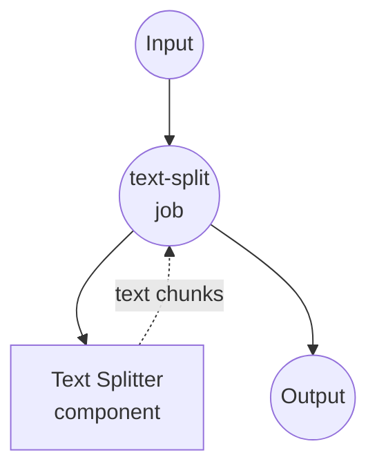

# Text Splitter Example

This example demonstrates how to use model-compose with a text splitter component to break down large text documents into smaller, manageable chunks for AI processing and analysis.

## Overview

This workflow provides intelligent text segmentation capabilities that:

1. **Intelligent Text Chunking**: Breaks large documents into smaller chunks with configurable parameters
2. **Context Preservation**: Maintains overlap between chunks to preserve context
3. **AI Model Compatibility**: Optimizes chunk sizes for various AI model token limits
4. **Flexible Splitting**: Uses intelligent separator-based splitting strategies

## Preparation

### Prerequisites

- model-compose installed and available in your PATH
- No additional API keys required (local processing)

### Environment Configuration

1. Navigate to this example directory:
   ```bash
   cd examples/split-text
   ```

2. No additional environment configuration required - all processing is done locally.

## How to Run

1. **Start the service:**
   ```bash
   model-compose up
   ```

2. **Run the workflow:**

   **Using API:**
   ```bash
   curl -X POST http://localhost:8080/api/workflows/runs \
     -H "Content-Type: application/json" \
     -d '{
       "input": {
         "text": "This is a long document that needs to be split into smaller chunks for processing by AI models. Each chunk should maintain context while respecting size limits.",
         "chunk_size": 1000,
         "chunk_overlap": 200
       }
     }'
   ```

   **Using Web UI:**
   - Open the Web UI: http://localhost:8081
   - Enter your text to split
   - Configure chunk size and overlap settings
   - Click the "Run Workflow" button

   **Using CLI:**
   ```bash
   # Basic text splitting
   model-compose run --input '{
     "text": "Large document text here...",
     "chunk_size": 1000,
     "chunk_overlap": 200
   }'

   # Optimized for embeddings
   model-compose run --input '{
     "text": "Document for embedding generation...",
     "chunk_size": 300,
     "chunk_overlap": 50,
     "maximize_chunk": false
   }'
   ```

## Component Details

### Text Splitter Component (Default)
- **Type**: Text processing component
- **Purpose**: Split large text into smaller, manageable chunks
- **Method**: Separator-based chunking with intelligent overlap
- **Features**:
  - Configurable chunk size and overlap
  - Intelligent separator detection
  - Context preservation between chunks
  - JSON output with metadata

## Workflow Details

### "Text Splitting" Workflow (Default)

**Description**: Split large text documents into smaller chunks with configurable size and overlap for AI model compatibility.

#### Job Flow



#### Input Parameters

| Parameter | Type | Required | Default | Description |
|-----------|------|----------|---------|-------------|
| `text` | string | Yes | - | Text to split into chunks |
| `chunk_size` | integer | No | `1000` | Maximum characters per chunk |
| `chunk_overlap` | integer | No | `200` | Characters to overlap between chunks |
| `maximize_chunk` | boolean | No | `true` | Optimize chunk size utilization |

#### Output Format

| Field | Type | Description |
|-------|------|-------------|
| `chunks` | array | Array of text chunks |
| `total_chunks` | integer | Number of chunks created |
| `average_chunk_size` | integer | Average size of chunks |

## Customization

### Basic Configuration

```yaml
input:
  text: ${input.text}
  chunk_size: ${input.chunk_size | 1000}
  chunk_overlap: ${input.chunk_overlap | 200}
  maximize_chunk: ${input.maximize_chunk | true}
```

### AI Model Optimization

#### GPT Models
```yaml
# GPT-3.5-turbo (4,096 tokens)
input:
  text: ${input.text}
  chunk_size: 3000
  chunk_overlap: 300
```

#### Embedding Models
```yaml
# OpenAI text-embedding-ada-002
input:
  text: ${input.text}
  chunk_size: 500
  chunk_overlap: 50
  maximize_chunk: false
```

### Document Type Optimization

#### Technical Documentation
```yaml
input:
  text: ${input.text}
  chunk_size: 800
  chunk_overlap: 150
  # Preserves code blocks and technical terms
```

#### Narrative Text
```yaml
input:
  text: ${input.text}
  chunk_size: 1200
  chunk_overlap: 250
  # Maintains story flow and character context
```
