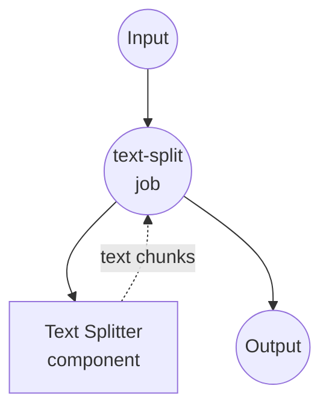

# 文本分割器示例

此示例演示如何使用 model-compose 的文本分割器组件将大型文本文档分解为更小、可管理的块，以便进行 AI 处理和分析。

## 概述

此工作流提供智能文本分割功能：

1. **智能文本分块**：使用可配置参数将大型文档分解为更小的块
2. **上下文保留**：在块之间保持重叠以保留上下文
3. **AI 模型兼容性**：为各种 AI 模型的 token 限制优化块大小
4. **灵活分割**：使用基于智能分隔符的分割策略

## 准备工作

### 前置条件

- 已安装 model-compose 并在您的 PATH 中可用
- 不需要额外的 API 密钥（本地处理）

### 环境配置

1. 导航到此示例目录：
   ```bash
   cd examples/split-text
   ```

2. 不需要额外的环境配置 - 所有处理都在本地完成。

## 运行方式

1. **启动服务：**
   ```bash
   model-compose up
   ```

2. **运行工作流：**

   **使用 API：**
   ```bash
   curl -X POST http://localhost:8080/api/workflows/runs \
     -H "Content-Type: application/json" \
     -d '{
       "input": {
         "text": "This is a long document that needs to be split into smaller chunks for processing by AI models. Each chunk should maintain context while respecting size limits.",
         "chunk_size": 1000,
         "chunk_overlap": 200
       }
     }'
   ```

   **使用 Web UI：**
   - 打开 Web UI：http://localhost:8081
   - 输入要分割的文本
   - 配置块大小和重叠设置
   - 点击"运行工作流"按钮

   **使用 CLI：**
   ```bash
   # 基本文本分割
   model-compose run --input '{
     "text": "Large document text here...",
     "chunk_size": 1000,
     "chunk_overlap": 200
   }'

   # 针对嵌入优化
   model-compose run --input '{
     "text": "Document for embedding generation...",
     "chunk_size": 300,
     "chunk_overlap": 50,
     "maximize_chunk": false
   }'
   ```

## 组件详情

### 文本分割器组件（默认）
- **类型**：文本处理组件
- **用途**：将大型文本分割为更小、可管理的块
- **方法**：基于分隔符的智能块分割和重叠
- **功能**：
  - 可配置的块大小和重叠
  - 智能分隔符检测
  - 块之间的上下文保留
  - 带元数据的 JSON 输出

## 工作流详情

### "文本分割"工作流（默认）

**描述**：将大型文本文档分割为具有可配置大小和重叠的更小块，以与 AI 模型兼容。

#### 作业流程



#### 输入参数

| 参数 | 类型 | 必需 | 默认值 | 描述 |
|-----------|------|----------|---------|-------------|
| `text` | string | 是 | - | 要分割成块的文本 |
| `chunk_size` | integer | 否 | `1000` | 每个块的最大字符数 |
| `chunk_overlap` | integer | 否 | `200` | 块之间重叠的字符数 |
| `maximize_chunk` | boolean | 否 | `true` | 优化块大小利用率 |

#### 输出格式

| 字段 | 类型 | 描述 |
|-------|------|-------------|
| `chunks` | array | 文本块数组 |
| `total_chunks` | integer | 创建的块数 |
| `average_chunk_size` | integer | 块的平均大小 |

## 自定义

### 基本配置

```yaml
input:
  text: ${input.text}
  chunk_size: ${input.chunk_size | 1000}
  chunk_overlap: ${input.chunk_overlap | 200}
  maximize_chunk: ${input.maximize_chunk | true}
```

### AI 模型优化

#### GPT 模型
```yaml
# GPT-3.5-turbo (4,096 tokens)
input:
  text: ${input.text}
  chunk_size: 3000
  chunk_overlap: 300
```

#### 嵌入模型
```yaml
# OpenAI text-embedding-ada-002
input:
  text: ${input.text}
  chunk_size: 500
  chunk_overlap: 50
  maximize_chunk: false
```

### 文档类型优化

#### 技术文档
```yaml
input:
  text: ${input.text}
  chunk_size: 800
  chunk_overlap: 150
  # 保留代码块和技术术语
```

#### 叙事文本
```yaml
input:
  text: ${input.text}
  chunk_size: 1200
  chunk_overlap: 250
  # 保持故事流程和角色上下文
```
