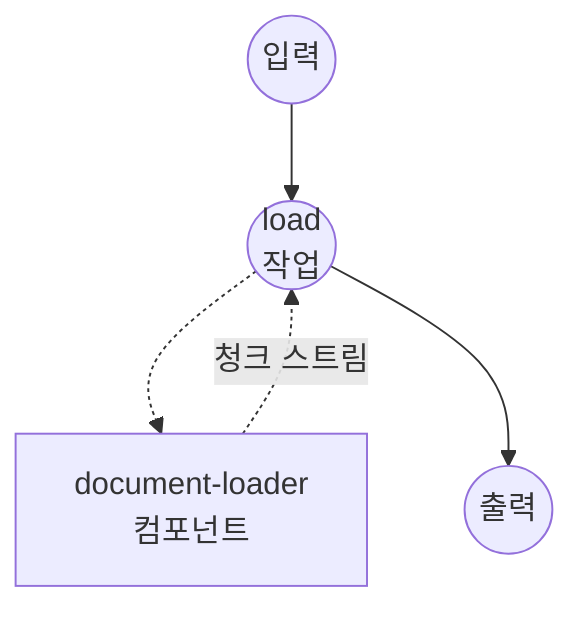

# 문서 로더 예제

이 예제는 model-compose와 `document-loader` 컴포넌트를 사용해 문서(PDF, DOCX, HTML 등)를 스트리밍 방식의 청크 레코드로 로드하고 분할하는 방법을 보여줍니다. Docling의 다섯 가지 청킹 전략을 각각 별도 워크플로우로 노출해 서로 비교할 수 있으며, 원시 페이지 추출용 pypdf 워크플로우도 함께 제공합니다.

## 개요

두 개의 컴포넌트가 여섯 개의 워크플로우를 지원합니다.

Docling 드라이버 — 하나의 `docling-loader` 컴포넌트가 청커 전략별로 다섯 개의 워크플로우를 담당합니다:

1. **`load-with-docling-hybrid`** — 토크나이저 예산에 맞춰 크기가 조정된 헤딩 인식 청크. 임베딩/검색 대상에 적합.
2. **`load-with-docling-hierarchical`** — 토큰 예산 없이 헤딩 경계로 청크 분할. 읽기 순서 유지에 적합.
3. **`load-with-docling-line`** — 토큰 안전망이 있는 라인 기반 청크. 표, 코드, 로그 형태의 콘텐츠에 적합.
4. **`load-with-docling-page`** — 원본 페이지당 청크 하나.
5. **`load-with-docling-whole`** — 문서 전체를 단일 마크다운 청크로 반환 (청킹 미적용).

pypdf 드라이버 — 별도의 `pypdf-loader` 컴포넌트가 하나의 워크플로우를 담당합니다:

6. **`load-with-pypdf`** — PDF 페이지당 레코드 하나. 모델 로드가 없어 가장 빠르게 시작됨.

모든 워크플로우는 스트리밍을 활성화하므로 청크는 생성되는 대로 흘러나옵니다.

## 준비사항

### 필수 요구사항

- model-compose가 설치되어 PATH에서 사용 가능
- Python 패키지는 드라이버별로 선언되어 필요할 때 자동 설치됩니다:
  - Docling 드라이버: `docling-slim` + `feat-chunking`, `format-pdf-docling`, `models-local` extras (그리고 OCR 사용 시 `feat-ocr-<engine>`)
  - pypdf 드라이버: `pypdf`

### 환경 구성

1. 이 예제 디렉토리로 이동:
   ```bash
   cd examples/text-processing/load-document
   ```

2. API 키 불필요 — 두 드라이버 모두 로컬에서 실행됩니다. Docling 드라이버는 첫 실행 시 지정된 HuggingFace 토크나이저와 docling-ibm-models의 레이아웃/테이블 가중치를 다운로드합니다.

## 실행 방법

1. **서비스 시작:**
   ```bash
   model-compose up
   ```

2. **워크플로우 실행:**

   **API 사용 — 토큰 크기 청크 (hybrid):**
   ```bash
   curl -X POST http://localhost:8080/api/workflows/load-with-docling-hybrid/runs \
     -H "Content-Type: application/json" \
     -d '{
       "input": {
         "source": "/absolute/path/to/paper.pdf",
         "max_token_count": 384
       }
     }'
   ```

   **API 사용 — 헤딩 기반 청크 (hierarchical):**
   ```bash
   curl -X POST http://localhost:8080/api/workflows/load-with-docling-hierarchical/runs \
     -H "Content-Type: application/json" \
     -d '{
       "input": {
         "source": "/absolute/path/to/paper.pdf",
         "always_emit_headings": true
       }
     }'
   ```

   **API 사용 — 라인 기반 청크:**
   ```bash
   curl -X POST http://localhost:8080/api/workflows/load-with-docling-line/runs \
     -H "Content-Type: application/json" \
     -d '{
       "input": {
         "source": "/absolute/path/to/paper.pdf",
         "max_line_count": 40,
         "max_token_count": 384
       }
     }'
   ```

   **API 사용 — 페이지 단위 청크:**
   ```bash
   curl -X POST http://localhost:8080/api/workflows/load-with-docling-page/runs \
     -H "Content-Type: application/json" \
     -d '{
       "input": { "source": "/absolute/path/to/paper.pdf" }
     }'
   ```

   **API 사용 — 전체 문서:**
   ```bash
   curl -X POST http://localhost:8080/api/workflows/load-with-docling-whole/runs \
     -H "Content-Type: application/json" \
     -d '{
       "input": { "source": "/absolute/path/to/paper.pdf" }
     }'
   ```

   **API 사용 — pypdf 페이지 추출:**
   ```bash
   curl -X POST http://localhost:8080/api/workflows/load-with-pypdf/runs \
     -H "Content-Type: application/json" \
     -d '{
       "input": {
         "source": "/absolute/path/to/paper.pdf",
         "page_range": "1-5"
       }
     }'
   ```

   **웹 UI 사용:**
   - 웹 UI 열기: http://localhost:8081
   - 사이드바에서 워크플로우 선택
   - 문서 경로(또는 업로드 파일)와 매개변수 입력
   - "Run Workflow" 버튼 클릭

## 컴포넌트 세부사항

### `docling-loader` (Docling 드라이버)

모든 `load-with-docling-*` 워크플로우가 공유합니다. `chunker` 필드는 각 워크플로우에서 주입되므로 한 컴포넌트 인스턴스가 모든 전략을 처리할 수 있습니다.

- **유형**: `document-loader`
- **드라이버**: `docling`
- **컴포넌트 레벨 구성**:
  - `backend` — PDF 백엔드. `pypdfium2`로 설정하면 텍스트 레이어를 빠르게 추출합니다 (미지정 시 Docling 기본 백엔드 사용). `pypdfium2`는 OCR을 완전히 건너뜁니다.
  - `tokenizer` — 토큰 예산을 사용하는 청커(`hybrid`, `line`)가 사용하는 HuggingFace 토크나이저 ID. 컴포넌트 시작 시 한 번 로드되어 모든 액션 호출에서 재사용됩니다.
  - `enable_ocr` — 스캔본이나 이미지 기반 페이지에 OCR 수행 여부. 기본 `false`.
  - `ocr_engine` — `easyocr`, `tesseract`, `rapidocr`, `ocrmac` 중 하나. `enable_ocr: true`일 때만 의미 있음. 미지정 시 Docling 기본(easyocr) 사용.
  - `recognize_table` — 표 구조 인식 여부. 기본 `true`. 끄면 표가 많은 문서에서 첫 청크가 훨씬 빠르게 나옵니다.
  - `table_mode` — `fast` 또는 `accurate`. `recognize_table: true`일 때만 의미 있음.
  - `accelerator` — `auto`, `cpu`, `cuda`, `mps` 중 하나. 미지정 시 Docling이 자동 선택.
- **액션 레벨 구성**: `chunker`, `max_token_count`, `merge_peers`, `repeat_table_header`, `omit_header_on_overflow`, `always_emit_headings`, `code_chunking_strategy`, `max_line_count`, `return_enriched_text`, `streaming`. 선택된 청커에 관련된 필드만 반영되며 나머지는 무시됩니다.
- **청크 출력**: `{ text, index, meta }` — `meta`에는 export된 `DocMeta`(headings, doc_items, origin)가 담깁니다.

### `pypdf-loader` (pypdf 드라이버)

- **유형**: `document-loader`
- **드라이버**: `pypdf`
- **컴포넌트 레벨 구성**: 없음.
- **액션 레벨 구성**: `password`, `extraction_mode`(`plain` 또는 `layout`), `page_range`(예: `"1-5,7"`), `streaming`.
- **청크 출력**: `{ text, index, meta }` — `meta`에는 `number`(1부터 시작하는 페이지 번호)와 `rotation`이 담깁니다.

## 워크플로우 세부사항

### `load-with-docling-hybrid`

Docling의 hybrid 전략으로 파싱된 문서를 청킹합니다. 청크 크기는 지정된 토크나이저 기준으로 `max_token_count` 안에 유지됩니다. 각 청크에 헤딩과 캡션 메타데이터가 첨부됩니다.

| 매개변수 | 유형 | 필수 | 기본값 | 설명 |
|---------|------|------|--------|------|
| `source` | string | 예 | - | 문서 경로. |
| `max_token_count` | integer | 아니오 | `384` | 청크당 최대 토큰 수. |

### `load-with-docling-hierarchical`

헤딩 경계로 청크를 나눕니다. 토큰 예산이 없으므로 한 헤딩 섹션이 아주 큰 청크를 만들 수 있습니다.

| 매개변수 | 유형 | 필수 | 기본값 | 설명 |
|---------|------|------|--------|------|
| `source` | string | 예 | - | 문서 경로. |
| `always_emit_headings` | boolean | 아니오 | `false` | 헤딩을 뒤따르는 콘텐츠에 붙이는 것 외에 독립 청크로도 emit할지 여부. |
| `code_chunking_strategy` | string | 아니오 | 생략 | 코드 블록 분할 전략. `"standard"`만 지원. |

### `load-with-docling-line`

토큰 안전망이 있는 라인 기반 청크. 각 청크는 최대 `max_line_count` 라인을 포함하면서 전체 토큰은 `max_token_count` 이내로 유지됩니다. 라인 경계가 의미 있는 표·코드·로그 형태의 콘텐츠에 유용합니다.

| 매개변수 | 유형 | 필수 | 기본값 | 설명 |
|---------|------|------|--------|------|
| `source` | string | 예 | - | 문서 경로. |
| `max_line_count` | integer | 아니오 | `40` | 청크당 최대 라인 수. |
| `max_token_count` | integer | 아니오 | `384` | 청크당 최대 토큰 수. |

### `load-with-docling-page`

원본 페이지당 청크 하나. 메타데이터는 Docling의 페이지 단위 provenance를 유지합니다.

| 매개변수 | 유형 | 필수 | 기본값 | 설명 |
|---------|------|------|--------|------|
| `source` | string | 예 | - | 문서 경로. |

### `load-with-docling-whole`

문서 전체를 단일 마크다운 청크로 반환합니다. 다운스트림이 문서 전문을 한 덩어리로 원할 때 유용합니다.

| 매개변수 | 유형 | 필수 | 기본값 | 설명 |
|---------|------|------|--------|------|
| `source` | string | 예 | - | 문서 경로. |

### `load-with-pypdf`

pypdf로 PDF를 열어 페이지당 레코드 하나를 스트리밍합니다.

| 매개변수 | 유형 | 필수 | 기본값 | 설명 |
|---------|------|------|--------|------|
| `source` | string | 예 | - | PDF 경로. |
| `page_range` | string | 아니오 | 생략 시 전체 페이지 | `"1-5,7"` 같은 페이지 범위 문자열. 1부터 시작. 생략하면 전체 페이지 emit. |

## 작업 흐름

모든 워크플로우는 동일한 형태입니다 — 하나의 작업이 하나의 로더 컴포넌트를 호출하고 그 스트리밍 출력을 그대로 전달합니다:



## 출력 형식

모든 청크 레코드는 다음 형태를 공유합니다:

| 필드 | 유형 | 설명 |
|-----|------|------|
| `text` | string | 청크 텍스트. |
| `index` | integer | emit 순서상의 0부터 시작하는 위치. |
| `meta` | object | 드라이버별 메타데이터 (아래 참조). |
| `enriched_text` | string | Docling 컴포넌트에서 `return_enriched_text: true`일 때만 존재. 헤딩과 캡션이 앞에 붙은 청크 텍스트. |

Docling `meta` 필드 (export된 `DocMeta`에서):

| 필드 | 유형 | 설명 |
|-----|------|------|
| `headings` | 문자열 배열 | 청크에 도달하는 헤딩 계층. |
| `doc_items` | 배열 | 원본 요소의 provenance(페이지 번호, 바운딩 박스 등). |
| `origin` | object | 원본 문서 참조. |

pypdf `meta` 필드:

| 필드 | 유형 | 설명 |
|-----|------|------|
| `number` | integer | 1부터 시작하는 페이지 번호. |
| `rotation` | integer | 페이지 회전 각도(도). |

## 성능 관련 참고사항

Docling의 파이프라인은 파싱 단계에서 lazy하지 않습니다: 첫 청크가 나오기 전에 문서 전체를 파싱합니다. 청커 자체는 제너레이터라 파싱이 끝나면 청크가 즉시 흘러나옵니다. 즉 첫 청크까지의 지연은 파싱 시간과 같습니다.

이 지연을 줄이려면:
- 텍스트 레이어가 있는 PDF에는 `backend: pypdfium2`를 우선 사용하세요 — 기본 Docling 백엔드보다 훨씬 빠릅니다.
- 스캔본이 아니라면 `enable_ocr: false`를 유지하세요.
- 문서가 텍스트 중심이라면 `recognize_table`을 끄세요 — 표가 많은 페이지에서 TableFormer가 파싱 시간의 큰 비중을 차지합니다.
- GPU가 있다면 `accelerator: cuda` 또는 `mps`로 설정하세요.

진짜 페이지 단위 lazy 스트리밍이 필요하다면 `load-with-pypdf` 워크플로우를 사용하세요 — pypdf는 파일을 열고 페이지를 읽으면서 바로 emit합니다.

## 맞춤화

### 토크나이저 변경

컴포넌트 레벨 `tokenizer` 필드를 원하는 HuggingFace 토크나이저 ID로 지정하세요. 시작 시 한 번 로드되므로 변경 후에는 `model-compose up`을 재시작해야 합니다.

```yaml
components:
  - id: docling-loader
    type: document-loader
    driver: docling
    tokenizer: BAAI/bge-small-en
    ...
```

### 헤딩 강화 텍스트 첨부

다운스트림이 임베딩 모델이나 LLM 프롬프트인 경우 Docling 컴포넌트의 액션에서 `return_enriched_text: true`를 활성화하면 각 청크가 헤딩·캡션 접두어가 붙은 두 번째 필드를 함께 담습니다:

```yaml
components:
  - id: docling-loader
    type: document-loader
    driver: docling
    tokenizer: sentence-transformers/all-MiniLM-L6-v2
    action:
      source: ${input.source}
      chunker: ${input.chunker}
      return_enriched_text: true
      ...
      streaming: true
```

각 청크에 `text`와 함께 `enriched_text` 필드가 포함됩니다.

### OCR 활성화

Docling 컴포넌트에서 `enable_ocr: true`와 (선택적으로) `ocr_engine`을 설정하세요. 기본 백엔드(docling-parse)가 필요합니다 — `backend: pypdfium2`는 텍스트 레이어만 읽고 OCR 요청을 조용히 무시합니다.

```yaml
components:
  - id: docling-loader
    type: document-loader
    driver: docling
    enable_ocr: true
    ocr_engine: easyocr
    ...
```

### 비스트리밍 출력

모든 워크플로우는 `streaming: true`를 활성화합니다. 컴포넌트 액션에서 `false`로 설정하면 청크 스트림 대신 전체 결과를 한 번에 응답으로 받습니다.
