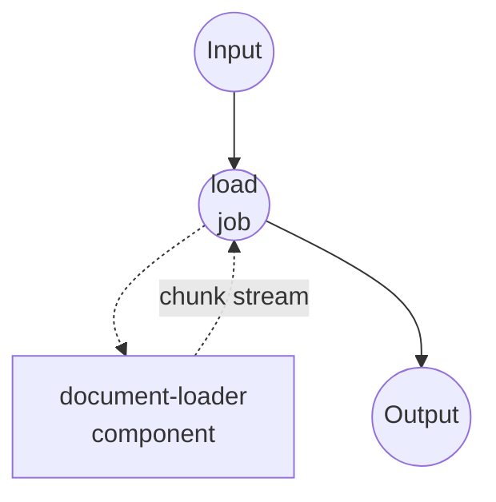

# Document Loader Example

This example demonstrates how to use model-compose to load and chunk documents (PDF, DOCX, HTML, and more) into streaming per-chunk records using the `document-loader` component. Multiple workflows are provided so you can compare the Docling chunker strategies side by side, plus a pypdf workflow for raw page extraction.

## Overview

Six workflows share two components.

Docling driver — a single `docling-loader` component drives five workflows, one per chunker strategy:

1. **`load-with-docling-hybrid`** — heading-aware chunks sized to a tokenizer's token budget. Best for embedding/retrieval targets.
2. **`load-with-docling-hierarchical`** — heading-driven chunks without a token budget. Best for preserving reading order.
3. **`load-with-docling-line`** — line-oriented chunks with a token safety net. Best for tables, code, and log-like content.
4. **`load-with-docling-page`** — one chunk per source page.
5. **`load-with-docling-whole`** — the entire document as a single markdown chunk (no chunker applied).

pypdf driver — a separate `pypdf-loader` component drives one workflow:

6. **`load-with-pypdf`** — one record per PDF page. No models loaded, fastest to start.

Every workflow enables streaming, so chunks flow out as they are produced.

## Preparation

### Prerequisites

- model-compose installed and available in your PATH
- Python packages are declared per driver and installed on demand:
  - Docling driver: `docling-slim` with `feat-chunking`, `format-pdf-docling`, `models-local`, and the optional `feat-ocr-<engine>` extras
  - pypdf driver: `pypdf`

### Environment Configuration

1. Navigate to this example directory:
   ```bash
   cd examples/text-processing/load-document
   ```

2. No API keys required — both drivers run locally. On first start the Docling driver downloads the configured HuggingFace tokenizer and the docling-ibm-models layout/table weights.

## How to Run

1. **Start the service:**
   ```bash
   model-compose up
   ```

2. **Run a workflow:**

   **Using API — token-windowed chunks (hybrid):**
   ```bash
   curl -X POST http://localhost:8080/api/workflows/load-with-docling-hybrid/runs \
     -H "Content-Type: application/json" \
     -d '{
       "input": {
         "source": "/absolute/path/to/paper.pdf",
         "max_token_count": 384
       }
     }'
   ```

   **Using API — heading-based chunks (hierarchical):**
   ```bash
   curl -X POST http://localhost:8080/api/workflows/load-with-docling-hierarchical/runs \
     -H "Content-Type: application/json" \
     -d '{
       "input": {
         "source": "/absolute/path/to/paper.pdf",
         "always_emit_headings": true
       }
     }'
   ```

   **Using API — line-based chunks:**
   ```bash
   curl -X POST http://localhost:8080/api/workflows/load-with-docling-line/runs \
     -H "Content-Type: application/json" \
     -d '{
       "input": {
         "source": "/absolute/path/to/paper.pdf",
         "max_line_count": 40,
         "max_token_count": 384
       }
     }'
   ```

   **Using API — page-level chunks:**
   ```bash
   curl -X POST http://localhost:8080/api/workflows/load-with-docling-page/runs \
     -H "Content-Type: application/json" \
     -d '{
       "input": { "source": "/absolute/path/to/paper.pdf" }
     }'
   ```

   **Using API — whole document:**
   ```bash
   curl -X POST http://localhost:8080/api/workflows/load-with-docling-whole/runs \
     -H "Content-Type: application/json" \
     -d '{
       "input": { "source": "/absolute/path/to/paper.pdf" }
     }'
   ```

   **Using API — pypdf pages:**
   ```bash
   curl -X POST http://localhost:8080/api/workflows/load-with-pypdf/runs \
     -H "Content-Type: application/json" \
     -d '{
       "input": {
         "source": "/absolute/path/to/paper.pdf",
         "page_range": "1-5"
       }
     }'
   ```

   **Using Web UI:**
   - Open the Web UI at http://localhost:8081
   - Pick a workflow from the sidebar
   - Enter the document path (or upload a file) and any parameters
   - Click "Run Workflow"

## Component Details

### `docling-loader` (Docling driver)

Shared by every `load-with-docling-*` workflow. The `chunker` field is passed in from each workflow so a single component instance can serve every strategy.

- **Type**: `document-loader`
- **Driver**: `docling`
- **Component-level config**:
  - `backend` — PDF backend. Set to `pypdfium2` for fast text-layer extraction (default docling backend is used when omitted). `pypdfium2` skips OCR entirely.
  - `tokenizer` — HuggingFace tokenizer id used by chunkers that respect a token budget (`hybrid`, `line`). Loaded once at start and reused across every action call.
  - `enable_ocr` — Run OCR on scanned or image-based pages. Default `false`.
  - `ocr_engine` — One of `easyocr`, `tesseract`, `rapidocr`, `ocrmac`. Only meaningful when `enable_ocr: true`; docling's default (easyocr) is used when omitted.
  - `recognize_table` — Run table structure recognition. Default `true`. Turning it off makes the first chunk arrive much faster on table-heavy documents.
  - `table_mode` — `fast` or `accurate`. Only meaningful when `recognize_table: true`.
  - `accelerator` — `auto`, `cpu`, `cuda`, or `mps`. Docling picks a default when omitted.
- **Action-level config**: `chunker`, `max_token_count`, `merge_peers`, `repeat_table_header`, `omit_header_on_overflow`, `always_emit_headings`, `code_chunking_strategy`, `max_line_count`, `return_enriched_text`, `streaming`. Only fields relevant to the selected chunker take effect; the rest are ignored.
- **Chunk output**: `{ text, index, meta }` — `meta` carries the exported `DocMeta` (headings, doc_items, origin).

### `pypdf-loader` (pypdf driver)

- **Type**: `document-loader`
- **Driver**: `pypdf`
- **Component-level config**: none.
- **Action-level config**: `password`, `extraction_mode` (`plain` or `layout`), `page_range` (e.g. `"1-5,7"`), `streaming`.
- **Chunk output**: `{ text, index, meta }` — `meta` carries `number` (one-based page number) and `rotation`.

## Workflow Details

### `load-with-docling-hybrid`

Chunks the parsed document with docling's hybrid strategy. Chunk sizes stay within `max_token_count`, measured against the configured tokenizer. Heading and caption metadata is attached to each chunk.

| Parameter | Type | Required | Default | Description |
|-----------|------|----------|---------|-------------|
| `source` | string | Yes | - | Path to the document. |
| `max_token_count` | integer | No | `384` | Maximum tokens per chunk. |

### `load-with-docling-hierarchical`

Chunks along heading boundaries. No token budget, so a single heading section can produce an arbitrarily large chunk.

| Parameter | Type | Required | Default | Description |
|-----------|------|----------|---------|-------------|
| `source` | string | Yes | - | Path to the document. |
| `always_emit_headings` | boolean | No | `false` | Emit headings as standalone chunks in addition to prefixing them to following content. |
| `code_chunking_strategy` | string | No | omit | Strategy for fenced code blocks. Only `"standard"` is supported. |

### `load-with-docling-line`

Line-oriented chunks with a token safety net. Each chunk contains up to `max_line_count` lines while keeping total tokens under `max_token_count`. Useful for tables, code, and log-style content where line boundaries are meaningful.

| Parameter | Type | Required | Default | Description |
|-----------|------|----------|---------|-------------|
| `source` | string | Yes | - | Path to the document. |
| `max_line_count` | integer | No | `40` | Maximum lines per chunk. |
| `max_token_count` | integer | No | `384` | Maximum tokens per chunk. |

### `load-with-docling-page`

One chunk per source page. Metadata retains docling's per-page provenance.

| Parameter | Type | Required | Default | Description |
|-----------|------|----------|---------|-------------|
| `source` | string | Yes | - | Path to the document. |

### `load-with-docling-whole`

Emits the entire document as a single markdown chunk. Useful when the downstream consumer wants the full text in one piece.

| Parameter | Type | Required | Default | Description |
|-----------|------|----------|---------|-------------|
| `source` | string | Yes | - | Path to the document. |

### `load-with-pypdf`

Opens the PDF with pypdf and streams one record per page.

| Parameter | Type | Required | Default | Description |
|-----------|------|----------|---------|-------------|
| `source` | string | Yes | - | Path to the PDF. |
| `page_range` | string | No | omit for all pages | Page range like `"1-5,7"`. One-based. Omit to emit every page. |

## Job Flow

Every workflow follows the same shape — one job invokes one loader component and forwards its streaming output:



## Output Format

Every chunk record shares this shape:

| Field | Type | Description |
|-------|------|-------------|
| `text` | string | Chunk text. |
| `index` | integer | Zero-based position in the emit order. |
| `meta` | object | Driver-specific metadata (see below). |
| `enriched_text` | string | Only present when `return_enriched_text: true` on the Docling component. Chunk text with heading and caption prefixes prepended. |

Docling `meta` fields (from the exported `DocMeta`):

| Field | Type | Description |
|-------|------|-------------|
| `headings` | array of strings | Heading hierarchy leading to the chunk. |
| `doc_items` | array | Provenance items (page numbers, bounding boxes) for the source elements. |
| `origin` | object | Original document reference. |

pypdf `meta` fields:

| Field | Type | Description |
|-------|------|-------------|
| `number` | integer | One-based page number. |
| `rotation` | integer | Page rotation in degrees. |

## Notes on Performance

Docling's pipeline is not lazy at the parsing stage: the entire document is parsed before the first chunk is emitted. The chunker itself is a generator, so once parsing finishes chunks flow out immediately. Time-to-first-chunk therefore equals the parsing time.

To shorten that gap:
- Prefer `backend: pypdfium2` for text-layer PDFs — much faster than the default docling backend.
- Keep `enable_ocr: false` unless you have scanned pages.
- Turn off `recognize_table` when your document is text-heavy — TableFormer accounts for a large share of parsing time on table-dense pages.
- Set `accelerator: cuda` or `mps` when a GPU is available.

For truly lazy, page-by-page streaming, use the `load-with-pypdf` workflow — pypdf opens the file and emits pages as it reads them.

## Customization

### Change the tokenizer

Point the component-level `tokenizer` field at any HuggingFace tokenizer id. It is loaded once at start, so switching it requires restarting `model-compose up`.

```yaml
components:
  - id: docling-loader
    type: document-loader
    driver: docling
    tokenizer: BAAI/bge-small-en
    ...
```

### Attach heading-enriched text

When the downstream target is an embedding model or an LLM prompt, enable `return_enriched_text: true` on the Docling component's action so each chunk carries a second field with heading and caption prefixes prepended:

```yaml
components:
  - id: docling-loader
    type: document-loader
    driver: docling
    tokenizer: sentence-transformers/all-MiniLM-L6-v2
    action:
      source: ${input.source}
      chunker: ${input.chunker}
      return_enriched_text: true
      ...
      streaming: true
```

Each chunk then includes an `enriched_text` field alongside `text`.

### Enable OCR

Set `enable_ocr: true` and (optionally) `ocr_engine` on the Docling component. The default backend (docling-parse) is required — `backend: pypdfium2` reads only the text layer and silently ignores OCR requests.

```yaml
components:
  - id: docling-loader
    type: document-loader
    driver: docling
    enable_ocr: true
    ocr_engine: easyocr
    ...
```

### Non-streaming output

Every workflow enables `streaming: true`. Set it to `false` on the component action to receive the whole result in one response instead of a chunk stream.
