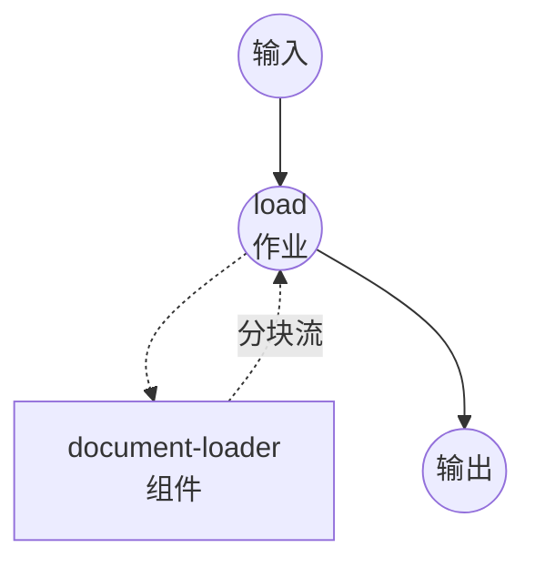

# 文档加载器示例

本示例演示如何使用 model-compose 通过 `document-loader` 组件将文档（PDF、DOCX、HTML 等)加载并切分为流式的分块记录。示例提供了 Docling 的五种切分策略作为独立工作流，方便并排比较，并额外提供一个用于原始页面提取的 pypdf 工作流。

## 概览

两个组件驱动六个工作流。

Docling 驱动 —— 单个 `docling-loader` 组件驱动五个工作流，每个对应一种切分策略：

1. **`load-with-docling-hybrid`** —— 感知标题的分块，大小对齐到分词器的 token 预算。适合嵌入 / 检索场景。
2. **`load-with-docling-hierarchical`** —— 沿标题边界切分，不施加 token 预算。适合保留阅读顺序。
3. **`load-with-docling-line`** —— 以行为单位，附带 token 安全网。适合表格、代码和日志类内容。
4. **`load-with-docling-page`** —— 每个源页面产出一个分块。
5. **`load-with-docling-whole`** —— 整份文档作为单个 markdown 分块返回（不施加切分器）。

pypdf 驱动 —— 独立的 `pypdf-loader` 组件驱动一个工作流：

6. **`load-with-pypdf`** —— 每个 PDF 页面产出一条记录。无需加载模型，启动最快。

所有工作流都启用了流式输出，分块在产生时即时流出。

## 准备工作

### 前置条件

- model-compose 已安装并可在 PATH 中调用
- Python 包按驱动声明，按需安装：
  - Docling 驱动：`docling-slim` 加上 `feat-chunking`、`format-pdf-docling`、`models-local` extras（启用 OCR 时再加 `feat-ocr-<engine>`)
  - pypdf 驱动：`pypdf`

### 环境配置

1. 进入本示例目录：
   ```bash
   cd examples/text-processing/load-document
   ```

2. 无需 API 密钥 —— 两个驱动均在本地运行。Docling 驱动会在首次启动时下载配置的 HuggingFace 分词器以及 docling-ibm-models 的布局 / 表格权重。

## 运行方式

1. **启动服务：**
   ```bash
   model-compose up
   ```

2. **运行工作流：**

   **使用 API —— token 窗口分块（hybrid)：**
   ```bash
   curl -X POST http://localhost:8080/api/workflows/load-with-docling-hybrid/runs \
     -H "Content-Type: application/json" \
     -d '{
       "input": {
         "source": "/absolute/path/to/paper.pdf",
         "max_token_count": 384
       }
     }'
   ```

   **使用 API —— 基于标题的分块（hierarchical)：**
   ```bash
   curl -X POST http://localhost:8080/api/workflows/load-with-docling-hierarchical/runs \
     -H "Content-Type: application/json" \
     -d '{
       "input": {
         "source": "/absolute/path/to/paper.pdf",
         "always_emit_headings": true
       }
     }'
   ```

   **使用 API —— 基于行的分块：**
   ```bash
   curl -X POST http://localhost:8080/api/workflows/load-with-docling-line/runs \
     -H "Content-Type: application/json" \
     -d '{
       "input": {
         "source": "/absolute/path/to/paper.pdf",
         "max_line_count": 40,
         "max_token_count": 384
       }
     }'
   ```

   **使用 API —— 页面级分块：**
   ```bash
   curl -X POST http://localhost:8080/api/workflows/load-with-docling-page/runs \
     -H "Content-Type: application/json" \
     -d '{
       "input": { "source": "/absolute/path/to/paper.pdf" }
     }'
   ```

   **使用 API —— 整份文档：**
   ```bash
   curl -X POST http://localhost:8080/api/workflows/load-with-docling-whole/runs \
     -H "Content-Type: application/json" \
     -d '{
       "input": { "source": "/absolute/path/to/paper.pdf" }
     }'
   ```

   **使用 API —— pypdf 页面提取：**
   ```bash
   curl -X POST http://localhost:8080/api/workflows/load-with-pypdf/runs \
     -H "Content-Type: application/json" \
     -d '{
       "input": {
         "source": "/absolute/path/to/paper.pdf",
         "page_range": "1-5"
       }
     }'
   ```

   **使用 Web UI：**
   - 打开 Web UI：http://localhost:8081
   - 在侧边栏选择工作流
   - 输入文档路径（或上传文件）以及参数
   - 点击 "Run Workflow" 按钮

## 组件详情

### `docling-loader`（Docling 驱动)

所有 `load-with-docling-*` 工作流共享该组件。`chunker` 字段由各工作流传入，因此单个组件实例可服务于每种策略。

- **类型**：`document-loader`
- **驱动**：`docling`
- **组件级配置**：
  - `backend` —— PDF 后端。设为 `pypdfium2` 可快速提取文本层（未指定时使用 Docling 默认后端)。`pypdfium2` 完全跳过 OCR。
  - `tokenizer` —— 使用 token 预算的切分器（`hybrid`、`line`)所依赖的 HuggingFace 分词器 ID。在组件启动时加载一次，所有 action 调用共享。
  - `enable_ocr` —— 是否对扫描件或图像页面运行 OCR。默认 `false`。
  - `ocr_engine` —— 取值 `easyocr`、`tesseract`、`rapidocr`、`ocrmac` 之一。仅在 `enable_ocr: true` 时有效；未指定时使用 Docling 默认（easyocr)。
  - `recognize_table` —— 是否运行表格结构识别。默认 `true`。关闭后表格密集文档的首个分块会大幅提前。
  - `table_mode` —— `fast` 或 `accurate`。仅在 `recognize_table: true` 时有效。
  - `accelerator` —— `auto`、`cpu`、`cuda`、`mps` 之一。未指定时由 Docling 自动选择。
- **Action 级配置**：`chunker`、`max_token_count`、`merge_peers`、`repeat_table_header`、`omit_header_on_overflow`、`always_emit_headings`、`code_chunking_strategy`、`max_line_count`、`return_enriched_text`、`streaming`。仅与所选切分器相关的字段生效，其余被忽略。
- **分块输出**：`{ text, index, meta }` —— `meta` 承载导出的 `DocMeta`（headings、doc_items、origin)。

### `pypdf-loader`（pypdf 驱动)

- **类型**：`document-loader`
- **驱动**：`pypdf`
- **组件级配置**：无。
- **Action 级配置**：`password`、`extraction_mode`（`plain` 或 `layout`)、`page_range`（例如 `"1-5,7"`)、`streaming`。
- **分块输出**：`{ text, index, meta }` —— `meta` 承载 `number`（从 1 开始的页码)和 `rotation`。

## 工作流详情

### `load-with-docling-hybrid`

以 Docling 的 hybrid 策略切分已解析的文档。分块大小按所配置的分词器保持在 `max_token_count` 以内。每个分块附带标题与标注元数据。

| 参数 | 类型 | 必填 | 默认值 | 说明 |
|------|------|------|--------|------|
| `source` | string | 是 | - | 文档路径。 |
| `max_token_count` | integer | 否 | `384` | 每个分块的最大 token 数。 |

### `load-with-docling-hierarchical`

沿标题边界切分。没有 token 预算，因此某一节可能产出任意大的分块。

| 参数 | 类型 | 必填 | 默认值 | 说明 |
|------|------|------|--------|------|
| `source` | string | 是 | - | 文档路径。 |
| `always_emit_headings` | boolean | 否 | `false` | 除了作为后续内容前缀外，是否额外将标题作为独立分块 emit。 |
| `code_chunking_strategy` | string | 否 | 省略 | 代码块切分策略。仅支持 `"standard"`。 |

### `load-with-docling-line`

带 token 安全网的行分块。每个分块最多包含 `max_line_count` 行，同时总 token 数保持在 `max_token_count` 以内。适合行边界具有语义意义的表格、代码、日志类内容。

| 参数 | 类型 | 必填 | 默认值 | 说明 |
|------|------|------|--------|------|
| `source` | string | 是 | - | 文档路径。 |
| `max_line_count` | integer | 否 | `40` | 每个分块的最大行数。 |
| `max_token_count` | integer | 否 | `384` | 每个分块的最大 token 数。 |

### `load-with-docling-page`

每个源页面一个分块。元数据保留 Docling 的按页 provenance。

| 参数 | 类型 | 必填 | 默认值 | 说明 |
|------|------|------|--------|------|
| `source` | string | 是 | - | 文档路径。 |

### `load-with-docling-whole`

将整份文档作为单个 markdown 分块返回。当下游希望一次拿到完整文本时使用。

| 参数 | 类型 | 必填 | 默认值 | 说明 |
|------|------|------|--------|------|
| `source` | string | 是 | - | 文档路径。 |

### `load-with-pypdf`

使用 pypdf 打开 PDF 并按页流式返回记录。

| 参数 | 类型 | 必填 | 默认值 | 说明 |
|------|------|------|--------|------|
| `source` | string | 是 | - | PDF 路径。 |
| `page_range` | string | 否 | 省略即全部页面 | 形如 `"1-5,7"` 的页面范围，从 1 计。省略则输出全部页面。 |

## 作业流程

每个工作流形态相同 —— 一个作业调用一个加载器组件，并转发其流式输出：



## 输出格式

每条分块记录共享以下形态：

| 字段 | 类型 | 说明 |
|------|------|------|
| `text` | string | 分块文本。 |
| `index` | integer | 输出顺序中从 0 开始的位置。 |
| `meta` | object | 驱动相关元数据（见下)。 |
| `enriched_text` | string | 仅当 Docling 组件设置 `return_enriched_text: true` 时出现。附带标题和标注前缀的分块文本。 |

Docling `meta` 字段（来自导出的 `DocMeta`)：

| 字段 | 类型 | 说明 |
|------|------|------|
| `headings` | 字符串数组 | 到达分块的标题层级。 |
| `doc_items` | 数组 | 源要素的 provenance（页码、边界框等)。 |
| `origin` | object | 原始文档引用。 |

pypdf `meta` 字段：

| 字段 | 类型 | 说明 |
|------|------|------|
| `number` | integer | 从 1 开始的页码。 |
| `rotation` | integer | 页面旋转角度（度)。 |

## 性能说明

Docling 的管道在解析阶段并非惰性：首个分块出现前，会先解析完整份文档。切分器本身是生成器，一旦解析完成分块便立即流出。因此首个分块的延迟约等于解析时间。

要缩短这段延迟：
- 文本层清晰的 PDF 优先使用 `backend: pypdfium2` —— 比默认 Docling 后端快得多。
- 非扫描件保持 `enable_ocr: false`。
- 文档以文本为主时关闭 `recognize_table` —— 表格密集页面上 TableFormer 占用了很大部分解析时间。
- 有 GPU 时设置 `accelerator: cuda` 或 `mps`。

如果需要真正按页惰性的流式，请使用 `load-with-pypdf` 工作流 —— pypdf 打开文件后随读随输出页面。

## 自定义

### 更换分词器

将组件级 `tokenizer` 字段指向任意 HuggingFace 分词器 ID。它在启动时加载一次，切换后需要重启 `model-compose up`。

```yaml
components:
  - id: docling-loader
    type: document-loader
    driver: docling
    tokenizer: BAAI/bge-small-en
    ...
```

### 附加标题增强文本

当下游是嵌入模型或 LLM 提示时，在 Docling 组件的 action 上启用 `return_enriched_text: true`，每个分块会额外携带一个字段，附带标题与标注前缀：

```yaml
components:
  - id: docling-loader
    type: document-loader
    driver: docling
    tokenizer: sentence-transformers/all-MiniLM-L6-v2
    action:
      source: ${input.source}
      chunker: ${input.chunker}
      return_enriched_text: true
      ...
      streaming: true
```

此时每个分块除了 `text` 外还带有 `enriched_text` 字段。

### 启用 OCR

在 Docling 组件设置 `enable_ocr: true`（可选)配合 `ocr_engine`。需要使用默认后端（docling-parse) —— `backend: pypdfium2` 只读取文本层，会静默忽略 OCR 请求。

```yaml
components:
  - id: docling-loader
    type: document-loader
    driver: docling
    enable_ocr: true
    ocr_engine: easyocr
    ...
```

### 非流式输出

所有工作流默认启用 `streaming: true`。在组件 action 上将其设为 `false`，即可一次性获得完整结果，而非分块流。
