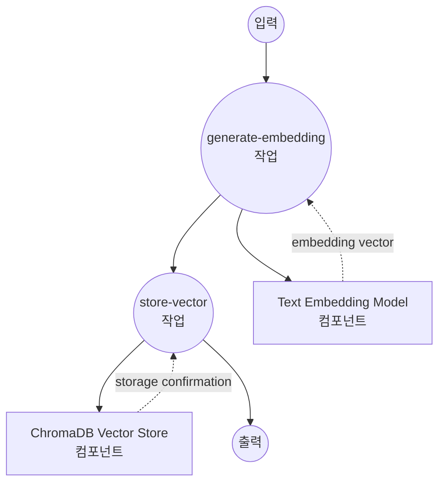
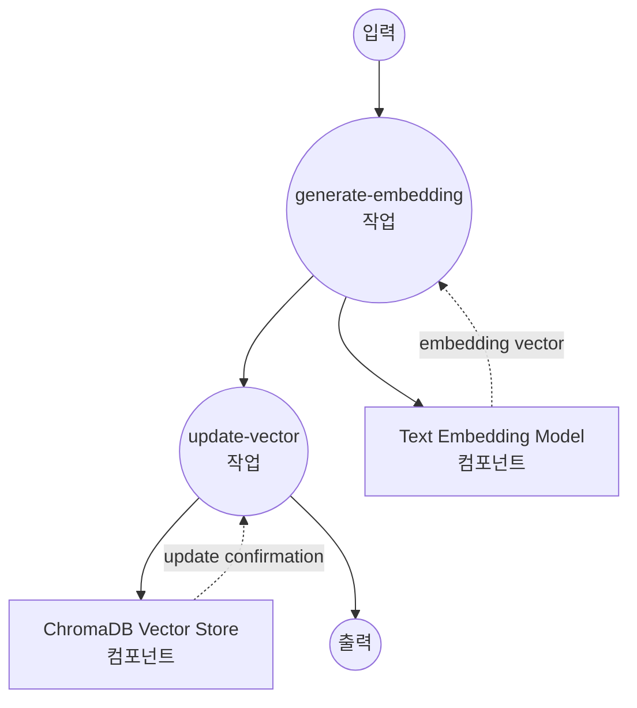
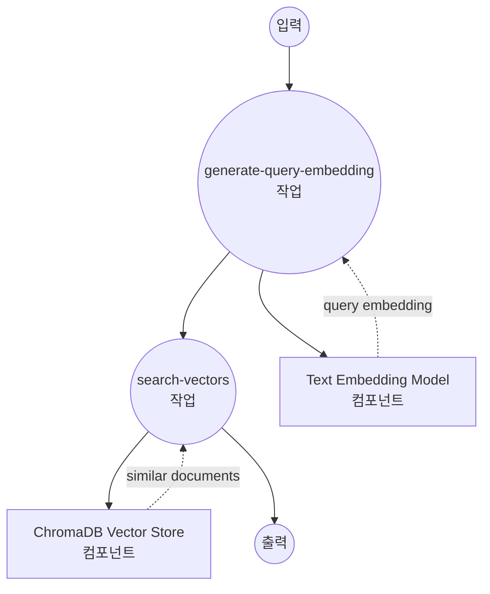
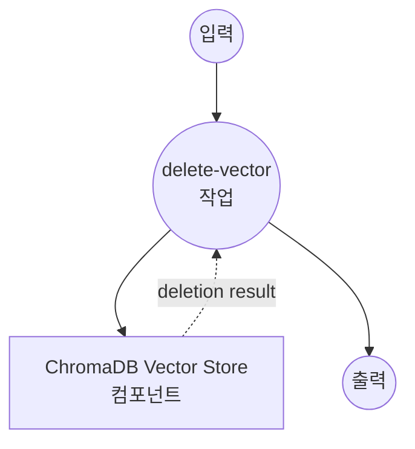

# ChromaDB 벡터 스토어 예제

이 예제는 텍스트 임베딩을 사용한 의미 검색 및 유사도 매칭을 위해 model-compose를 ChromaDB와 벡터 스토어로 사용하는 방법을 보여줍니다.

## 개요

이 워크플로우는 다음과 같은 완전한 벡터 데이터베이스 솔루션을 제공합니다:

1. **텍스트 임베딩 생성**: sentence transformers를 사용하여 텍스트를 벡터 임베딩으로 변환
2. **벡터 저장**: 메타데이터와 함께 ChromaDB에 임베딩 저장
3. **의미 검색**: 벡터 임베딩을 사용한 유사도 기반 검색 수행
4. **CRUD 연산**: insert, update, search, delete 연산 지원

## 준비사항

### 필수 요구사항

- model-compose가 설치되어 PATH에서 사용 가능
- ChromaDB 서버 (로컬 또는 원격)
- PyTorch 지원 Python

### ChromaDB 설치

model-compose는 워크플로우가 시작될 때 ChromaDB 및 필요한 종속성을 자동으로 설치합니다.

**선택 사항 - 외부 ChromaDB 서버:**
```bash
# 원격 ChromaDB 서버를 사용하는 경우에만 필요
docker run -p 8000:8000 chromadb/chroma
```

### 환경 구성

1. 이 예제 디렉토리로 이동:
   ```bash
   cd examples/vector-store/chroma
   ```

2. 추가 환경 구성이 필요하지 않습니다 - ChromaDB는 기본적으로 로컬에서 실행됩니다.

## 실행 방법

1. **서비스 시작:**
   ```bash
   model-compose up
   ```

2. **워크플로우 실행:**

   **텍스트 임베딩 삽입:**
   ```bash
   curl -X POST http://localhost:8080/api/workflows/runs \
     -H "Content-Type: application/json" \
     -d '{"workflow_id": "insert-sentence-embedding", "input": {"text": "This is a sample document about machine learning."}}}'
   ```

   **유사 텍스트 검색:**
   ```bash
   curl -X POST http://localhost:8080/api/workflows/runs \
     -H "Content-Type: application/json" \
     -d '{"workflow_id": "search-sentence-embeddings", "input": {"text": "artificial intelligence and neural networks"}}}'
   ```

   **웹 UI 사용:**
   - 웹 UI 열기: http://localhost:8081
   - 원하는 워크플로우 선택 (insert, search, update, delete)
   - 입력 매개변수 입력
   - "Run Workflow" 버튼 클릭

   **CLI 사용:**
   ```bash
   # 텍스트 임베딩 삽입
   model-compose run insert-sentence-embedding --input '{"text": "Machine learning is a subset of AI."}'

   # 유사 텍스트 검색
   model-compose run search-sentence-embeddings --input '{"text": "deep learning algorithms"}'
   ```

## 컴포넌트 세부사항

### 텍스트 임베딩 모델 컴포넌트 (embedding-model)
- **유형**: text-embedding task를 가진 모델 컴포넌트
- **목적**: 텍스트를 384차원 벡터 임베딩으로 변환
- **모델**: sentence-transformers/all-MiniLM-L6-v2
- **기능**:
  - 빠른 추론 속도
  - 우수한 의미 이해
  - 컴팩트한 임베딩 크기

### ChromaDB 벡터 스토어 컴포넌트 (vector-store)
- **유형**: 벡터 데이터베이스 컴포넌트
- **목적**: 메타데이터와 함께 벡터 임베딩 저장 및 검색
- **드라이버**: ChromaDB
- **기능**:
  - 벡터에 대한 CRUD 연산
  - 유사도 검색 기능
  - 메타데이터 저장 및 필터링
  - 로컬 및 원격 배포

## 워크플로우 세부사항

### "Insert Text Embedding" 워크플로우

**설명**: 텍스트 임베딩을 생성하고 ChromaDB 벡터 스토어에 삽입합니다.

#### 작업 흐름



#### 입력 매개변수

| 매개변수 | 유형 | 필수 | 기본값 | 설명 |
|---------|------|------|--------|------|
| `text` | string | 예 | - | 변환하고 저장할 텍스트 |

#### 출력 형식

| 필드 | 유형 | 설명 |
|-----|------|------|
| `ids` | string[] | 생성/할당된 벡터 ID 배열 |
| `affected_rows` | integer | 성공적으로 삽입된 벡터 수 |

### "Update Text Embedding" 워크플로우

**설명**: 새 텍스트 임베딩을 생성하고 ChromaDB의 기존 벡터를 업데이트합니다.

#### 작업 흐름



#### 입력 매개변수

| 매개변수 | 유형 | 필수 | 기본값 | 설명 |
|---------|------|------|--------|------|
| `vector_id` | string | 예 | - | 업데이트할 벡터의 ID |
| `text` | string | 예 | - | 임베딩을 생성할 새 텍스트 |

#### 출력 형식

| 필드 | 유형 | 설명 |
|-----|------|------|
| `affected_rows` | integer | 성공적으로 업데이트된 벡터 수 |

### "Search Similar Embeddings" 워크플로우

**설명**: 쿼리 임베딩을 생성하고 ChromaDB에서 유사한 벡터를 검색합니다.

#### 작업 흐름



#### 입력 매개변수

| 매개변수 | 유형 | 필수 | 기본값 | 설명 |
|---------|------|------|--------|------|
| `text` | string | 예 | - | 유사도 검색을 위한 쿼리 텍스트 |

#### 출력 형식

| 필드 | 유형 | 설명 |
|-----|------|------|
| `id` | string | 벡터 ID |
| `score` | number | 유사도 점수 (0-1, 높을수록 더 유사함) |
| `distance` | number | 벡터 거리 (낮을수록 더 유사함) |
| `metadata` | object | 관련 메타데이터 (output_fields로 필터링됨) |
| `document` | string | 원본 문서 텍스트 |
| `embedding` | number[] | 벡터 임베딩 값 |

### "Delete Text Embedding" 워크플로우

**설명**: ChromaDB 컬렉션에서 특정 벡터를 제거합니다.

#### 작업 흐름

이 워크플로우는 단순화된 단일 컴포넌트 구성을 사용합니다.



#### 입력 매개변수

| 매개변수 | 유형 | 필수 | 기본값 | 설명 |
|---------|------|------|--------|------|
| `vector_id` | string | 예 | - | 삭제할 벡터의 ID |

#### 출력 형식

| 필드 | 유형 | 설명 |
|-----|------|------|
| `affected_rows` | integer | 성공적으로 삭제된 벡터 수 |

## 사용 가능한 연산

### 삽입 연산
- **insert-sentence-embedding**: 텍스트 임베딩 삽입 - 텍스트 임베딩을 생성하고 ChromaDB 벡터 스토어에 삽입
- **update-sentence-embedding**: 텍스트 임베딩 업데이트 - 새 텍스트 임베딩을 생성하고 ChromaDB의 기존 벡터 업데이트

### 검색 연산
- **search-sentence-embeddings**: 유사 임베딩 검색 - 쿼리 임베딩을 생성하고 ChromaDB에서 유사한 벡터 검색

### 관리 연산
- **delete-sentence-embedding**: 텍스트 임베딩 삭제 - ChromaDB 컬렉션에서 특정 벡터 제거

## 사용자 정의

### 임베딩 모델 선택

```yaml
components:
  - id: embedding-model
    type: model
    task: text-embedding
    model: sentence-transformers/all-mpnet-base-v2  # 더 높은 정확도
    # or
    model: sentence-transformers/paraphrase-multilingual-MiniLM-L12-v2  # 다국어
```

### ChromaDB 구성

#### 원격 ChromaDB 인스턴스
```yaml
components:
  - id: vector-store
    type: vector-store
    driver: chroma
    host: your-chroma-server.com
    port: 8000
```

#### 사용자 정의 컬렉션 설정
```yaml
actions:
  - id: insert
    collection: documents  # 사용자 정의 컬렉션 이름
    method: insert
```
