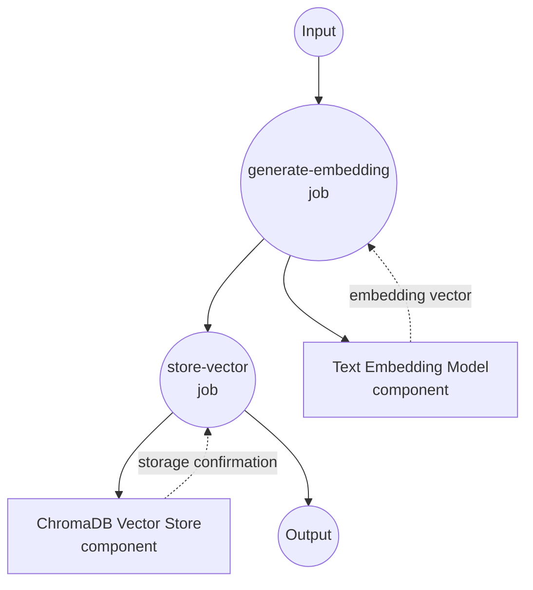
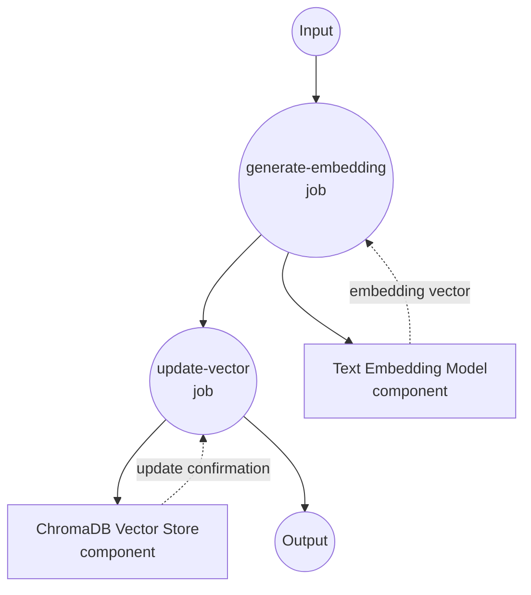
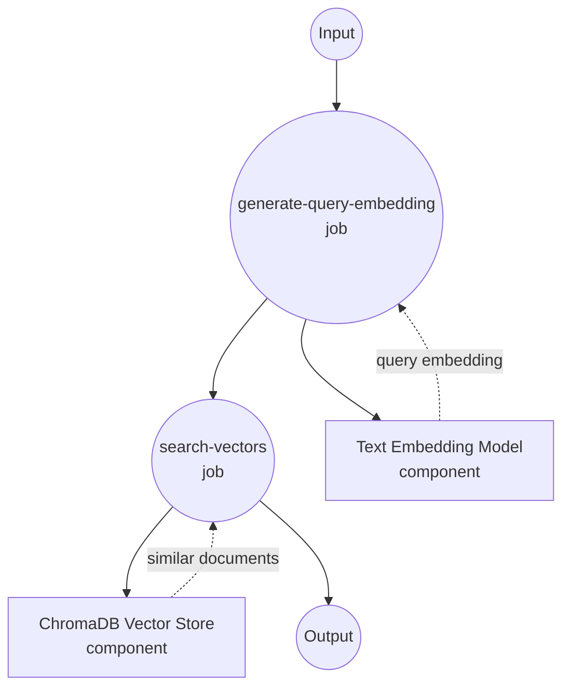
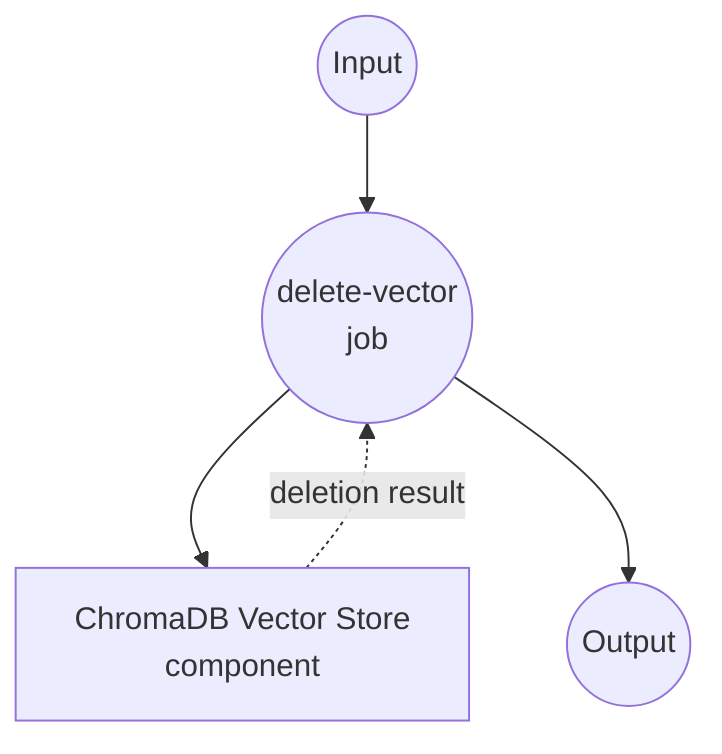

# ChromaDB Vector Store Example

This example demonstrates how to use model-compose with ChromaDB as a vector store for semantic search and similarity matching using text embeddings.

## Overview

This workflow provides a complete vector database solution that:

1. **Text Embedding Generation**: Converts text to vector embeddings using sentence transformers
2. **Vector Storage**: Stores embeddings in ChromaDB with metadata
3. **Semantic Search**: Performs similarity-based searches using vector embeddings
4. **CRUD Operations**: Supports insert, update, search, and delete operations

## Preparation

### Prerequisites

- model-compose installed and available in your PATH
- ChromaDB server (local or remote)
- Python with PyTorch support

### ChromaDB Installation

```bash
# Install ChromaDB
pip install chromadb

# Or run with Docker
docker run -p 8000:8000 chromadb/chroma
```

### Model Dependencies

```bash
# Install sentence transformers
pip install sentence-transformers torch
```

### Environment Configuration

1. Navigate to this example directory:
   ```bash
   cd examples/vector-store/chroma
   ```

2. No additional environment configuration required - ChromaDB runs locally by default.

## How to Run

1. **Start the service:**
   ```bash
   model-compose up
   ```

2. **Run the workflows:**

   **Insert Text Embedding:**
   ```bash
   curl -X POST http://localhost:8080/api/workflows/runs \
     -H "Content-Type: application/json" \
     -d '{"workflow_id": "insert-sentence-embedding", "input": {"text": "This is a sample document about machine learning."}}}'
   ```

   **Search Similar Texts:**
   ```bash
   curl -X POST http://localhost:8080/api/workflows/runs \
     -H "Content-Type: application/json" \
     -d '{"workflow_id": "search-sentence-embeddings", "input": {"text": "artificial intelligence and neural networks"}}}'
   ```

   **Using Web UI:**
   - Open the Web UI: http://localhost:8081
   - Select the desired workflow (insert, search, update, delete)
   - Enter your input parameters
   - Click the "Run Workflow" button

   **Using CLI:**
   ```bash
   # Insert text embedding
   model-compose run insert-sentence-embedding --input '{"text": "Machine learning is a subset of AI."}'

   # Search for similar texts
   model-compose run search-sentence-embeddings --input '{"text": "deep learning algorithms"}'
   ```

## Component Details

### Text Embedding Model Component (embedding-model)
- **Type**: Model component with text-embedding task
- **Purpose**: Convert text to 384-dimensional vector embeddings
- **Model**: sentence-transformers/all-MiniLM-L6-v2
- **Features**:
  - Fast inference speed
  - Good semantic understanding
  - Compact embedding size

### ChromaDB Vector Store Component (vector-store)
- **Type**: Vector database component
- **Purpose**: Store and search vector embeddings with metadata
- **Driver**: ChromaDB
- **Features**:
  - CRUD operations on vectors
  - Similarity search capabilities
  - Metadata storage and filtering
  - Local and remote deployment

## Workflow Details

### "Insert Text Embedding" Workflow

**Description**: Generate text embedding and insert it into ChromaDB vector store.

#### Job Flow



#### Input Parameters

| Parameter | Type | Required | Default | Description |
|-----------|------|----------|---------|-------------|
| `text` | string | Yes | - | Text to convert and store |

#### Output Format

| Field | Type | Description |
|-------|------|-------------|
| `ids` | string[] | Array of generated/assigned vector IDs |
| `affected_rows` | integer | Number of vectors successfully inserted |

### "Update Text Embedding" Workflow

**Description**: Generate new text embedding and update existing vector in ChromaDB.

#### Job Flow



#### Input Parameters

| Parameter | Type | Required | Default | Description |
|-----------|------|----------|---------|-------------|
| `vector_id` | string | Yes | - | ID of the vector to update |
| `text` | string | Yes | - | New text to generate embedding for |

#### Output Format

| Field | Type | Description |
|-------|------|-------------|
| `affected_rows` | integer | Number of vectors successfully updated |

### "Search Similar Embeddings" Workflow

**Description**: Generate query embedding and search for similar vectors in ChromaDB.

#### Job Flow



#### Input Parameters

| Parameter | Type | Required | Default | Description |
|-----------|------|----------|---------|-------------|
| `text` | string | Yes | - | Query text for similarity search |

#### Output Format

| Field | Type | Description |
|-------|------|-------------|
| `id` | string | Vector ID |
| `score` | number | Similarity score (0-1, higher is more similar) |
| `distance` | number | Vector distance (lower is more similar) |
| `metadata` | object | Associated metadata (filtered by output_fields) |
| `document` | string | Original document text |
| `embedding` | number[] | Vector embedding values |

### "Delete Text Embedding" Workflow

**Description**: Remove a specific vector from the ChromaDB collection.

#### Job Flow

This workflow uses a simplified single-component configuration.



#### Input Parameters

| Parameter | Type | Required | Default | Description |
|-----------|------|----------|---------|-------------|
| `vector_id` | string | Yes | - | ID of the vector to delete |

#### Output Format

| Field | Type | Description |
|-------|------|-------------|
| `affected_rows` | integer | Number of vectors successfully deleted |

## Available Operations

### Insert Operations
- **insert-sentence-embedding**: Insert Text Embedding - Generate text embedding and insert it into ChromaDB vector store
- **update-sentence-embedding**: Update Text Embedding - Generate new text embedding and update existing vector in ChromaDB

### Search Operations
- **search-sentence-embeddings**: Search Similar Embeddings - Generate query embedding and search for similar vectors in ChromaDB

### Management Operations
- **delete-sentence-embedding**: Delete Text Embedding - Remove a specific vector from the ChromaDB collection

## Customization

### Embedding Model Selection

```yaml
components:
  - id: embedding-model
    type: model
    task: text-embedding
    model: sentence-transformers/all-mpnet-base-v2  # Higher accuracy
    # or
    model: sentence-transformers/paraphrase-multilingual-MiniLM-L12-v2  # Multilingual
```

### ChromaDB Configuration

#### Remote ChromaDB Instance
```yaml
components:
  - id: vector-store
    type: vector-store
    driver: chroma
    host: your-chroma-server.com
    port: 8000
```

#### Custom Collection Settings
```yaml
actions:
  - id: insert
    collection: documents  # Custom collection name
    method: insert
```
