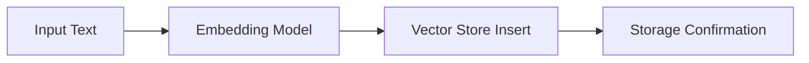
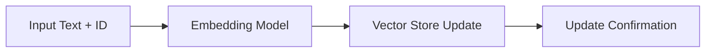
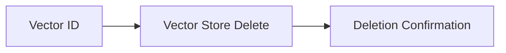

# ChromaDB Vector Store Example

This example demonstrates how to use model-compose with ChromaDB as a vector store for semantic search and similarity matching. It provides a complete pipeline for embedding text, storing vectors, and performing similarity searches using the `sentence-transformers/all-MiniLM-L6-v2` embedding model.

## Overview

ChromaDB is an open-source embedding database designed for building AI applications. This configuration showcases:

- Text embedding generation using sentence transformers
- Vector storage and retrieval with ChromaDB
- CRUD operations on vector embeddings
- Semantic similarity search capabilities
- Web UI for interactive testing

## Prerequisites

### ChromaDB Installation
```bash
# Install ChromaDB
pip install chromadb

# Or run with Docker
docker run -p 8000:8000 chromadb/chroma
```

### Model Dependencies
```bash
# Install sentence transformers
pip install sentence-transformers torch
```

### Environment Setup
```bash
# Install model-compose
pip install -e .
```

## Architecture

The system consists of two main components:

### Components

#### 1. Embedding Model (`embedding-model`)
- **Type**: Local model
- **Task**: Text embedding
- **Model**: `sentence-transformers/all-MiniLM-L6-v2`
- **Purpose**: Converts text into 384-dimensional vector embeddings

#### 2. Vector Store (`vector-store`)
- **Type**: Vector database
- **Driver**: ChromaDB
- **Collection**: `test`
- **Purpose**: Stores and searches vector embeddings

### Available Actions

| Action | Method | Description |
|--------|---------|-------------|
| `insert` | INSERT | Add new vector with metadata |
| `update` | UPDATE | Modify existing vector by ID |
| `search` | SEARCH | Find similar vectors |
| `delete` | DELETE | Remove vector by ID |

## Workflows

### 1. Insert Sentence Embedding

Converts text to embeddings and stores them in ChromaDB.



**Input Parameters:**
| Parameter | Type | Required | Description |
|-----------|------|----------|-------------|
| `text` | string | Yes | Text to convert and store |

**Output:**
- JSON confirmation with insertion status

**Usage Example:**
```bash
curl -X POST http://localhost:8080/api/insert-sentence-embedding \
  -H "Content-Type: application/json" \
  -d '{"text": "This is a sample document about machine learning."}'
```

### 2. Update Sentence Embedding

Updates an existing vector embedding with new text.



**Input Parameters:**
| Parameter | Type | Required | Description |
|-----------|------|----------|-------------|
| `text` | string | Yes | New text content |
| `vector_id` | string | Yes | ID of vector to update |

**Output:**
- JSON confirmation with update status

**Usage Example:**
```bash
curl -X POST http://localhost:8080/api/update-sentence-embedding \
  -H "Content-Type: application/json" \
  -d '{
    "text": "Updated content about deep learning.",
    "vector_id": "doc_123"
  }'
```

### 3. Search Sentence Embeddings

Performs semantic similarity search using query text.


**Input Parameters:**
| Parameter | Type | Required | Description |
|-----------|------|----------|-------------|
| `text` | string | Yes | Query text for similarity search |

**Output:**
- Array of objects with `id`, `score`, and `metadata.text`
- Results sorted by similarity score (higher = more similar)

**Usage Example:**
```bash
curl -X POST http://localhost:8080/api/search-sentence-embeddings \
  -H "Content-Type: application/json" \
  -d '{"text": "artificial intelligence and neural networks"}'
```

**Sample Response:**
```json
[
  {
    "id": "doc_123",
    "score": 0.85,
    "metadata": {
      "text": "Deep learning and neural networks are subsets of machine learning."
    }
  },
  {
    "id": "doc_456",
    "score": 0.72,
    "metadata": {
      "text": "AI applications include computer vision and natural language processing."
    }
  }
]
```

### 4. Delete Sentence Embedding

Removes a vector embedding by its ID.



**Input Parameters:**
| Parameter | Type | Required | Description |
|-----------|------|----------|-------------|
| `vector_id` | string | Yes | ID of vector to delete |

**Output:**
- JSON confirmation with deletion status

**Usage Example:**
```bash
curl -X POST http://localhost:8080/api/delete-sentence-embedding \
  -H "Content-Type: application/json" \
  -d '{"vector_id": "doc_123"}'
```

## How to Run Instructions

### 1. Start the Service

```bash
# Navigate to the example directory
cd examples/vector-store/chroma

# Start the controller
model-compose up
```

This starts:
- HTTP API server on port 8080
- Gradio web interface on port 8081

### 2. Access the Web UI

Open http://localhost:8081 in your browser to interact with the workflows through a web interface.

### 3. API Endpoints

Base URL: `http://localhost:8080/api`

- `POST /insert-sentence-embedding` - Store new text embeddings
- `POST /update-sentence-embedding` - Update existing embeddings
- `POST /search-sentence-embeddings` - Search for similar texts
- `POST /delete-sentence-embedding` - Remove embeddings

## System Requirements

### Hardware
- **RAM**: 2GB+ for embedding model
- **Storage**: 500MB for model files
- **CPU**: Multi-core recommended for better performance

### Software
- Python 3.8+
- PyTorch (CPU or GPU)
- ChromaDB server (local or remote)

## Customization Options

### Embedding Model

Change the embedding model in `model-compose.yml`:

```yaml
components:
  - id: embedding-model
    type: model
    task: text-embedding
    model: sentence-transformers/all-mpnet-base-v2  # More accurate but larger
    # or
    model: sentence-transformers/paraphrase-multilingual-MiniLM-L12-v2  # Multilingual
```

### ChromaDB Configuration

For remote ChromaDB instance:

```yaml
components:
  - id: vector-store
    type: vector-store
    driver: chroma
    host: your-chroma-server.com
    port: 8000
    # Add authentication if needed
```

### Collection Settings

Modify collection names and settings:

```yaml
actions:
  - id: insert
    collection: documents  # Custom collection name
    method: insert
```

## Performance Considerations

### Embedding Model Performance
- **all-MiniLM-L6-v2**: Fast, 384 dimensions, good for most use cases
- **all-mpnet-base-v2**: Slower, 768 dimensions, higher accuracy
- **all-distilroberta-v1**: Balanced speed and accuracy

### ChromaDB Performance
- Use persistent storage for production
- Consider batch operations for large datasets
- Monitor memory usage with large collections

## Use Cases

### Document Search
Store and search through document collections using semantic similarity rather than keyword matching.

### FAQ Systems
Build intelligent FAQ systems that understand user questions and find relevant answers.

### Content Recommendation
Recommend similar articles, products, or content based on embeddings.

### Duplicate Detection
Identify duplicate or near-duplicate content using similarity thresholds.

### Clustering and Classification
Group similar documents or classify content based on embedding similarity.

## Troubleshooting

### Model Download Issues
If the embedding model fails to download:
```bash
# Pre-download the model
python -c "from sentence_transformers import SentenceTransformer; SentenceTransformer('sentence-transformers/all-MiniLM-L6-v2')"
```

### ChromaDB Connection Issues
- Ensure ChromaDB is running and accessible
- Check firewall settings for port 8000
- Verify ChromaDB version compatibility

### Memory Issues
- Reduce batch size for large documents
- Use smaller embedding models for resource-constrained environments
- Consider using quantized models for edge deployment

## API Rate Limits

This example uses local models and ChromaDB, so there are no external API rate limits. Performance is limited by:
- Local hardware capabilities
- ChromaDB performance characteristics
- Model inference speed