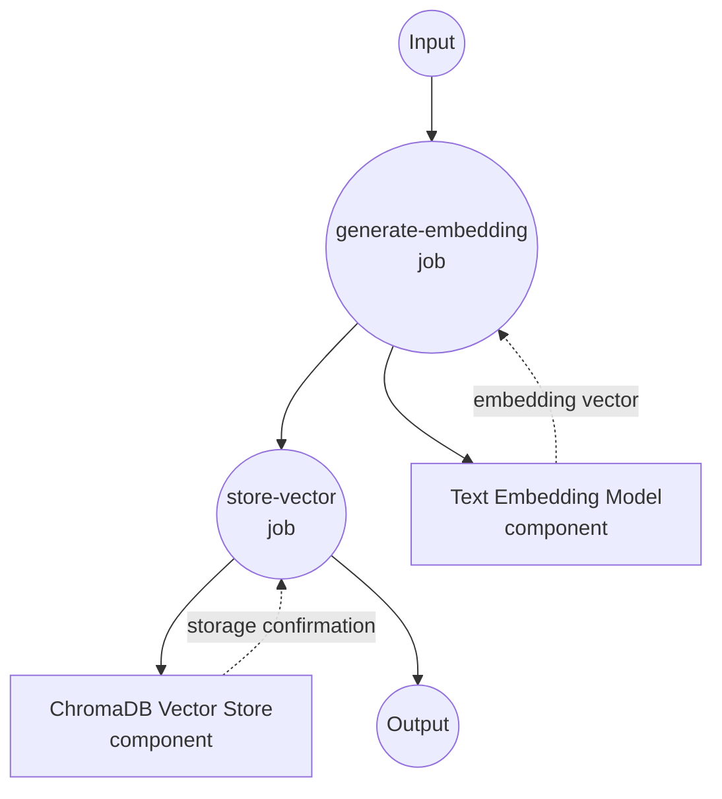
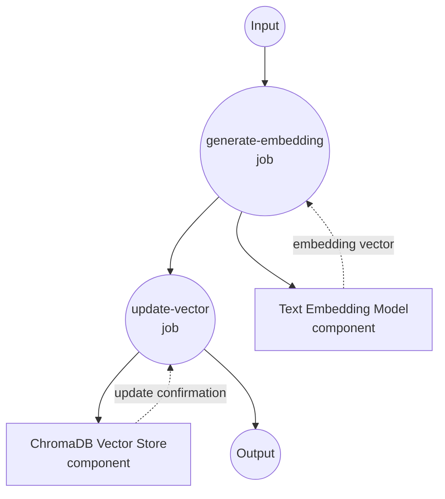
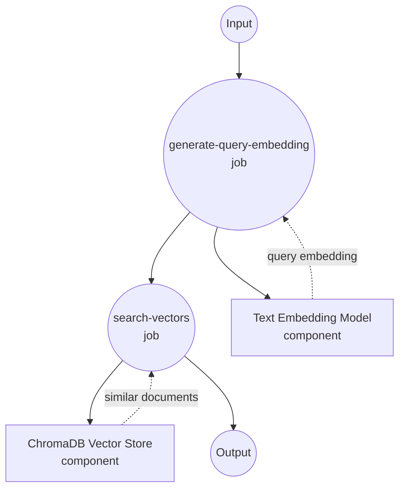
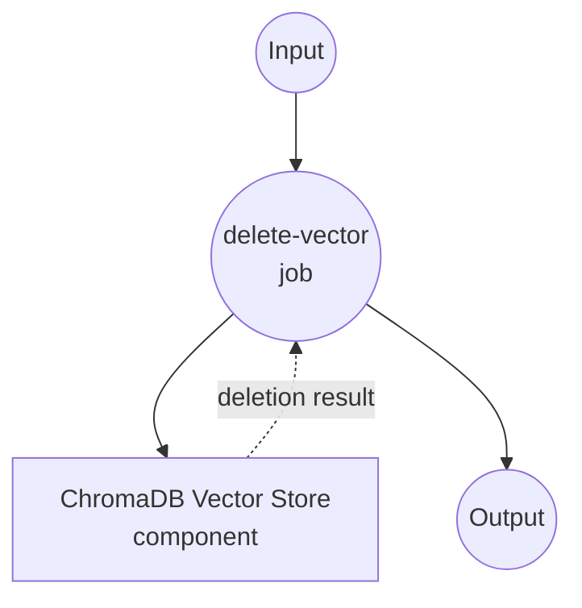

# ChromaDB Vector Store 示例

本示例演示如何使用 model-compose 与 ChromaDB 作为向量存储，利用文本嵌入进行语义搜索和相似度匹配。

## 概述

此工作流提供了一个完整的向量数据库解决方案，具有以下功能：

1. **文本嵌入生成**：使用句子转换器将文本转换为向量嵌入
2. **向量存储**：在 ChromaDB 中存储带有元数据的嵌入
3. **语义搜索**：使用向量嵌入执行基于相似度的搜索
4. **CRUD 操作**：支持插入、更新、搜索和删除操作

## 准备工作

### 前置要求

- 已安装 model-compose 并在 PATH 中可用
- ChromaDB 服务器（本地或远程）
- 支持 PyTorch 的 Python

### ChromaDB 安装

model-compose 在工作流启动时自动安装 ChromaDB 和所需的依赖项。

**可选 - 外部 ChromaDB 服务器：**
```bash
# 仅在使用远程 ChromaDB 服务器时需要
docker run -p 8000:8000 chromadb/chroma
```

### 环境配置

1. 导航到此示例目录：
   ```bash
   cd examples/vector-store/chroma
   ```

2. 无需额外的环境配置 - ChromaDB 默认在本地运行。

## 如何运行

1. **启动服务：**
   ```bash
   model-compose up
   ```

2. **运行工作流：**

   **插入文本嵌入：**
   ```bash
   curl -X POST http://localhost:8080/api/workflows/runs \
     -H "Content-Type: application/json" \
     -d '{"workflow_id": "insert-sentence-embedding", "input": {"text": "这是一个关于机器学习的示例文档。"}}}'
   ```

   **搜索相似文本：**
   ```bash
   curl -X POST http://localhost:8080/api/workflows/runs \
     -H "Content-Type: application/json" \
     -d '{"workflow_id": "search-sentence-embeddings", "input": {"text": "人工智能和神经网络"}}}'
   ```

   **使用 Web UI：**
   - 打开 Web UI：http://localhost:8081
   - 选择所需的工作流（插入、搜索、更新、删除）
   - 输入你的输入参数
   - 点击"运行工作流"按钮

   **使用 CLI：**
   ```bash
   # 插入文本嵌入
   model-compose run insert-sentence-embedding --input '{"text": "机器学习是 AI 的一个子集。"}'

   # 搜索相似文本
   model-compose run search-sentence-embeddings --input '{"text": "深度学习算法"}'
   ```

## 组件详情

### Text Embedding Model 组件（embedding-model）
- **类型**：带文本嵌入任务的模型组件
- **用途**：将文本转换为 384 维向量嵌入
- **模型**：sentence-transformers/all-MiniLM-L6-v2
- **特性**：
  - 快速推理速度
  - 良好的语义理解
  - 紧凑的嵌入尺寸

### ChromaDB Vector Store 组件（vector-store）
- **类型**：向量数据库组件
- **用途**：存储和搜索带有元数据的向量嵌入
- **驱动**：ChromaDB
- **特性**：
  - 向量的 CRUD 操作
  - 相似度搜索功能
  - 元数据存储和过滤
  - 本地和远程部署

## 工作流详情

### "插入文本嵌入"工作流

**描述**：生成文本嵌入并将其插入 ChromaDB 向量存储。

#### 作业流程



#### 输入参数

| 参数 | 类型 | 必需 | 默认值 | 描述 |
|-----------|------|----------|---------|-------------|
| `text` | string | 是 | - | 要转换和存储的文本 |

#### 输出格式

| 字段 | 类型 | 描述 |
|-------|------|-------------|
| `ids` | string[] | 生成/分配的向量 ID 数组 |
| `affected_rows` | integer | 成功插入的向量数 |

### "更新文本嵌入"工作流

**描述**：生成新的文本嵌入并更新 ChromaDB 中的现有向量。

#### 作业流程



#### 输入参数

| 参数 | 类型 | 必需 | 默认值 | 描述 |
|-----------|------|----------|---------|-------------|
| `vector_id` | string | 是 | - | 要更新的向量 ID |
| `text` | string | 是 | - | 用于生成嵌入的新文本 |

#### 输出格式

| 字段 | 类型 | 描述 |
|-------|------|-------------|
| `affected_rows` | integer | 成功更新的向量数 |

### "搜索相似嵌入"工作流

**描述**：生成查询嵌入并在 ChromaDB 中搜索相似向量。

#### 作业流程



#### 输入参数

| 参数 | 类型 | 必需 | 默认值 | 描述 |
|-----------|------|----------|---------|-------------|
| `text` | string | 是 | - | 用于相似度搜索的查询文本 |

#### 输出格式

| 字段 | 类型 | 描述 |
|-------|------|-------------|
| `id` | string | 向量 ID |
| `score` | number | 相似度分数（0-1，越高越相似）|
| `distance` | number | 向量距离（越低越相似）|
| `metadata` | object | 关联的元数据（由 output_fields 过滤）|
| `document` | string | 原始文档文本 |
| `embedding` | number[] | 向量嵌入值 |

### "删除文本嵌入"工作流

**描述**：从 ChromaDB 集合中删除特定向量。

#### 作业流程

此工作流使用简化的单组件配置。



#### 输入参数

| 参数 | 类型 | 必需 | 默认值 | 描述 |
|-----------|------|----------|---------|-------------|
| `vector_id` | string | 是 | - | 要删除的向量 ID |

#### 输出格式

| 字段 | 类型 | 描述 |
|-------|------|-------------|
| `affected_rows` | integer | 成功删除的向量数 |

## 可用操作

### 插入操作
- **insert-sentence-embedding**：插入文本嵌入 - 生成文本嵌入并将其插入 ChromaDB 向量存储
- **update-sentence-embedding**：更新文本嵌入 - 生成新的文本嵌入并更新 ChromaDB 中的现有向量

### 搜索操作
- **search-sentence-embeddings**：搜索相似嵌入 - 生成查询嵌入并在 ChromaDB 中搜索相似向量

### 管理操作
- **delete-sentence-embedding**：删除文本嵌入 - 从 ChromaDB 集合中删除特定向量

## 自定义

### 嵌入模型选择

```yaml
components:
  - id: embedding-model
    type: model
    task: text-embedding
    model: sentence-transformers/all-mpnet-base-v2  # 更高准确性
    # 或
    model: sentence-transformers/paraphrase-multilingual-MiniLM-L12-v2  # 多语言
```

### ChromaDB 配置

#### 远程 ChromaDB 实例
```yaml
components:
  - id: vector-store
    type: vector-store
    driver: chroma
    host: your-chroma-server.com
    port: 8000
```

#### 自定义集合设置
```yaml
actions:
  - id: insert
    collection: documents  # 自定义集合名称
    method: insert
```
