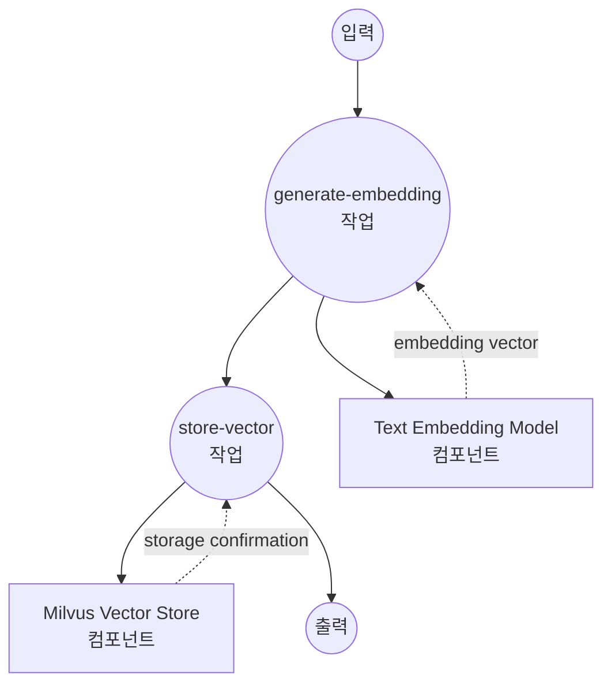
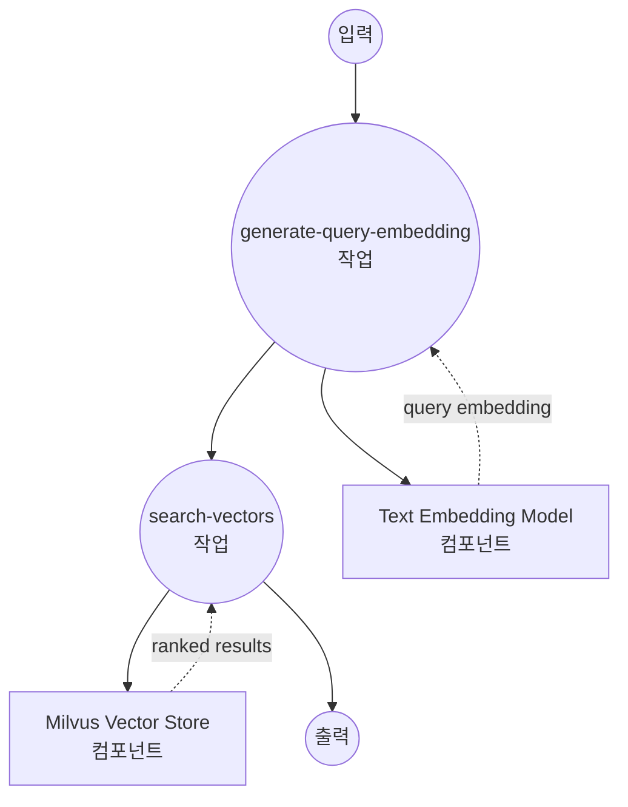
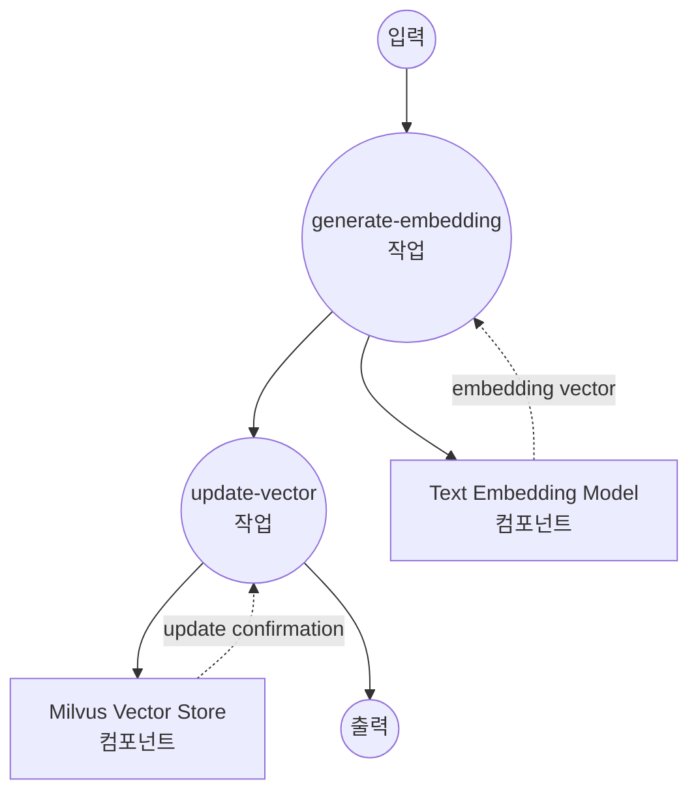
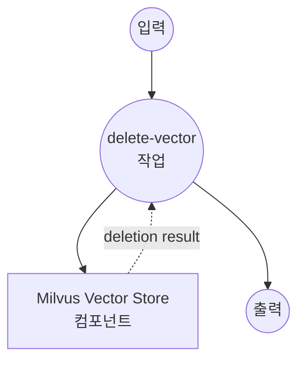

# Milvus 벡터 스토어 예제

이 예제는 텍스트 임베딩을 사용한 대규모 의미 검색 및 유사도 매칭을 위해 model-compose를 Milvus 벡터 데이터베이스와 함께 사용하는 방법을 보여줍니다.

## 개요

이 워크플로우는 다음과 같은 프로덕션 준비 벡터 데이터베이스 솔루션을 제공합니다:

1. **고성능 텍스트 임베딩**: sentence transformers를 사용하여 텍스트를 벡터 임베딩으로 변환
2. **확장 가능한 벡터 저장**: 엔터프라이즈급 성능으로 Milvus에 임베딩 저장
3. **빠른 유사도 검색**: 벡터 임베딩을 사용한 밀리초 미만의 의미 검색 수행
4. **완전한 CRUD 연산**: 정수 ID를 사용한 insert, update, search, delete 연산 지원

## 준비사항

### 필수 요구사항

- model-compose가 설치되어 PATH에서 사용 가능
- Milvus 서버 (로컬 또는 원격)
- PyTorch 지원 Python

### Milvus 설치

#### 옵션 1: Docker Compose (권장)
```bash
# Milvus docker-compose.yml 다운로드
wget https://github.com/milvus-io/milvus/releases/download/v2.3.0/milvus-standalone-docker-compose.yml -O docker-compose.yml

# Milvus 시작
docker-compose up -d

# 설치 확인
curl http://localhost:19530/health
```

#### 옵션 2: Milvus Cloud (Zilliz)
```bash
# https://cloud.zilliz.com/에서 가입
# 대시보드에서 연결 세부 정보 가져오기
```

### 환경 구성

1. 이 예제 디렉토리로 이동:
   ```bash
   cd examples/vector-store/milvus
   ```

2. Milvus가 포트 19530에서 실행 중이고 접근 가능한지 확인합니다.

## 실행 방법

1. **서비스 시작:**
   ```bash
   model-compose up
   ```

2. **워크플로우 실행:**

   **텍스트 임베딩 삽입:**
   ```bash
   curl -X POST http://localhost:8080/api/workflows/runs \
     -H "Content-Type: application/json" \
     -d '{"workflow_id": "insert-sentence-embedding", "input": {"text": "This is a comprehensive guide to machine learning algorithms."}}}'
   ```

   **텍스트 임베딩 업데이트:**
   ```bash
   curl -X POST http://localhost:8080/api/workflows/runs \
     -H "Content-Type: application/json" \
     -d '{"workflow_id": "update-sentence-embedding", "input": {"vector_id": 1, "text": "Updated content about advanced machine learning techniques."}}'
   ```

   **유사 텍스트 검색:**
   ```bash
   curl -X POST http://localhost:8080/api/workflows/runs \
     -H "Content-Type: application/json" \
     -d '{"workflow_id": "search-sentence-embeddings", "input": {"text": "artificial intelligence and deep learning techniques"}}}'
   ```

   **텍스트 임베딩 삭제:**
   ```bash
   curl -X POST http://localhost:8080/api/workflows/runs \
     -H "Content-Type: application/json" \
     -d '{"workflow_id": "delete-sentence-embedding", "input": {"vector_id": 1}}'
   ```

   **웹 UI 사용:**
   - 웹 UI 열기: http://localhost:8081
   - 원하는 워크플로우 선택 (insert, search, update, delete)
   - 입력 매개변수 입력
   - "Run Workflow" 버튼 클릭

   **CLI 사용:**
   ```bash
   # 텍스트 임베딩 삽입
   model-compose run insert-sentence-embedding --input '{"text": "Machine learning is transforming technology."}'

   # 기존 텍스트 임베딩 업데이트
   model-compose run update-sentence-embedding --input '{
     "vector_id": 1,
     "text": "Advanced neural networks and AI systems."
   }'

   # 유사 텍스트 검색
   model-compose run search-sentence-embeddings --input '{"text": "deep learning algorithms"}'

   # 텍스트 임베딩 삭제
   model-compose run delete-sentence-embedding --input '{"vector_id": 1}'
   ```

## 컴포넌트 세부사항

### 텍스트 임베딩 모델 컴포넌트 (embedding-model)
- **유형**: text-embedding task를 가진 모델 컴포넌트
- **목적**: 텍스트를 384차원 벡터 임베딩으로 변환
- **모델**: sentence-transformers/all-MiniLM-L6-v2
- **기능**:
  - 빠른 추론 속도
  - 고품질 의미 이해
  - 컴팩트한 임베딩 크기

### Milvus 벡터 스토어 컴포넌트 (vector-store)
- **유형**: 벡터 데이터베이스 컴포넌트
- **목적**: 고성능 벡터 저장 및 유사도 검색
- **드라이버**: Milvus
- **기능**:
  - 엔터프라이즈급 확장성
  - 밀리초 미만의 검색 성능
  - 정수 ID를 사용한 CRUD 연산
  - 프로덕션 준비 안정성

## 워크플로우 세부사항

### "Insert Text Embedding" 워크플로우

**설명**: 텍스트 임베딩을 생성하고 Milvus 벡터 데이터베이스에 삽입합니다.

#### 작업 흐름



#### 입력 매개변수

| 매개변수 | 유형 | 필수 | 기본값 | 설명 |
|---------|------|------|--------|------|
| `text` | string | 예 | - | 변환하고 저장할 텍스트 |

#### 출력 형식

| 필드 | 유형 | 설명 |
|-----|------|------|
| `ids` | integer[] | 생성/할당된 벡터 ID 배열 |
| `affected_rows` | integer | 성공적으로 삽입된 벡터 수 |

### "Search Similar Embeddings" 워크플로우

**설명**: 쿼리 임베딩을 생성하고 Milvus 데이터베이스에서 유사한 벡터를 검색합니다.

#### 작업 흐름



#### 입력 매개변수

| 매개변수 | 유형 | 필수 | 기본값 | 설명 |
|---------|------|------|--------|------|
| `text` | string | 예 | - | 유사도 검색을 위한 쿼리 텍스트 |

#### 출력 형식

| 필드 | 유형 | 설명 |
|-----|------|------|
| `id` | integer | 벡터 ID |
| `score` | number | 유사도 점수 (0-1, 높을수록 더 유사함) |
| `distance` | number | 벡터 거리 (낮을수록 더 유사함) |
| `metadata` | object | 관련 메타데이터 (output_fields로 필터링됨) |

### "Update Text Embedding" 워크플로우

**설명**: 새 텍스트 임베딩을 생성하고 Milvus 데이터베이스의 기존 벡터를 업데이트합니다.

#### 작업 흐름



#### 입력 매개변수

| 매개변수 | 유형 | 필수 | 기본값 | 설명 |
|---------|------|------|--------|------|
| `vector_id` | integer | 예 | - | 업데이트할 벡터의 ID |
| `text` | string | 예 | - | 임베딩을 생성할 새 텍스트 |

#### 출력 형식

| 필드 | 유형 | 설명 |
|-----|------|------|
| `affected_rows` | integer | 성공적으로 업데이트된 벡터 수 |

### "Delete Text Embedding" 워크플로우

**설명**: Milvus 컬렉션에서 특정 벡터를 제거합니다.

#### 작업 흐름

이 워크플로우는 단순화된 단일 컴포넌트 구성을 사용합니다.



#### 입력 매개변수

| 매개변수 | 유형 | 필수 | 기본값 | 설명 |
|---------|------|------|--------|------|
| `vector_id` | integer | 예 | - | 삭제할 벡터의 ID |

#### 출력 형식

| 필드 | 유형 | 설명 |
|-----|------|------|
| `affected_rows` | integer | 성공적으로 삭제된 벡터 수 |

## 사용자 정의

### Milvus 구성

#### 원격 Milvus 인스턴스
```yaml
components:
  - id: vector-store
    type: vector-store
    driver: milvus
    host: your-milvus-server.com
    port: 19530
    protocol: https
    database: production
```

#### Milvus Cloud (Zilliz)
```yaml
components:
  - id: vector-store
    type: vector-store
    driver: milvus
    host: your-cluster.aws-us-west-2.vectordb.zillizcloud.com
    port: 19530
    protocol: https
    token: ${env.ZILLIZ_API_KEY}
```

### 임베딩 모델 옵션

#### 더 높은 정확도 모델
```yaml
components:
  - id: embedding-model
    type: model
    task: text-embedding
    model: sentence-transformers/all-mpnet-base-v2  # 768 차원, 더 높은 정확도
```

#### 다국어 모델
```yaml
components:
  - id: embedding-model
    type: model
    task: text-embedding
    model: sentence-transformers/paraphrase-multilingual-MiniLM-L12-v2
```

### 컬렉션 및 인덱스 설정

```yaml
actions:
  - id: search
    collection: documents
    method: search
    search_params:
      metric_type: "L2"  # 유클리드 거리
      params: {"nprobe": 16}
```
