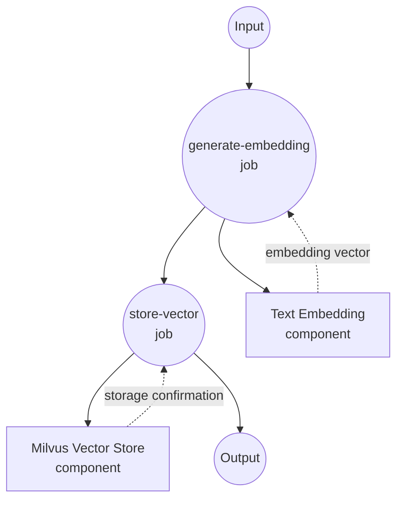
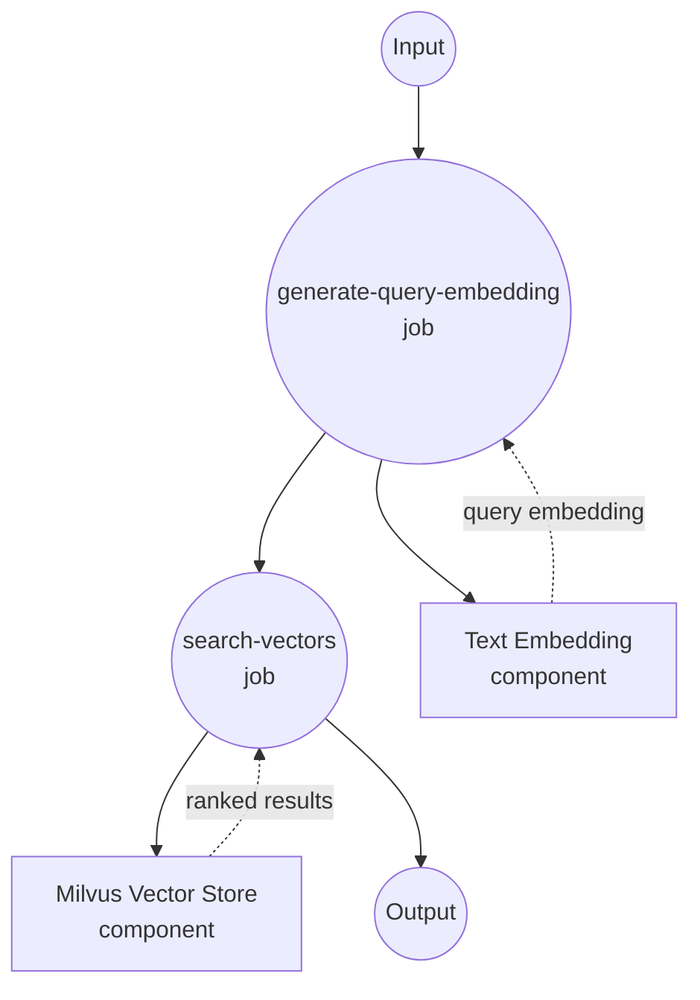

# Milvus Vector Store Example

This example demonstrates how to use model-compose with Milvus as a vector database for large-scale semantic search and similarity matching using text embeddings.

## Overview

This workflow provides a production-ready vector database solution that:

1. **High-Performance Text Embedding**: Converts text to vector embeddings using sentence transformers
2. **Scalable Vector Storage**: Stores embeddings in Milvus with enterprise-grade performance
3. **Fast Similarity Search**: Performs sub-millisecond semantic searches using vector embeddings
4. **Complete CRUD Operations**: Supports insert, update, search, and delete operations with integer IDs

## Preparation

### Prerequisites

- model-compose installed and available in your PATH
- Milvus server (local or remote)
- Python with PyTorch support

### Milvus Installation

#### Option 1: Docker Compose (Recommended)
```bash
# Download Milvus docker-compose.yml
wget https://github.com/milvus-io/milvus/releases/download/v2.3.0/milvus-standalone-docker-compose.yml -O docker-compose.yml

# Start Milvus
docker-compose up -d

# Verify installation
curl http://localhost:19530/health
```

#### Option 2: Milvus Cloud (Zilliz)
```bash
# Sign up at https://cloud.zilliz.com/
# Get connection details from dashboard
```

### Model Dependencies

```bash
# Install required packages
pip install sentence-transformers torch pymilvus
```

### Environment Configuration

1. Navigate to this example directory:
   ```bash
   cd examples/vector-store/milvus
   ```

2. Ensure Milvus is running and accessible on port 19530.

## How to Run

1. **Start the service:**
   ```bash
   model-compose up
   ```

2. **Run the workflows:**

   **Insert Text Embedding:**
   ```bash
   curl -X POST http://localhost:8080/api/workflows/insert-sentence-embedding/runs \
     -H "Content-Type: application/json" \
     -d '{"input": {"text": "This is a comprehensive guide to machine learning algorithms."}}'
   ```

   **Search Similar Texts:**
   ```bash
   curl -X POST http://localhost:8080/api/workflows/search-sentence-embeddings/runs \
     -H "Content-Type: application/json" \
     -d '{"input": {"text": "artificial intelligence and deep learning techniques"}}'
   ```

   **Using Web UI:**
   - Open the Web UI: http://localhost:8081
   - Select the desired workflow (insert, search, update, delete)
   - Enter your input parameters
   - Click the "Run Workflow" button

   **Using CLI:**
   ```bash
   # Insert text embedding
   model-compose run insert-sentence-embedding --input '{"text": "Machine learning is transforming technology."}'

   # Search for similar texts
   model-compose run search-sentence-embeddings --input '{"text": "deep learning algorithms"}'
   ```

## Component Details

### embedding-model
- **Type**: Model component with text-embedding task
- **Purpose**: Convert text to 384-dimensional vector embeddings
- **Model**: sentence-transformers/all-MiniLM-L6-v2
- **Features**:
  - Fast inference speed
  - High-quality semantic understanding
  - Compact embedding size

### vector-store
- **Type**: Vector database component
- **Purpose**: High-performance vector storage and similarity search
- **Driver**: Milvus
- **Features**:
  - Enterprise-grade scalability
  - Sub-millisecond search performance
  - CRUD operations with integer IDs
  - Production-ready reliability

## Workflow Details

### "Insert Sentence Embedding" Workflow

**Description**: Convert text to embeddings and store them in Milvus with auto-generated integer IDs.

#### Job Flow



#### Input Parameters

| Parameter | Type | Required | Default | Description |
|-----------|------|----------|---------|-------------|
| `text` | string | Yes | - | Text to convert and store |

#### Output Format

| Field | Type | Description |
|-------|------|-------------|
| `status` | string | Insertion status confirmation |
| `vector_id` | integer | Auto-generated integer ID for the stored vector |

### "Search Sentence Embeddings" Workflow

**Description**: Perform high-speed semantic similarity search using query text to find related stored embeddings.

#### Job Flow



#### Input Parameters

| Parameter | Type | Required | Default | Description |
|-----------|------|----------|---------|-------------|
| `text` | string | Yes | - | Query text for similarity search |

#### Output Format

| Field | Type | Description |
|-------|------|-------------|
| `results` | array | Array of similar documents with scores and metadata |
| `total_results` | integer | Number of results returned |

## Available Operations

### Insert Operations
- **insert-sentence-embedding**: Store new text embeddings with auto-generated IDs
- **update-sentence-embedding**: Update existing embeddings by integer ID

### Search Operations
- **search-sentence-embeddings**: Find similar texts using high-speed semantic search

### Management Operations
- **delete-sentence-embedding**: Remove embeddings by integer ID

## Customization

### Milvus Configuration

#### Remote Milvus Instance
```yaml
components:
  - id: vector-store
    type: vector-store
    driver: milvus
    host: your-milvus-server.com
    port: 19530
    protocol: https
    database: production
```

#### Milvus Cloud (Zilliz)
```yaml
components:
  - id: vector-store
    type: vector-store
    driver: milvus
    host: your-cluster.aws-us-west-2.vectordb.zillizcloud.com
    port: 19530
    protocol: https
    token: ${env.ZILLIZ_API_KEY}
```

### Embedding Model Options

#### Higher Accuracy Model
```yaml
components:
  - id: embedding-model
    type: model
    task: text-embedding
    model: sentence-transformers/all-mpnet-base-v2  # 768 dimensions, higher accuracy
```

#### Multilingual Model
```yaml
components:
  - id: embedding-model
    type: model
    task: text-embedding
    model: sentence-transformers/paraphrase-multilingual-MiniLM-L12-v2
```

### Collection and Index Settings

```yaml
actions:
  - id: search
    collection: documents
    method: search
    search_params:
      metric_type: "L2"  # Euclidean distance
      params: {"nprobe": 16}
```

## Performance Considerations

### Milvus Performance

| Index Type | Memory Usage | Search Speed | Accuracy | Use Case |
|------------|--------------|--------------|----------|----------|
| **HNSW** | High | Fastest | Highest | Real-time applications |
| **IVF_FLAT** | Medium | Fast | High | Balanced performance |
| **IVF_PQ** | Low | Medium | Good | Large-scale datasets |

### Scaling Considerations
- Use Milvus cluster mode for large deployments
- Implement read replicas for query-heavy workloads
- Consider data partitioning strategies
- Monitor collection size and memory usage

## Use Cases

### Large-Scale Document Search
Handle millions of documents with sub-millisecond search times for enterprise knowledge bases.

### Real-time Recommendation Systems
Power recommendation engines with fast similarity searches across product catalogs.

### Content Moderation
Classify and filter content using embedding-based similarity to known patterns.

### Anomaly Detection
Use embeddings to detect outliers and anomalies in data streams.

### Enterprise RAG Systems
Provide high-performance context retrieval for large-language model applications.

## Example Integration

### Production RAG Pipeline
```yaml
workflows:
  - id: enterprise-rag
    jobs:
      - id: search-context
        component: vector-store
        action: search
        input:
          text: ${input.query}
          limit: 10

      - id: rerank-results
        component: reranker
        input:
          query: ${input.query}
          documents: ${jobs.search-context.output.results[*].metadata.text}
        depends_on: [search-context]

      - id: generate-answer
        component: llm-model
        input:
          context: ${jobs.rerank-results.output.top_documents}
          question: ${input.query}
        depends_on: [rerank-results]
```

## System Requirements

### Hardware
- **RAM**: 4GB+ for Milvus + embedding model
- **Storage**: 2GB+ for Milvus data and model files
- **CPU**: Multi-core recommended for concurrent operations
- **GPU**: Optional, but recommended for large-scale deployments

### Software
- Python 3.8+
- PyTorch (CPU or GPU)
- Docker & Docker Compose
- Milvus 2.3.0+

## Production Deployment

### High Availability
- Deploy Milvus in cluster mode
- Use load balancers for API endpoints
- Implement health checks and failover

### Monitoring
- Monitor Milvus metrics via Prometheus endpoint
- Track query performance and resource usage
- Set up alerts for system health

### Backup and Recovery
```bash
# Backup Milvus data
docker exec milvus-standalone /bin/bash -c "cd /var/lib/milvus && tar -czf backup.tar.gz db_data"

# Restore from backup
docker exec milvus-standalone /bin/bash -c "cd /var/lib/milvus && tar -xzf backup.tar.gz"
```