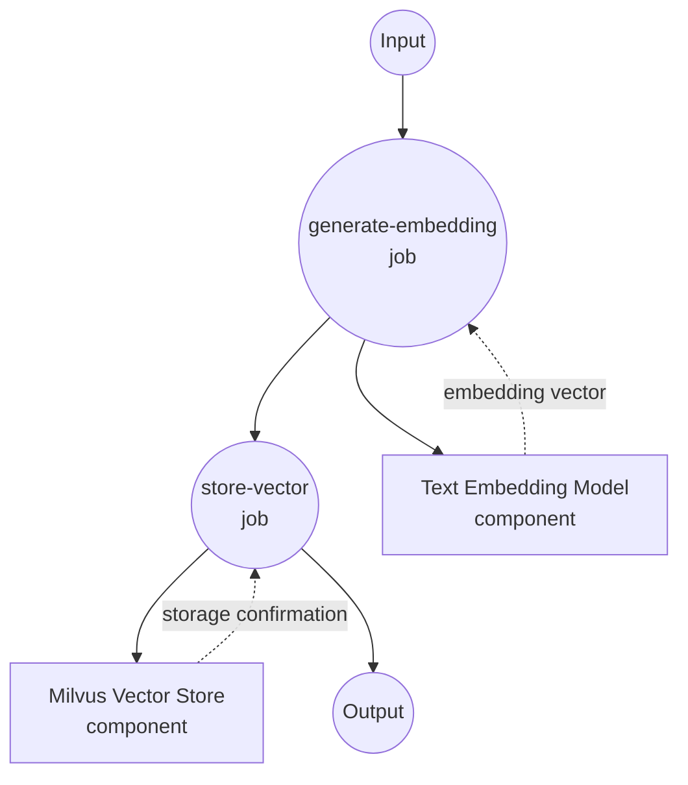
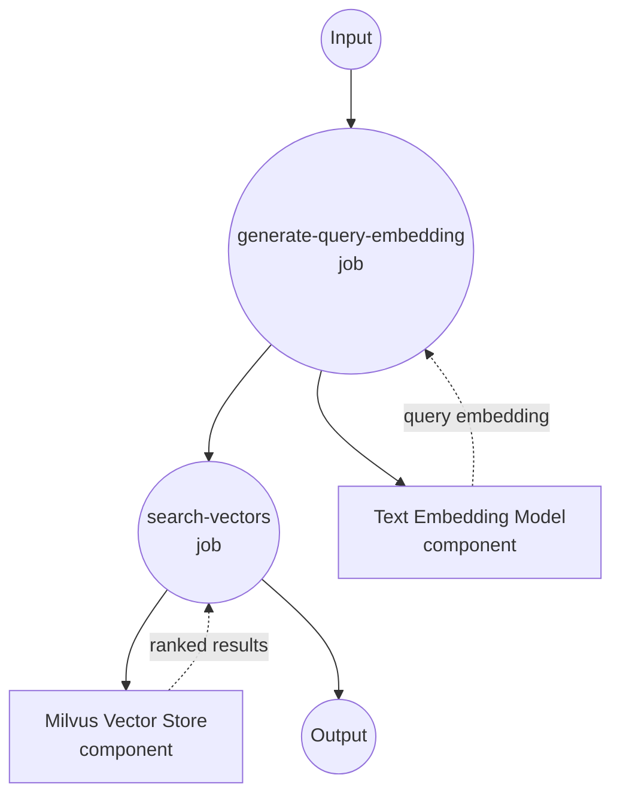
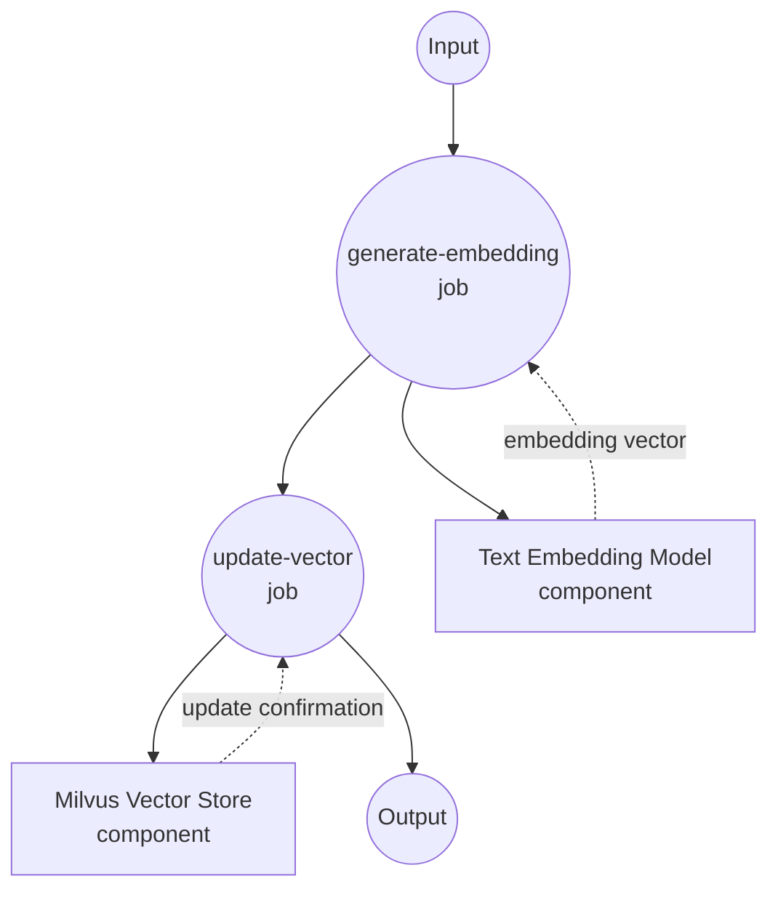
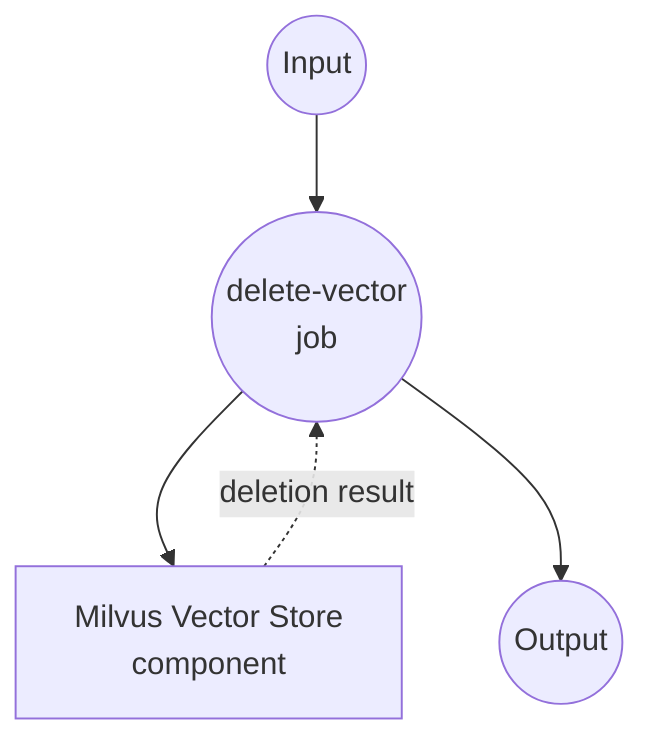

# Milvus Vector Store Example

This example demonstrates how to use model-compose with Milvus as a vector database for large-scale semantic search and similarity matching using text embeddings.

## Overview

This workflow provides a production-ready vector database solution that:

1. **High-Performance Text Embedding**: Converts text to vector embeddings using sentence transformers
2. **Scalable Vector Storage**: Stores embeddings in Milvus with enterprise-grade performance
3. **Fast Similarity Search**: Performs sub-millisecond semantic searches using vector embeddings
4. **Complete CRUD Operations**: Supports insert, update, search, and delete operations with integer IDs

## Preparation

### Prerequisites

- model-compose installed and available in your PATH
- Milvus server (local or remote)
- Python with PyTorch support

### Milvus Installation

#### Option 1: Docker Compose (Recommended)
```bash
# Download Milvus docker-compose.yml
wget https://github.com/milvus-io/milvus/releases/download/v2.3.0/milvus-standalone-docker-compose.yml -O docker-compose.yml

# Start Milvus
docker-compose up -d

# Verify installation
curl http://localhost:19530/health
```

#### Option 2: Milvus Cloud (Zilliz)
```bash
# Sign up at https://cloud.zilliz.com/
# Get connection details from dashboard
```

### Environment Configuration

1. Navigate to this example directory:
   ```bash
   cd examples/vector-store/milvus
   ```

2. Ensure Milvus is running and accessible on port 19530.

## How to Run

1. **Start the service:**
   ```bash
   model-compose up
   ```

2. **Run the workflows:**

   **Insert Text Embedding:**
   ```bash
   curl -X POST http://localhost:8080/api/workflows/runs \
     -H "Content-Type: application/json" \
     -d '{"workflow_id": "insert-sentence-embedding", "input": {"text": "This is a comprehensive guide to machine learning algorithms."}}}'
   ```

   **Update Text Embedding:**
   ```bash
   curl -X POST http://localhost:8080/api/workflows/runs \
     -H "Content-Type: application/json" \
     -d '{"workflow_id": "update-sentence-embedding", "input": {"vector_id": 1, "text": "Updated content about advanced machine learning techniques."}}'
   ```

   **Search Similar Texts:**
   ```bash
   curl -X POST http://localhost:8080/api/workflows/runs \
     -H "Content-Type: application/json" \
     -d '{"workflow_id": "search-sentence-embeddings", "input": {"text": "artificial intelligence and deep learning techniques"}}}'
   ```

   **Delete Text Embedding:**
   ```bash
   curl -X POST http://localhost:8080/api/workflows/runs \
     -H "Content-Type: application/json" \
     -d '{"workflow_id": "delete-sentence-embedding", "input": {"vector_id": 1}}'
   ```

   **Using Web UI:**
   - Open the Web UI: http://localhost:8081
   - Select the desired workflow (insert, search, update, delete)
   - Enter your input parameters
   - Click the "Run Workflow" button

   **Using CLI:**
   ```bash
   # Insert text embedding
   model-compose run insert-sentence-embedding --input '{"text": "Machine learning is transforming technology."}'

   # Update existing text embedding
   model-compose run update-sentence-embedding --input '{
     "vector_id": 1,
     "text": "Advanced neural networks and AI systems."
   }'

   # Search for similar texts
   model-compose run search-sentence-embeddings --input '{"text": "deep learning algorithms"}'

   # Delete text embedding
   model-compose run delete-sentence-embedding --input '{"vector_id": 1}'
   ```

## Component Details

### Text Embedding Model Component (embedding-model)
- **Type**: Model component with text-embedding task
- **Purpose**: Convert text to 384-dimensional vector embeddings
- **Model**: sentence-transformers/all-MiniLM-L6-v2
- **Features**:
  - Fast inference speed
  - High-quality semantic understanding
  - Compact embedding size

### Milvus Vector Store Component (vector-store)
- **Type**: Vector database component
- **Purpose**: High-performance vector storage and similarity search
- **Driver**: Milvus
- **Features**:
  - Enterprise-grade scalability
  - Sub-millisecond search performance
  - CRUD operations with integer IDs
  - Production-ready reliability

## Workflow Details

### "Insert Text Embedding" Workflow

**Description**: Generate text embedding and insert it into Milvus vector database.

#### Job Flow



#### Input Parameters

| Parameter | Type | Required | Default | Description |
|-----------|------|----------|---------|-------------|
| `text` | string | Yes | - | Text to convert and store |

#### Output Format

| Field | Type | Description |
|-------|------|-------------|
| `ids` | integer[] | Array of generated/assigned vector IDs |
| `affected_rows` | integer | Number of vectors successfully inserted |

### "Search Similar Embeddings" Workflow

**Description**: Generate query embedding and search for similar vectors in Milvus database.

#### Job Flow



#### Input Parameters

| Parameter | Type | Required | Default | Description |
|-----------|------|----------|---------|-------------|
| `text` | string | Yes | - | Query text for similarity search |

#### Output Format

| Field | Type | Description |
|-------|------|-------------|
| `id` | integer | Vector ID |
| `score` | number | Similarity score (0-1, higher is more similar) |
| `distance` | number | Vector distance (lower is more similar) |
| `metadata` | object | Associated metadata (filtered by output_fields) |

### "Update Text Embedding" Workflow

**Description**: Generate new text embedding and update existing vector in Milvus database.

#### Job Flow



#### Input Parameters

| Parameter | Type | Required | Default | Description |
|-----------|------|----------|---------|-------------|
| `vector_id` | integer | Yes | - | ID of the vector to update |
| `text` | string | Yes | - | New text to generate embedding for |

#### Output Format

| Field | Type | Description |
|-------|------|-------------|
| `affected_rows` | integer | Number of vectors successfully updated |

### "Delete Text Embedding" Workflow

**Description**: Remove a specific vector from the Milvus collection.

#### Job Flow

This workflow uses a simplified single-component configuration.



#### Input Parameters

| Parameter | Type | Required | Default | Description |
|-----------|------|----------|---------|-------------|
| `vector_id` | integer | Yes | - | ID of the vector to delete |

#### Output Format

| Field | Type | Description |
|-------|------|-------------|
| `affected_rows` | integer | Number of vectors successfully deleted |

## Customization

### Milvus Configuration

#### Remote Milvus Instance
```yaml
components:
  - id: vector-store
    type: vector-store
    driver: milvus
    host: your-milvus-server.com
    port: 19530
    protocol: https
    database: production
```

#### Milvus Cloud (Zilliz)
```yaml
components:
  - id: vector-store
    type: vector-store
    driver: milvus
    host: your-cluster.aws-us-west-2.vectordb.zillizcloud.com
    port: 19530
    protocol: https
    token: ${env.ZILLIZ_API_KEY}
```

### Embedding Model Options

#### Higher Accuracy Model
```yaml
components:
  - id: embedding-model
    type: model
    task: text-embedding
    model: sentence-transformers/all-mpnet-base-v2  # 768 dimensions, higher accuracy
```

#### Multilingual Model
```yaml
components:
  - id: embedding-model
    type: model
    task: text-embedding
    model: sentence-transformers/paraphrase-multilingual-MiniLM-L12-v2
```

### Collection and Index Settings

```yaml
actions:
  - id: search
    collection: documents
    method: search
    search_params:
      metric_type: "L2"  # Euclidean distance
      params: {"nprobe": 16}
```
