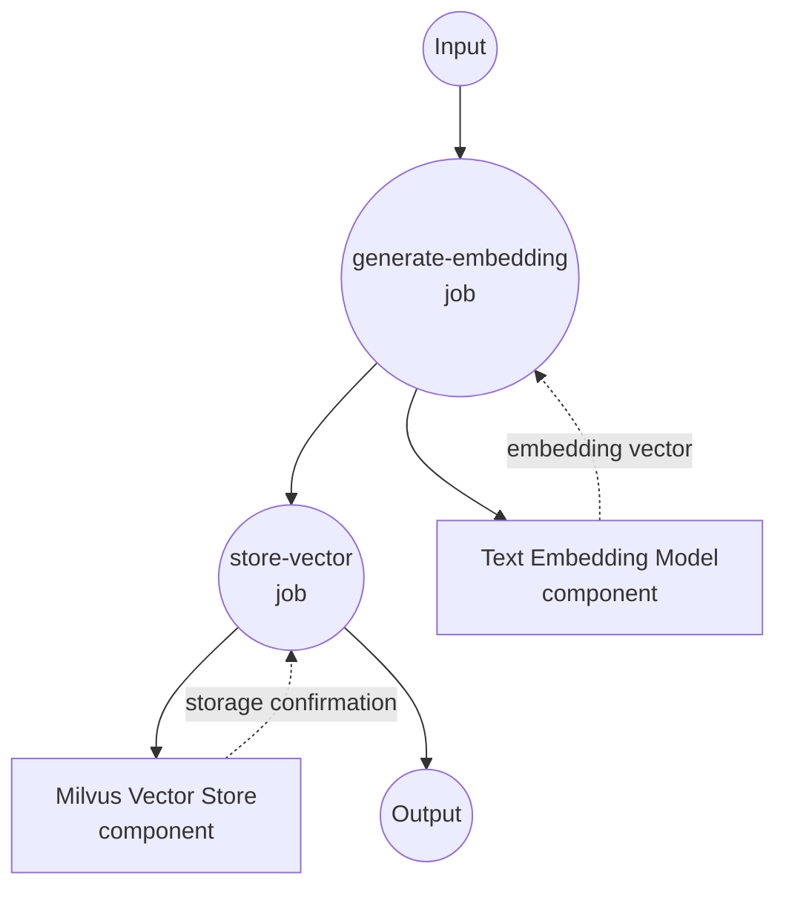
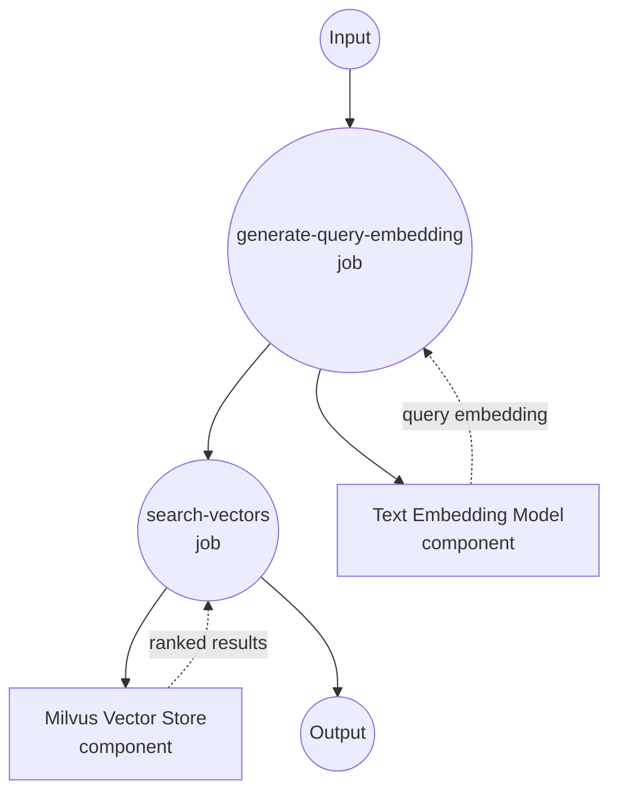
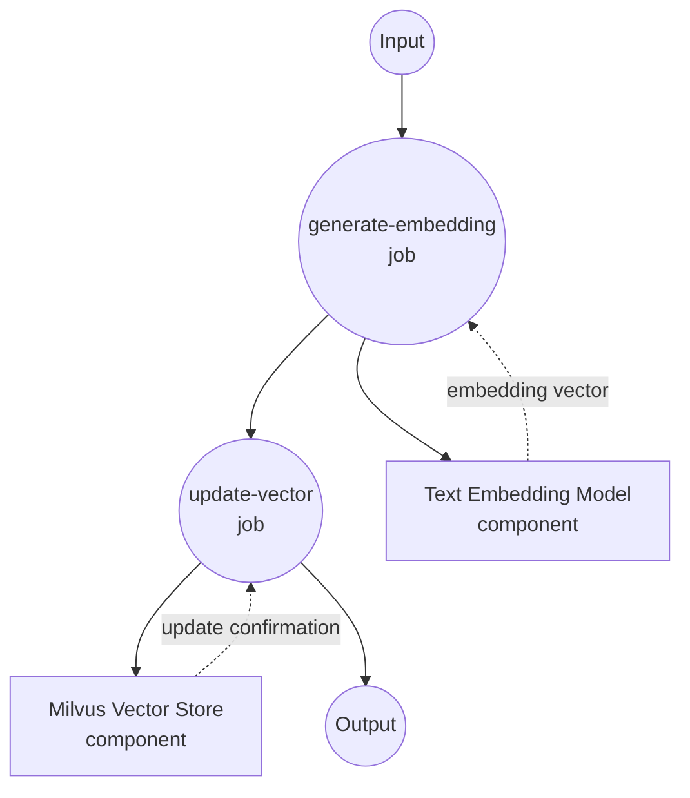
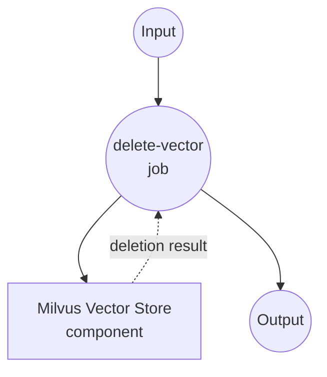

# Milvus Vector Store 示例

本示例演示如何使用 model-compose 与 Milvus 作为向量数据库，利用文本嵌入进行大规模语义搜索和相似度匹配。

## 概述

此工作流提供了一个生产就绪的向量数据库解决方案，具有以下功能：

1. **高性能文本嵌入**：使用句子转换器将文本转换为向量嵌入
2. **可扩展的向量存储**：在 Milvus 中存储嵌入，提供企业级性能
3. **快速相似度搜索**：使用向量嵌入执行亚毫秒级语义搜索
4. **完整的 CRUD 操作**：支持使用整数 ID 的插入、更新、搜索和删除操作

## 准备工作

### 前置要求

- 已安装 model-compose 并在 PATH 中可用
- Milvus 服务器（本地或远程）
- 支持 PyTorch 的 Python

### Milvus 安装

#### 选项 1：Docker Compose（推荐）
```bash
# 下载 Milvus docker-compose.yml
wget https://github.com/milvus-io/milvus/releases/download/v2.3.0/milvus-standalone-docker-compose.yml -O docker-compose.yml

# 启动 Milvus
docker-compose up -d

# 验证安装
curl http://localhost:19530/health
```

#### 选项 2：Milvus Cloud（Zilliz）
```bash
# 在 https://cloud.zilliz.com/ 注册
# 从仪表板获取连接详细信息
```

### 环境配置

1. 导航到此示例目录：
   ```bash
   cd examples/vector-store/milvus
   ```

2. 确保 Milvus 正在运行并可在端口 19530 上访问。

## 如何运行

1. **启动服务：**
   ```bash
   model-compose up
   ```

2. **运行工作流：**

   **插入文本嵌入：**
   ```bash
   curl -X POST http://localhost:8080/api/workflows/runs \
     -H "Content-Type: application/json" \
     -d '{"workflow_id": "insert-sentence-embedding", "input": {"text": "这是一个关于机器学习算法的综合指南。"}}}'
   ```

   **更新文本嵌入：**
   ```bash
   curl -X POST http://localhost:8080/api/workflows/runs \
     -H "Content-Type: application/json" \
     -d '{"workflow_id": "update-sentence-embedding", "input": {"vector_id": 1, "text": "关于高级机器学习技术的更新内容。"}}'
   ```

   **搜索相似文本：**
   ```bash
   curl -X POST http://localhost:8080/api/workflows/runs \
     -H "Content-Type: application/json" \
     -d '{"workflow_id": "search-sentence-embeddings", "input": {"text": "人工智能和深度学习技术"}}}'
   ```

   **删除文本嵌入：**
   ```bash
   curl -X POST http://localhost:8080/api/workflows/runs \
     -H "Content-Type: application/json" \
     -d '{"workflow_id": "delete-sentence-embedding", "input": {"vector_id": 1}}'
   ```

   **使用 Web UI：**
   - 打开 Web UI：http://localhost:8081
   - 选择所需的工作流（插入、搜索、更新、删除）
   - 输入你的输入参数
   - 点击"运行工作流"按钮

   **使用 CLI：**
   ```bash
   # 插入文本嵌入
   model-compose run insert-sentence-embedding --input '{"text": "机器学习正在改变技术。"}'

   # 更新现有文本嵌入
   model-compose run update-sentence-embedding --input '{
     "vector_id": 1,
     "text": "高级神经网络和 AI 系统。"
   }'

   # 搜索相似文本
   model-compose run search-sentence-embeddings --input '{"text": "深度学习算法"}'

   # 删除文本嵌入
   model-compose run delete-sentence-embedding --input '{"vector_id": 1}'
   ```

## 组件详情

### Text Embedding Model 组件（embedding-model）
- **类型**：带文本嵌入任务的模型组件
- **用途**：将文本转换为 384 维向量嵌入
- **模型**：sentence-transformers/all-MiniLM-L6-v2
- **特性**：
  - 快速推理速度
  - 高质量的语义理解
  - 紧凑的嵌入尺寸

### Milvus Vector Store 组件（vector-store）
- **类型**：向量数据库组件
- **用途**：高性能向量存储和相似度搜索
- **驱动**：Milvus
- **特性**：
  - 企业级可扩展性
  - 亚毫秒级搜索性能
  - 使用整数 ID 的 CRUD 操作
  - 生产就绪的可靠性

## 工作流详情

### "插入文本嵌入"工作流

**描述**：生成文本嵌入并将其插入 Milvus 向量数据库。

#### 作业流程



#### 输入参数

| 参数 | 类型 | 必需 | 默认值 | 描述 |
|-----------|------|----------|---------|-------------|
| `text` | string | 是 | - | 要转换和存储的文本 |

#### 输出格式

| 字段 | 类型 | 描述 |
|-------|------|-------------|
| `ids` | integer[] | 生成/分配的向量 ID 数组 |
| `affected_rows` | integer | 成功插入的向量数 |

### "搜索相似嵌入"工作流

**描述**：生成查询嵌入并在 Milvus 数据库中搜索相似向量。

#### 作业流程



#### 输入参数

| 参数 | 类型 | 必需 | 默认值 | 描述 |
|-----------|------|----------|---------|-------------|
| `text` | string | 是 | - | 用于相似度搜索的查询文本 |

#### 输出格式

| 字段 | 类型 | 描述 |
|-------|------|-------------|
| `id` | integer | 向量 ID |
| `score` | number | 相似度分数（0-1，越高越相似）|
| `distance` | number | 向量距离（越低越相似）|
| `metadata` | object | 关联的元数据（由 output_fields 过滤）|

### "更新文本嵌入"工作流

**描述**：生成新的文本嵌入并更新 Milvus 数据库中的现有向量。

#### 作业流程



#### 输入参数

| 参数 | 类型 | 必需 | 默认值 | 描述 |
|-----------|------|----------|---------|-------------|
| `vector_id` | integer | 是 | - | 要更新的向量 ID |
| `text` | string | 是 | - | 用于生成嵌入的新文本 |

#### 输出格式

| 字段 | 类型 | 描述 |
|-------|------|-------------|
| `affected_rows` | integer | 成功更新的向量数 |

### "删除文本嵌入"工作流

**描述**：从 Milvus 集合中删除特定向量。

#### 作业流程

此工作流使用简化的单组件配置。



#### 输入参数

| 参数 | 类型 | 必需 | 默认值 | 描述 |
|-----------|------|----------|---------|-------------|
| `vector_id` | integer | 是 | - | 要删除的向量 ID |

#### 输出格式

| 字段 | 类型 | 描述 |
|-------|------|-------------|
| `affected_rows` | integer | 成功删除的向量数 |

## 自定义

### Milvus 配置

#### 远程 Milvus 实例
```yaml
components:
  - id: vector-store
    type: vector-store
    driver: milvus
    host: your-milvus-server.com
    port: 19530
    protocol: https
    database: production
```

#### Milvus Cloud（Zilliz）
```yaml
components:
  - id: vector-store
    type: vector-store
    driver: milvus
    host: your-cluster.aws-us-west-2.vectordb.zillizcloud.com
    port: 19530
    protocol: https
    token: ${env.ZILLIZ_API_KEY}
```

### 嵌入模型选项

#### 更高准确性模型
```yaml
components:
  - id: embedding-model
    type: model
    task: text-embedding
    model: sentence-transformers/all-mpnet-base-v2  # 768 维，更高准确性
```

#### 多语言模型
```yaml
components:
  - id: embedding-model
    type: model
    task: text-embedding
    model: sentence-transformers/paraphrase-multilingual-MiniLM-L12-v2
```

### 集合和索引设置

```yaml
actions:
  - id: search
    collection: documents
    method: search
    search_params:
      metric_type: "L2"  # 欧几里得距离
      params: {"nprobe": 16}
```
