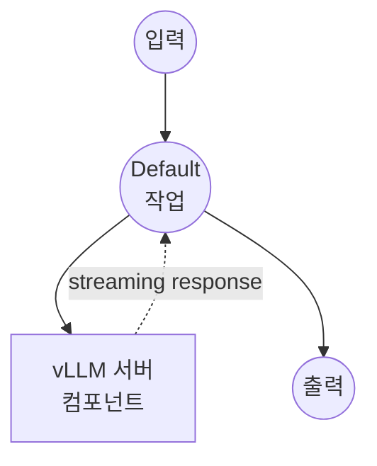

# vLLM Chat Completion 스트림 예제

이 예제는 Qwen2-7B-Instruct 모델과 함께 로컬 vLLM 서버를 사용하여 스트리밍 채팅 인터페이스를 만드는 방법을 보여주며, 실시간 스트리밍 응답을 제공합니다.

## 개요

이 워크플로우는 다음과 같은 스트리밍 채팅 인터페이스를 제공합니다:

1. **로컬 모델 서빙**: Qwen2-7B-Instruct 모델로 vLLM 서버를 자동으로 설정하고 관리
2. **스트리밍 Chat Completion**: 로컬 모델을 사용하여 실시간 스트리밍 응답 생성
3. **Server-Sent Events**: 실시간 사용자 경험을 위한 SSE (Server-Sent Events)로 응답 전달
4. **Temperature 제어**: temperature 매개변수를 통한 응답 창의성 사용자 정의 가능

## 준비사항

### 필수 요구사항

- model-compose가 설치되어 PATH에서 사용 가능
- Python 환경 관리 (pyenv 권장)
- Qwen2-7B-Instruct 모델 실행을 위한 충분한 시스템 리소스

### pyenv가 사용되는 이유

이 예제는 model-compose와의 의존성 충돌을 피하기 위해 vLLM을 위한 격리된 Python 환경을 만들기 위해 pyenv를 사용합니다:

**환경 격리의 장점:**
- model-compose는 자체 Python 환경에서 실행
- vLLM은 별도의 격리된 환경(`vllm` 가상 환경)에서 실행
- 두 시스템은 HTTP API를 통해서만 통신하여 완전한 런타임 격리 가능
- model-compose 업데이트가 vLLM 환경에 영향을 주지 않음
- vLLM 모델 또는 버전 변경이 model-compose에 영향을 주지 않음
- 각 시스템이 최적화된 의존성 버전 사용 가능

### 환경 구성

1. 이 예제 디렉토리로 이동:
   ```bash
   cd examples/vllm-chat-completion-stream
   ```

2. 충분한 디스크 공간과 RAM이 있는지 확인 (권장: 7B 모델을 위한 16GB+ RAM)

## 실행 방법

1. **서비스 시작 (첫 실행 시 vLLM 설치):**
   ```bash
   model-compose up
   ```

2. **설치 및 모델 로딩 대기:**
   - 첫 실행: 10-30분 (모델 다운로드 및 vLLM 설치)
   - 후속 실행: 2-5분 (모델 로딩만)

3. **워크플로우 실행:**

   **API 사용:**
   ```bash
   curl -X POST http://localhost:8080/api/workflows/runs \
     -H "Content-Type: application/json" \
     -d '{
       "input": {
         "prompt": "Explain the benefits of local AI models",
         "temperature": 0.7
       }
     }'
   ```

   **웹 UI 사용:**
   - 웹 UI 열기: http://localhost:8081
   - 프롬프트 및 설정 입력
   - "Run Workflow" 버튼 클릭

   **CLI 사용:**
   ```bash
   model-compose run --input '{
     "prompt": "Explain the benefits of local AI models",
     "temperature": 0.7
   }'
   ```

## 컴포넌트 세부사항

### vLLM Chat 서버 컴포넌트 (vllm-server)
- **유형**: 관리되는 수명 주기를 가진 HTTP 서버 컴포넌트
- **목적**: 스트리밍 chat completion을 통한 로컬 AI 모델 서빙
- **모델**: Qwen/Qwen2-7B-Instruct (70억 매개변수 지시 조정 모델)
- **서버**: vLLM OpenAI 호환 API 서버
- **포트**: 8000 (내부)
- **관리 명령**:
  - **설치**: Python 환경 설정 및 vLLM 설치
    ```bash
    eval "$(pyenv init -)" &&
    (pyenv activate vllm 2>/dev/null || pyenv virtualenv $(python --version | cut -d' ' -f2) vllm) &&
    pyenv activate vllm &&
    pip install vllm
    ```
  - **시작**: Qwen2-7B-Instruct 모델로 vLLM 서버 실행
    ```bash
    eval "$(pyenv init -)" &&
    pyenv activate vllm &&
    python -m vllm.entrypoints.openai.api_server
      --model Qwen/Qwen2-7B-Instruct
      --port 8000
      --served-model-name qwen2-7b-instruct
      --max-model-len 2048
    ```
- **기능**:
  - 자동 모델 다운로드 및 설정
  - `streaming: true`를 사용한 실시간 스트리밍 응답
  - 구성 가능한 temperature 및 max tokens
  - Server-Sent Events 출력 형식
  - 델타 콘텐츠 추출을 위한 JSON 스트림 파싱
  - 최대 컨텍스트 길이: 2048 토큰
  - 최대 응답 길이: 512 토큰

## 워크플로우 세부사항

### "Chat with vLLM server" 워크플로우 (기본)

**설명**: Qwen2-7B-Instruct 모델과 함께 로컬 vLLM 서버를 사용하여 스트리밍 텍스트 응답 생성

#### 작업 흐름

이 예제는 명시적인 작업 없이 단순화된 단일 컴포넌트 구성을 사용합니다.



#### 입력 매개변수

| 매개변수 | 유형 | 필수 | 기본값 | 설명 |
|---------|------|------|--------|------|
| `prompt` | text | 예 | - | AI에 전송할 사용자 메시지 |
| `temperature` | number | 아니오 | 0.7 | 응답의 무작위성 제어 (0.0-1.0)<br/>• 낮은 값 (예: 0.2): 더 집중적이고 결정적<br/>• 높은 값 (예: 0.8): 더 창의적이고 다양함 |

#### 출력 형식

| 필드 | 유형 | 설명 |
|-----|------|------|
| - | text (sse-text) | Server-Sent Events 스트림으로 전달되는 AI가 생성한 응답 텍스트 |

## 모델 정보

### Qwen2-7B-Instruct
- **개발자**: Alibaba Cloud
- **매개변수**: 70억 개
- **유형**: 지시 조정 대형 언어 모델
- **언어**: 주로 중국어와 영어
- **특화**: 일반 대화, 지시 수행, 추론 작업
- **컨텍스트 길이**: 최대 2048 토큰 (구성된 제한)
- **라이선스**: Apache 2.0

## 시스템 요구사항

### 최소 요구사항
- **RAM**: 16GB (권장 24GB+)
- **GPU**: 8GB+ VRAM을 가진 NVIDIA GPU (선택 사항이지만 권장)
- **디스크 공간**: 모델 저장을 위한 20GB+
- **CPU**: 멀티코어 프로세서 (8+ 코어 권장)

### 성능 참고사항
- 첫 시작 시 모델 다운로드에 몇 분 소요될 수 있음
- GPU 가속이 응답 속도를 크게 향상시킴
- 모델 로딩은 상당한 메모리 할당 필요

### 성능 최적화

- **GPU 사용**: GPU 가속을 위해 CUDA가 올바르게 설치되었는지 확인
- **메모리 관리**: RAM을 확보하기 위해 다른 애플리케이션 종료
- **모델 구성**: 시스템에 맞게 `max-model-len` 매개변수 조정

## 맞춤화

### 모델 선택
구성에서 모델 교체:
```yaml
start:
  - python -m vllm.entrypoints.openai.api_server --model microsoft/DialoGPT-medium --port 8000
```

### 서버 구성
vLLM 서버 매개변수 수정:
```yaml
start:
  - python -m vllm.entrypoints.openai.api_server
    --model Qwen/Qwen2-7B-Instruct
    --port 8000
    --max-model-len 4096
    --gpu-memory-utilization 0.8
```

### 응답 매개변수
생성 설정 조정:
```yaml
body:
  model: qwen2-7b-instruct
  max_tokens: ${input.max_tokens as number | 1024}
  temperature: ${input.temperature as number | 0.7}
  top_p: ${input.top_p as number | 0.9}
  streaming: true
```

## OpenAI와 비교

| 기능 | vLLM (로컬) | OpenAI (클라우드) |
|-----|------------|-----------------|
| 비용 | 하드웨어/전기만 | 토큰당 가격 |
| 프라이버시 | 완전한 로컬 처리 | OpenAI로 데이터 전송 |
| 지연 시간 | 로컬 하드웨어에 따라 다름 | 네트워크 + API 지연 시간 |
| 모델 제어 | 전체 모델 선택 | 제한된 모델 옵션 |
| 확장성 | 하드웨어에 의해 제한됨 | 탄력적 클라우드 확장 |
| 설정 복잡성 | 로컬 설정 필요 | API 키만 필요 |
| 맞춤화 | 높음 (미세 조정 가능) | API 매개변수로 제한됨 |
