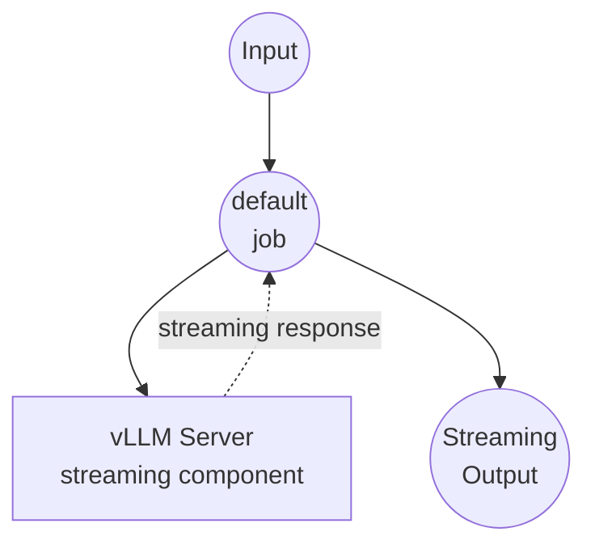

# vLLM Chat Completion Stream Example

This example demonstrates how to create a streaming chat interface using a local vLLM server with the Qwen2-7B-Instruct model, providing real-time streaming responses.

## Overview

This workflow provides a streaming chat interface that:

1. **Local Model Serving**: Automatically sets up and manages a vLLM server with Qwen2-7B-Instruct model
2. **Streaming Chat Completion**: Generates real-time streaming responses using the local model
3. **Server-Sent Events**: Delivers responses as SSE (Server-Sent Events) for real-time user experience
4. **Temperature Control**: Allows customization of response creativity through temperature parameter

## Setup

### Prerequisites

- model-compose installed and available in your PATH
- Python environment management (pyenv recommended)
- Sufficient system resources for running Qwen2-7B-Instruct model

### Why pyenv is Used

This example uses pyenv to create an isolated Python environment for vLLM to avoid dependency conflicts with model-compose:

**Benefits of Environment Isolation:**
- model-compose runs in its own Python environment
- vLLM runs in a separate isolated environment (`vllm` virtual environment)
- Both systems communicate only via HTTP API, allowing complete runtime isolation
- model-compose updates don't affect vLLM environment
- vLLM model or version changes don't impact model-compose
- Each system can use optimized dependency versions

### Environment Configuration

1. Navigate to this example directory:
   ```bash
   cd examples/vllm-chat-completion-stream
   ```

2. Ensure you have enough disk space and RAM (recommended: 16GB+ RAM for 7B model)

## How to Run

### Run in HTTP Server Mode

```bash
model-compose up
```

On first run, this will:
- Create a Python virtual environment using pyenv
- Install vLLM and dependencies
- Download the Qwen2-7B-Instruct model
- Start the vLLM server on port 8000
- Start the model-compose API on port 8080

Once the server starts:
- API endpoint: http://localhost:8080/api
- Web UI: http://localhost:8081
- vLLM server: http://localhost:8000 (internal)

### Single Execution

```bash
model-compose run --input '{"prompt": "Hello, how are you?", "temperature": 0.7}'
```

## Available Components

### Default Component (vLLM Server)
- **Type**: HTTP server component with managed lifecycle
- **Purpose**: Local AI model serving with streaming chat completion
- **Model**: Qwen/Qwen2-7B-Instruct (7 billion parameter instruct-tuned model)
- **Server**: vLLM OpenAI-compatible API server
- **Port**: 8000 (internal)
- **Management Commands**:
  - **Install**: Sets up Python environment and installs vLLM
    ```bash
    eval "$(pyenv init -)" &&
    (pyenv activate vllm 2>/dev/null || pyenv virtualenv $(python --version | cut -d' ' -f2) vllm) &&
    pyenv activate vllm &&
    pip install vllm
    ```
  - **Start**: Launches vLLM server with Qwen2-7B-Instruct model
    ```bash
    eval "$(pyenv init -)" &&
    pyenv activate vllm &&
    python -m vllm.entrypoints.openai.api_server
      --model Qwen/Qwen2-7B-Instruct
      --port 8000
      --served-model-name qwen2-7b-instruct
      --max-model-len 2048
    ```
- **Features**:
  - Automatic model download and setup
  - Real-time streaming responses using `stream: true`
  - Configurable temperature and max tokens
  - Server-Sent Events output format
  - JSON stream parsing for delta content extraction
  - Maximum context length: 2048 tokens
  - Maximum response length: 512 tokens

## Workflow Details

### "Chat with vLLM server" Workflow (Default)

**Description**: Generate streaming text responses using local vLLM server with Qwen2-7B-Instruct model

#### Job Flow

This example uses a simplified single-component configuration without explicit jobs.



#### Input Parameters

| Parameter | Type | Required | Default | Description |
|-----------|------|----------|---------|-------------|
| `prompt` | text | Yes | - | The user message to send to the AI |
| `temperature` | number | No | 0.7 | Controls randomness in responses (0.0-1.0)<br/>• Lower values (e.g., 0.2): more focused and deterministic<br/>• Higher values (e.g., 0.8): more creative and varied |

#### Output Format

| Field | Type | Description |
|-------|------|-------------|
| - | text (sse-text) | The AI-generated response text delivered as Server-Sent Events stream |

## Model Information

### Qwen2-7B-Instruct
- **Developer**: Alibaba Cloud
- **Parameters**: 7 billion
- **Type**: Instruction-tuned large language model
- **Languages**: Primarily Chinese and English
- **Specialties**: General conversation, instruction following, reasoning tasks
- **Context Length**: Up to 2048 tokens (configured limit)
- **License**: Apache 2.0

## System Requirements

### Minimum Requirements
- **RAM**: 16GB (recommended 24GB+)
- **GPU**: NVIDIA GPU with 8GB+ VRAM (optional but recommended)
- **Disk Space**: 20GB+ for model storage
- **CPU**: Multi-core processor (8+ cores recommended)

### Performance Notes
- First startup may take several minutes to download the model
- GPU acceleration significantly improves response speed
- Model loading requires substantial memory allocation

## Example Usage

### Basic Streaming Chat
```json
{
  "prompt": "Explain machine learning in simple terms"
}
```

### Creative Writing with Streaming
```json
{
  "prompt": "Write a short poem about autumn",
  "temperature": 0.9
}
```

### Technical Questions
```json
{
  "prompt": "How does a neural network work?",
  "temperature": 0.3
}
```

## Example Output

The workflow returns streaming text delivered as Server-Sent Events:

```
data: Machine
data:  learning
data:  is
data:  a
data:  subset
data:  of
data:  artificial
data:  intelligence...
```

## Troubleshooting

### Common Issues

1. **Out of Memory**: Reduce model context length or upgrade system RAM
2. **Model Download Fails**: Check internet connection and disk space
3. **vLLM Installation Issues**: Ensure compatible Python version and CUDA drivers
4. **Server Startup Timeout**: Allow more time for first model loading

### Performance Optimization

- **GPU Usage**: Ensure CUDA is properly installed for GPU acceleration
- **Memory Management**: Close other applications to free up RAM
- **Model Configuration**: Adjust `max-model-len` parameter for your system

## Customization

### Model Selection
Replace the model in the configuration:
```yaml
start:
  - python -m vllm.entrypoints.openai.api_server --model microsoft/DialoGPT-medium --port 8000
```

### Server Configuration
Modify vLLM server parameters:
```yaml
start:
  - python -m vllm.entrypoints.openai.api_server
    --model Qwen/Qwen2-7B-Instruct
    --port 8000
    --max-model-len 4096
    --gpu-memory-utilization 0.8
```

### Response Parameters
Adjust generation settings:
```yaml
body:
  model: qwen2-7b-instruct
  max_tokens: ${input.max_tokens as number | 1024}
  temperature: ${input.temperature as number | 0.7}
  top_p: ${input.top_p as number | 0.9}
  stream: true
```

## Comparison with OpenAI

| Feature | vLLM (Local) | OpenAI (Cloud) |
|---------|--------------|----------------|
| Cost | Hardware/electricity only | Per-token pricing |
| Privacy | Complete local processing | Data sent to OpenAI |
| Latency | Depends on local hardware | Network + API latency |
| Model Control | Full model selection | Limited model options |
| Scalability | Limited by hardware | Elastic cloud scaling |
| Setup Complexity | Requires local setup | API key only |
| Customization | High (fine-tuning possible) | Limited to API parameters |