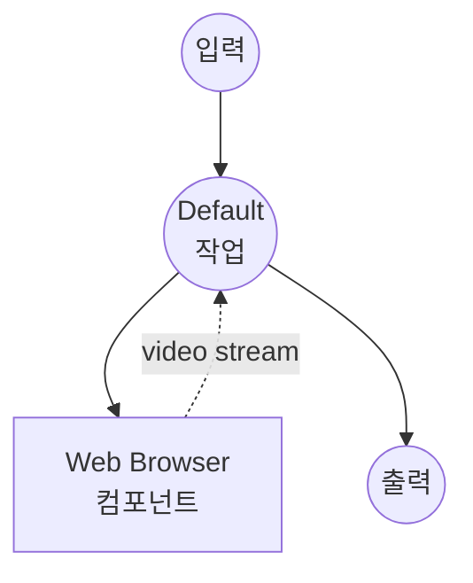

# YouTube 영상 캡처 예제

YouTube 영상(그리고 오디오)을 WebM/MP4 파일로 녹화합니다. Playwright가 전용 프로필로
실제 Chrome 창을 실행해 요청된 URL로 이동한 뒤, 재생 중인 `<video>` 엘리먼트를
`HTMLMediaElement.captureStream()` + `MediaRecorder`로 녹화합니다. OS 수준의
화면 녹화 권한은 필요하지 않습니다.

## 준비사항

### 필수 요구사항

- model-compose가 설치되어 PATH에서 사용 가능
- Google Chrome 설치
- model-compose용 Playwright + Chromium 추가 설치

### 환경 구성

1. 이 예제 디렉토리로 이동:
   ```bash
   cd examples/capture-youtube-video
   ```

이것이 전체 설정입니다. 처음 워크플로우를 실행할 때 Playwright가
`~/.model-compose/chrome-profile`에 영구 프로필로 Chrome을 실행하며,
이후 실행에서 재사용됩니다.

## 실행 방법

1. **서비스 시작:**
   ```bash
   model-compose up
   ```

2. **워크플로우 실행:**

   **웹 UI 사용:**
   - Web UI 열기: http://localhost:8081
   - YouTube URL 붙여넣기
   - 필요한 경우 duration / 코덱 / 비트레이트 조정
   - **Run Workflow** 클릭
   - 결과 영상 파일 다운로드

   **API 사용:**
   ```bash
   curl -X POST http://localhost:8080/api/workflows/runs \
     -H "Content-Type: application/json" \
     -d '{
       "url": "https://www.youtube.com/watch?v=we4tjLOYB9I",
       "duration": "30s",
       "format": "webm",
       "video_codec": "vp9",
       "video_bitrate": "3M",
       "audio_codec": "opus",
       "audio_bitrate": "128k"
     }'
   ```

   **CLI 사용:**
   ```bash
   model-compose run --input '{
     "url": "https://www.youtube.com/watch?v=we4tjLOYB9I",
     "duration": "10s"
   }'
   ```

## 컴포넌트 세부사항

### Web Browser 컴포넌트

- **유형**: `web-browser`
- **드라이버**: `playwright`
- **채널**: `chrome` — 번들 Chromium 대신 시스템에 설치된 Chrome을 사용
  (macOS ScreenCaptureKit 호환성이 더 좋음).
- **Headless**: `false` — 브라우저 창은 대상 영상을 재생하는 동안 표시됩니다.
  녹화 중에 창을 닫거나 최소화하지 마세요.
- **`persistent_dir`**: `~/.model-compose/chrome-profile` — 쿠키, 확장 프로그램,
  사이트 설정이 실행 간에 유지되므로 실행된 창에서 수행하는 대화형 설정
  (동의 대화 상자 해제, 첫 방문 시 광고 옵트아웃 등)이 다음 번에도 재사용됩니다.

### `capture-video` 액션

페이지에서 이미 재생 중인 `<video>` 엘리먼트를 사용합니다. 이 액션은:

1. 실행된 탭을 요청된 URL로 이동시킵니다.
2. 첫 번째 `<video>` 엘리먼트가 재생 가능해질 때까지 기다립니다.
3. `videoElement.captureStream()`을 호출해 MediaStream(비디오 + 오디오)을 가져옵니다.
4. 요청된 `mimeType`과 비트레이트로 `MediaRecorder`에 공급합니다.
5. `duration`이 경과할 때까지 Playwright 페이지 바인딩을 통해 인코딩된 청크를
   model-compose로 스트리밍합니다.

## 워크플로우 세부사항

### "Capture YouTube Video" 워크플로우 (기본)

**설명**: Playwright를 통해 Chrome을 실행하고 요청된 duration 동안 재생 중인
`<video>` 엘리먼트를 녹화한 뒤 결과 미디어 파일을 반환합니다.

#### 작업 흐름



#### 입력 매개변수

| 매개변수 | 유형 | 필수 | 기본값 | 설명 |
|---------|------|------|--------|------|
| `url` | string | 예 | - | YouTube 영상 URL |
| `duration` | string | 아니오 | `30s` | 녹화 길이 (예: `10s`, `2m`) |
| `format` | select | 아니오 | `webm` | 컨테이너 포맷: `webm`, `mp4` |
| `video_codec` | select | 아니오 | `vp9` | 비디오 코덱: `vp9`, `vp8`, `h264` |
| `audio_codec` | select | 아니오 | `opus` | 오디오 코덱: `opus` |
| `video_bitrate` | select | 아니오 | `3M` | 비디오 비트레이트: `500k` – `5M` |
| `audio_bitrate` | select | 아니오 | `128k` | 오디오 비트레이트: `64k` – `192k` |

#### 출력

| 필드 | 유형 | 설명 |
|-----|------|------|
| `video` | video | 녹화된 영상 파일 (WebM 또는 MP4) |

## 참고 사항 및 주의점

- **컨테이너/코덱 조합**: `MediaRecorder`는 브라우저가 만들 수 있는 조합만
  생성합니다. WebM은 VP8/VP9/AV1 + Opus와 함께 작동합니다. MP4 지원은
  Chrome 빌드에 따라 다릅니다. 브라우저가 조합을 거부하면 페이지 내부에서
  녹화 오류가 발생합니다 — model-compose 로그를 확인하세요.
- **재생이 진행 중이어야 함**: `MediaRecorder.start()`가 호출될 때 캡처가 시작됩니다.
  Playwright가 실행하는 Chrome 창은 이동한 URL에 대해 자동 재생이 허용되지만,
  탭이 백그라운드로 이동하거나 최소화되면 재생이 일시 중지될 수 있습니다.
  녹화 중에는 창을 포커스 상태로 유지하세요.
- **로그인 필요 콘텐츠**: Google은 Playwright가 실행한 Chrome 내부에서 수행되는
  로그인을 차단합니다("이 브라우저 또는 앱은 안전하지 않을 수 있습니다").
  이 예제는 공개 영상에 최적화되어 있습니다. Google 로그인이 필요한 영상을
  녹화해야 하는 경우 아래의 [로그인 필요 콘텐츠 녹화](#로그인-필요-콘텐츠-녹화)를
  참조하세요.
- **광고 및 인터스티셜**: 로그인하지 않은 캡처에는 미디어 스트림을 방해하고
  녹화의 유용한 부분을 단축시키는 광고 브레이크가 종종 포함됩니다.
- **긴 녹화**: 긴 캡처의 경우 Chrome과 model-compose 모두에서 메모리와 디스크를
  주시하세요. `MediaRecorder` 청크는 약 1초씩이며 디스크로 바로 스트리밍되지만,
  브라우저는 전체 duration 동안 디코드/인코드 파이프라인을 유지합니다.

## 로그인 필요 콘텐츠 녹화

Google의 자동화 감지는 Playwright가 실행한 Chrome 내부에서의 로그인을 차단하므로,
로그인된 프로필을 별도로 준비해야 합니다. `model-compose.yml`의 컴포넌트 블록을
`persistent_dir`(자동 실행)에서 `cdp_url`(연결)로 교체한 뒤:

1. 전용 프로필과 CDP 포트를 활성화한 상태로 Chrome을 직접 실행합니다.
   워크플로우를 실행하는 동안 이 Chrome 창을 계속 열어 두세요:
   ```bash
   "/Applications/Google Chrome.app/Contents/MacOS/Google Chrome" \
     --remote-debugging-port=9222 \
     --user-data-dir="$HOME/.model-compose/chrome-profile-signed-in"
   ```
   Linux에서는 경로를 `google-chrome`으로 교체하세요.
2. 해당 Chrome 창에서 YouTube에 로그인합니다. 프로필당 한 번만 수행하면 됩니다.
3. 컴포넌트를 CDP를 통해 연결하도록 업데이트합니다:
   ```yaml
   components:
     - id: browser
       type: web-browser
       driver: playwright
       cdp_url: http://127.0.0.1:9222
   ```
   Playwright의 IPv6 해석 시도를 피하기 위해 `localhost`가 아닌 `127.0.0.1`을 사용하세요.
4. 평소처럼 워크플로우를 실행합니다.

## 문제 해결

### Chrome 창이 열리지 않음

Google Chrome이 표준 위치에 설치되어 있는지 확인하세요. 그렇지 않은 경우,
그 위치로 옮기거나 컴포넌트에서 `channel: chrome`을 제거하세요 (Playwright는
번들 Chromium으로 대체됩니다 — 녹화는 여전히 작동하지만 macOS 화면 캡처
안정성은 떨어집니다).

### `duration`이 더 길어도 녹화가 몇 초에 불과함

탭이 일시 중지되었을 가능성이 있습니다 (자동 재생 차단, 탭 백그라운드, 광고 재생).
워크플로우를 시작하기 전에 Chrome 창을 전면으로 가져오고 녹화 중에는 만지지 마세요.

### 비어 있거나 읽을 수 없는 출력 파일

`MediaRecorder`가 요청된 `mimeType`을 준수할 수 없었습니다. 더 간단한 조합
(코덱 오버라이드 없이 `format: webm`)을 시도하고 실행된 Chrome의 DevTools
콘솔에서 정확한 오류를 확인하세요.
