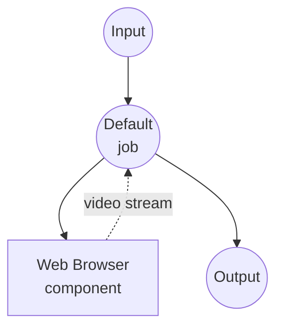

# Capture YouTube Video Example

Record a YouTube video (and its audio) as a WebM/MP4 file. Playwright launches
a real Chrome window with a dedicated profile, navigates to the requested URL,
and records the playing `<video>` element via
`HTMLMediaElement.captureStream()` + `MediaRecorder`. No OS-level
screen-recording permission is required.

## Preparation

### Prerequisites

- model-compose installed and available in your PATH
- Google Chrome installed
- Playwright + Chromium extras installed for model-compose

### Environment Configuration

1. Navigate to this example directory:
   ```bash
   cd examples/capture-youtube-video
   ```

That is the whole setup. Playwright will launch Chrome with a persistent
profile under `~/.model-compose/chrome-profile` the first time you run the
workflow, and reuse it on subsequent runs.

## How to Run

1. **Start the service:**
   ```bash
   model-compose up
   ```

2. **Run the workflow:**

   **Using Web UI:**
   - Open the Web UI: http://localhost:8081
   - Paste a YouTube URL
   - Adjust duration / codecs / bitrates if desired
   - Click **Run Workflow**
   - Download the resulting video file

   **Using API:**
   ```bash
   curl -X POST http://localhost:8080/api/workflows/runs \
     -H "Content-Type: application/json" \
     -d '{
       "url": "https://www.youtube.com/watch?v=we4tjLOYB9I",
       "duration": "30s",
       "format": "webm",
       "video_codec": "vp9",
       "video_bitrate": "3M",
       "audio_codec": "opus",
       "audio_bitrate": "128k"
     }'
   ```

   **Using CLI:**
   ```bash
   model-compose run --input '{
     "url": "https://www.youtube.com/watch?v=we4tjLOYB9I",
     "duration": "10s"
   }'
   ```

## Component Details

### Web Browser Component

- **Type**: `web-browser`
- **Driver**: `playwright`
- **Channel**: `chrome` — uses the system-installed Chrome instead of the
  bundled Chromium (better macOS ScreenCaptureKit compatibility).
- **Headless**: `false` — the browser window is visible while it plays the
  target video. Do not close or minimize it during the recording.
- **`persistent_dir`**: `~/.model-compose/chrome-profile` — cookies, extensions,
  and site settings are kept between runs, so any interactive setup you do in
  the launched window (dismissing consent dialogs, opting out of ads on the
  first visit, etc.) is reused next time.

### `capture-video` Action

Uses the `<video>` element already playing on the page. The action:

1. Navigates the launched tab to the requested URL.
2. Waits for the first `<video>` element to become playable.
3. Calls `videoElement.captureStream()` to get a MediaStream (video + audio).
4. Feeds it into a `MediaRecorder` with the requested `mimeType` and bitrates.
5. Streams the encoded chunks back to model-compose over a Playwright page
   binding until `duration` elapses.

## Workflow Details

### "Capture YouTube Video" Workflow (Default)

**Description**: Launches Chrome via Playwright, records the playing `<video>`
element for the requested duration, and returns the resulting media file.

#### Job Flow



#### Input Parameters

| Parameter | Type | Required | Default | Description |
|-----------|------|----------|---------|-------------|
| `url` | string | Yes | - | YouTube video URL |
| `duration` | string | No | `30s` | Recording length (e.g. `10s`, `2m`) |
| `format` | select | No | `webm` | Container format: `webm`, `mp4` |
| `video_codec` | select | No | `vp9` | Video codec: `vp9`, `vp8`, `h264` |
| `audio_codec` | select | No | `opus` | Audio codec: `opus` |
| `video_bitrate` | select | No | `3M` | Video bitrate: `500k` – `5M` |
| `audio_bitrate` | select | No | `128k` | Audio bitrate: `64k` – `192k` |

#### Output

| Field | Type | Description |
|-------|------|-------------|
| `video` | video | The recorded video file (WebM or MP4) |

## Notes and Caveats

- **Container/codec pairing**: `MediaRecorder` only produces combinations the
  browser knows how to make. WebM works with VP8/VP9/AV1 + Opus. MP4 support
  depends on the Chrome build. If the browser rejects the combination, the
  recording will error out inside the page — check the model-compose logs.
- **Playback must be running**: capture starts when `MediaRecorder.start()` is
  called. The Chrome window that Playwright launches has autoplay allowed for
  the URL you navigate to, but if the tab is back-grounded or minimized,
  playback may pause. Keep the window in focus during the recording.
- **Sign-in-required content**: Google blocks logins performed inside a
  Playwright-launched Chrome ("This browser or app may not be secure"). This
  example is optimized for public videos. If you need to record a video that
  requires a Google login, see [Recording sign-in-required
  content](#recording-sign-in-required-content) below.
- **Ads and interstitials**: non-logged-in captures often contain ad breaks
  that interrupt the media stream and shorten the useful part of the recording.
- **Long recordings**: for long captures, keep an eye on memory and disk in
  both Chrome and model-compose. `MediaRecorder` chunks are ~1 s each and are
  streamed straight to disk, but the browser still holds a decode/encode
  pipeline for the whole duration.

## Recording sign-in-required content

Google's automation detection blocks logins inside the Chrome that Playwright
launches, so a signed-in profile has to be prepared out-of-band. Swap the
component block in `model-compose.yml` from `persistent_dir` (auto-launch) to
`cdp_url` (attach), then:

1. Launch Chrome yourself with a dedicated profile and the CDP port enabled.
   Keep this Chrome window open the whole time you run the workflow:
   ```bash
   "/Applications/Google Chrome.app/Contents/MacOS/Google Chrome" \
     --remote-debugging-port=9222 \
     --user-data-dir="$HOME/.model-compose/chrome-profile-signed-in"
   ```
   On Linux, replace the path with `google-chrome`.
2. Sign in to YouTube in that Chrome window. You only need to do this once
   per profile.
3. Update the component to attach over CDP:
   ```yaml
   components:
     - id: browser
       type: web-browser
       driver: playwright
       cdp_url: http://127.0.0.1:9222
   ```
   Use `127.0.0.1` (not `localhost`) to avoid Playwright's IPv6 resolution
   attempt.
4. Run the workflow as usual.

## Troubleshooting

### Chrome window doesn't open

Make sure Google Chrome is installed at the standard location. If it isn't,
either move it there, or drop `channel: chrome` from the component (Playwright
will fall back to the bundled Chromium — recording still works, but macOS
screen capture stability is worse).

### Recording is only a few seconds even though `duration` is longer

The tab probably paused (autoplay blocked, tab back-grounded, ad played). Bring
the Chrome window to the foreground before starting the workflow, and don't
touch it during the recording.

### Empty or unreadable output file

The `MediaRecorder` couldn't honor the requested `mimeType`. Try a simpler
combination (`format: webm` with no codec overrides) and inspect the browser's
DevTools console in the launched Chrome for the exact error.
