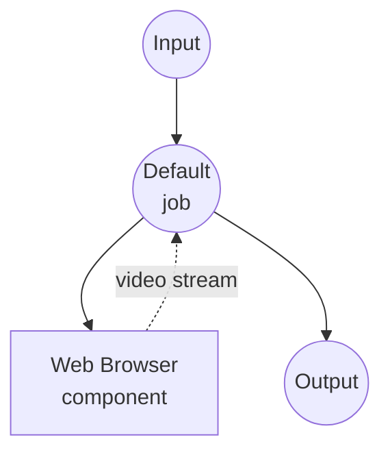

# 捕获 YouTube 视频示例

将 YouTube 视频（及其音频）录制为 WebM/MP4 文件。Playwright 使用专用配置文件启动一个
真实的 Chrome 窗口，导航到请求的 URL，并通过
`HTMLMediaElement.captureStream()` + `MediaRecorder` 录制正在播放的 `<video>` 元素。
无需操作系统级别的屏幕录制权限。

## 准备工作

### 前置条件

- 已安装 model-compose 并在您的 PATH 中可用
- 已安装 Google Chrome
- 为 model-compose 安装了 Playwright + Chromium 附加组件

### 环境配置

1. 导航到此示例目录：
   ```bash
   cd examples/capture-youtube-video
   ```

这就是全部设置。第一次运行工作流时，Playwright 将使用
`~/.model-compose/chrome-profile` 下的持久配置文件启动 Chrome，
并在后续运行中重用。

## 运行方式

1. **启动服务：**
   ```bash
   model-compose up
   ```

2. **运行工作流：**

   **使用 Web UI：**
   - 打开 Web UI：http://localhost:8081
   - 粘贴 YouTube URL
   - 如需要，调整时长 / 编解码器 / 比特率
   - 点击 **Run Workflow**
   - 下载生成的视频文件

   **使用 API：**
   ```bash
   curl -X POST http://localhost:8080/api/workflows/runs \
     -H "Content-Type: application/json" \
     -d '{
       "url": "https://www.youtube.com/watch?v=we4tjLOYB9I",
       "duration": "30s",
       "format": "webm",
       "video_codec": "vp9",
       "video_bitrate": "3M",
       "audio_codec": "opus",
       "audio_bitrate": "128k"
     }'
   ```

   **使用 CLI：**
   ```bash
   model-compose run --input '{
     "url": "https://www.youtube.com/watch?v=we4tjLOYB9I",
     "duration": "10s"
   }'
   ```

## 组件详情

### Web Browser 组件

- **类型**：`web-browser`
- **驱动**：`playwright`
- **通道**：`chrome` — 使用系统安装的 Chrome 而不是捆绑的 Chromium
  （更好的 macOS ScreenCaptureKit 兼容性）。
- **Headless**：`false` — 浏览器窗口在播放目标视频时可见。
  录制期间请勿关闭或最小化它。
- **`persistent_dir`**：`~/.model-compose/chrome-profile` — cookies、扩展程序和
  站点设置在运行之间保留，因此您在启动的窗口中所做的任何交互式设置
  （关闭同意对话框、首次访问时选择退出广告等）在下次都会被重用。

### `capture-video` 操作

使用页面上已经播放的 `<video>` 元素。此操作：

1. 将启动的选项卡导航到请求的 URL。
2. 等待第一个 `<video>` 元素变为可播放。
3. 调用 `videoElement.captureStream()` 获取 MediaStream（视频 + 音频）。
4. 将其输入到具有请求的 `mimeType` 和比特率的 `MediaRecorder`。
5. 通过 Playwright 页面绑定将编码块流回 model-compose，直到 `duration` 耗尽。

## 工作流详情

### "Capture YouTube Video" 工作流（默认）

**描述**：通过 Playwright 启动 Chrome，在请求的 duration 内录制正在播放的
`<video>` 元素，并返回生成的媒体文件。

#### 作业流程



#### 输入参数

| 参数 | 类型 | 必需 | 默认值 | 描述 |
|------|------|------|--------|------|
| `url` | string | 是 | - | YouTube 视频 URL |
| `duration` | string | 否 | `30s` | 录制长度（例如 `10s`、`2m`） |
| `format` | select | 否 | `webm` | 容器格式：`webm`、`mp4` |
| `video_codec` | select | 否 | `vp9` | 视频编解码器：`vp9`、`vp8`、`h264` |
| `audio_codec` | select | 否 | `opus` | 音频编解码器：`opus` |
| `video_bitrate` | select | 否 | `3M` | 视频比特率：`500k` – `5M` |
| `audio_bitrate` | select | 否 | `128k` | 音频比特率：`64k` – `192k` |

#### 输出

| 字段 | 类型 | 描述 |
|------|------|------|
| `video` | video | 录制的视频文件（WebM 或 MP4） |

## 注意事项和警告

- **容器/编解码器配对**：`MediaRecorder` 仅生成浏览器知道如何创建的组合。
  WebM 适用于 VP8/VP9/AV1 + Opus。MP4 支持取决于 Chrome 构建。如果浏览器
  拒绝该组合，录制将在页面内部报错 — 请检查 model-compose 日志。
- **必须正在播放**：捕获在调用 `MediaRecorder.start()` 时开始。Playwright 启动的
  Chrome 窗口允许您导航到的 URL 自动播放，但如果选项卡处于后台或最小化，
  播放可能会暂停。录制期间请保持窗口聚焦。
- **需要登录的内容**：Google 阻止在 Playwright 启动的 Chrome 内执行的登录
  （"此浏览器或应用可能不安全"）。此示例针对公开视频进行了优化。
  如果您需要录制需要 Google 登录的视频，请参阅下面的
  [录制需要登录的内容](#录制需要登录的内容)。
- **广告和插页广告**：未登录的捕获通常包含中断媒体流并缩短录制有用部分的广告。
- **长时间录制**：对于长时间捕获，请密切关注 Chrome 和 model-compose 中的内存和磁盘。
  `MediaRecorder` 块约为 1 秒，会直接流式传输到磁盘，但浏览器仍会在整个持续时间内
  保持解码/编码管道。

## 录制需要登录的内容

Google 的自动化检测会阻止在 Playwright 启动的 Chrome 内登录，因此必须在外部准备
已登录的配置文件。将 `model-compose.yml` 中的组件块从 `persistent_dir`（自动启动）
切换到 `cdp_url`（附加），然后：

1. 使用专用配置文件并启用 CDP 端口自行启动 Chrome。
   运行工作流时始终保持此 Chrome 窗口打开：
   ```bash
   "/Applications/Google Chrome.app/Contents/MacOS/Google Chrome" \
     --remote-debugging-port=9222 \
     --user-data-dir="$HOME/.model-compose/chrome-profile-signed-in"
   ```
   在 Linux 上，将路径替换为 `google-chrome`。
2. 在该 Chrome 窗口中登录 YouTube。每个配置文件只需执行一次。
3. 更新组件以通过 CDP 附加：
   ```yaml
   components:
     - id: browser
       type: web-browser
       driver: playwright
       cdp_url: http://127.0.0.1:9222
   ```
   使用 `127.0.0.1`（而不是 `localhost`）以避免 Playwright 的 IPv6 解析尝试。
4. 像往常一样运行工作流。

## 故障排除

### Chrome 窗口未打开

确保 Google Chrome 安装在标准位置。如果没有，请将其移到那里，或者从组件中
删除 `channel: chrome`（Playwright 将回退到捆绑的 Chromium — 录制仍然有效，
但 macOS 屏幕捕获稳定性较差）。

### 即使 `duration` 更长，录制也只有几秒

选项卡可能已暂停（自动播放被阻止、选项卡后台、播放广告）。在启动工作流之前
将 Chrome 窗口置于前台，并且在录制期间不要触碰它。

### 空的或无法读取的输出文件

`MediaRecorder` 无法遵循请求的 `mimeType`。尝试更简单的组合（无编解码器
覆盖的 `format: webm`），并检查启动的 Chrome 的 DevTools 控制台以获取
确切的错误。
