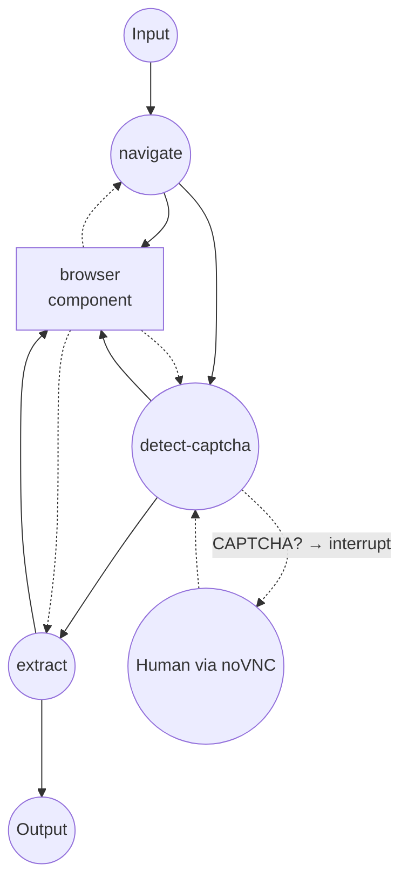
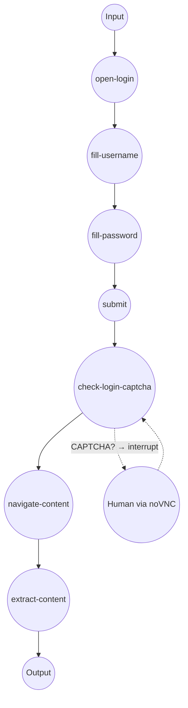

# Web Browser Example

This example demonstrates headless browser automation using the `web-browser` component, with CAPTCHA detection and human-in-the-loop resolution via noVNC.

## Overview

This example runs a Chromium-based browser inside a Docker container and exposes two workflows:

1. **Scrape with CAPTCHA**: Navigate to a URL, detect CAPTCHA, pause for human resolution via noVNC, then extract page content
2. **Login then Scrape**: Fill a login form, handle possible CAPTCHA/MFA, then extract protected content

Key features:

- **Docker System Module**: Single container running Chromium, Xvfb, x11vnc, noVNC, and socat via supervisord
- **CDP (Chrome DevTools Protocol)**: Communicates with Chromium through CDP for navigation, form interaction, and content extraction
- **noVNC Remote Desktop**: Provides browser-visible UI at `http://localhost:6080/vnc.html` for manual CAPTCHA solving
- **Human-in-the-Loop Interrupt**: Automatically pauses when CAPTCHA is detected, resumes after human intervention

## Preparation

### Prerequisites

- model-compose installed and available in your PATH
- Docker installed and running

### Environment Configuration

1. Navigate to this example directory:
   ```bash
   cd examples/web-browser
   ```

2. No additional environment configuration required — the Docker image is built automatically on first run.

## How to Run

1. **Start the service:**
   ```bash
   model-compose up
   ```
   This builds the Docker image (if needed) and starts the browser container.

2. **Run a workflow:**

   **Using API:**
   ```bash
   curl -X POST http://localhost:8080/api/workflows/runs \
     -H "Content-Type: application/json" \
     -d '{"workflow_id": "scrape-with-captcha", "input": {"url": "https://example.com"}}'
   ```

   **Using Web UI:**
   - Open the Web UI: http://localhost:8081
   - Select the workflow, enter a URL, and click Run

   **Using CLI:**
   ```bash
   model-compose run scrape-with-captcha --input '{"url": "https://example.com"}'
   ```

3. **If CAPTCHA is detected:**
   - The workflow pauses automatically
   - Open noVNC at http://localhost:6080/vnc.html to see the browser
   - Solve the CAPTCHA manually
   - Resume via API or press Enter in CLI

4. **Stop the service:**
   ```bash
   model-compose down
   ```

## Workflow Details

### "Scrape with CAPTCHA" Workflow

**Description**: Navigate to a URL, detect CAPTCHA, pause for human resolution via noVNC, then extract content.

#### Job Flow



#### Input Parameters

| Parameter | Type | Required | Default | Description |
|-----------|------|----------|---------|-------------|
| `url` | string | Yes | — | Target URL to scrape |
| `selector` | string | No | `body` | CSS selector for content extraction |

#### Output Format

| Field | Type | Description |
|-------|------|-------------|
| `content` | text | Extracted text content from the page |

### "Login then Scrape" Workflow

**Description**: Fill login form, handle possible CAPTCHA, then extract protected content.

#### Job Flow



#### Input Parameters

| Parameter | Type | Required | Description |
|-----------|------|----------|-------------|
| `login_url` | string | Yes | Login page URL |
| `username` | string | Yes | Username or email |
| `password` | string | Yes | Password |
| `content_url` | string | Yes | URL to scrape after login |
| `selector` | string | No | CSS selector (default: `body`) |

#### Output Format

| Field | Type | Description |
|-------|------|-------------|
| `content` | text | Extracted text content from the protected page |

## Component Details

### Browser Component

- **Type**: `web-browser`
- **Driver**: Chrome (CDP)
- **Host**: `localhost:9222`
- **Timeout**: 30 seconds

#### Available Actions

| Action | Method | Description |
|--------|--------|-------------|
| `navigate` | `navigate` | Navigate to a URL and wait for network idle |
| `check-captcha` | `evaluate` | Detect CAPTCHA elements on the page |
| `click` | `click` | Click an element by CSS selector |
| `type-text` | `input-text` | Type text into an input field |
| `screenshot` | `screenshot` | Capture a screenshot (PNG) |
| `extract-text` | `extract` | Extract text content by CSS selector |
| `extract-html` | `extract` | Extract HTML content by CSS selector |
| `get-cookies` | `get-cookies` | Retrieve all browser cookies |
| `evaluate` | `evaluate` | Execute arbitrary JavaScript |

## System Details

### Docker Container Architecture

The `chrome-with-novnc` system runs a single Alpine-based container with the following services managed by supervisord:

| Service | Port | Description |
|---------|------|-------------|
| Xvfb | — | Virtual framebuffer (display `:99`) |
| Chromium | 9222 | Headless browser with CDP remote debugging |
| x11vnc | 5900 | VNC server mirroring the virtual display |
| noVNC | 6080 | Web-based VNC client |
| socat | 9223 | TCP proxy for external CDP access |

**Port mapping**: `9222→9223` (CDP), `6080→6080` (noVNC)

## Customization

### Change Screen Resolution
Set environment variables in `supervisord.conf`:
```
ENV SCREEN_WIDTH=1920
ENV SCREEN_HEIGHT=1080
```

### Add Custom Fonts
Add font packages in `Dockerfile`:
```dockerfile
RUN apk add --no-cache font-noto font-noto-cjk font-noto-emoji
```

### Modify CAPTCHA Detection
Update the `check-captcha` action's JavaScript expression to match site-specific selectors:
```yaml
expression: >
  !!(document.querySelector('[id*=captcha]')
  || document.querySelector('.custom-challenge'))
```

## Troubleshooting

### Common Issues

1. **Container build fails**: Ensure Docker is running (`docker info`)
2. **CDP connection timeout**: The container may take a few seconds to start. model-compose retries automatically within the configured timeout
3. **noVNC not accessible**: Check that port `6080` is not in use (`lsof -i :6080`)
4. **CAPTCHA not detected**: Customize the `check-captcha` JavaScript expression for the target site
5. **Shared memory errors**: The container uses `shm_size: 2gb` to prevent Chromium crashes. Increase if needed
