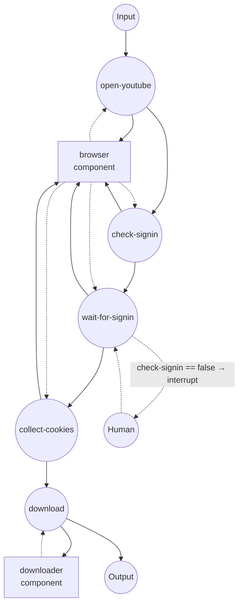

# YouTube 다운로더 (인증 세션 기반)

로컬에서 실행 중인 Chrome 브라우저의 세션 쿠키를 사용해 YouTube
영상을 다운로드합니다. 연령 제한, 지역 제한, 로그인이 필요한 영상 등
yt-dlp만으로는 접근할 수 없는 콘텐츠를 다룰 때 사용합니다.

## 개요

두 컴포넌트가 함께 동작합니다:

1. **`browser` (`web-browser` / `chrome`)** — 사용자가
   `--remote-debugging-port=9222`로 실행한 Chrome에 attach합니다.
   그 창에서 YouTube에 한 번 로그인해두면, 워크플로우가 세션 쿠키를
   읽어옵니다.
2. **`downloader` (`media-downloader` / `ytdlp`)** — 그 쿠키 리스트를
   그대로 받아 yt-dlp에 전달하고, 인증된 세션으로 영상을 다운로드
   합니다.

`web-browser`의 `get-cookies`가 반환하는 쿠키 형식은
`media-downloader`가 기대하는 형식과 동일하므로, 변환 없이 그대로
연결할 수 있습니다.

## 준비

### 사전 요건

- model-compose가 설치되어 PATH에 등록되어 있어야 함
- Google Chrome (또는 Chromium)이 설치되어 있어야 함
- `yt-dlp` — 드라이버의 setup requirement로 첫 실행 시 자동 설치됨
- `ffmpeg`이 PATH에 있어야 함 (오디오 추출과 영상/오디오 스트림 병합에
  필요)
- JS 런타임 — 최근 YouTube의 안티봇 흐름(`n challenge`)을 풀려면
  yt-dlp가 JavaScript 솔버를 실행해야 합니다. `deno`(권장) 또는
  yt-dlp가 지원하는 다른 런타임을 설치하세요:
  ```bash
  brew install deno    # macOS
  ```
  JS 런타임이 없으면 yt-dlp가 "images only" 상태로 떨어져
  `Requested format is not available` 오류로 실패합니다.

### 원격 디버깅 모드로 Chrome 실행

일상 브라우저 세션과 겹치지 않도록 별도 프로필로 실행하세요:

**macOS**
```bash
/Applications/Google\ Chrome.app/Contents/MacOS/Google\ Chrome \
  --remote-debugging-port=9222 \
  --user-data-dir=/tmp/chrome-yt-profile
```

**Linux**
```bash
google-chrome \
  --remote-debugging-port=9222 \
  --user-data-dir=/tmp/chrome-yt-profile
```

**Windows (PowerShell)**
```powershell
& "C:\Program Files\Google\Chrome\Application\chrome.exe" `
  --remote-debugging-port=9222 `
  --user-data-dir=$env:TEMP\chrome-yt-profile
```

이 창은 계속 열어두세요. 이 창에서 YouTube에 한 번 로그인하면, 이후
워크플로우 실행마다 세션이 유지됩니다 (프로필을 지우거나 Google이
쿠키를 만료시키기 전까지).

## 실행 방법

1. **컨트롤러 시작:**
   ```bash
   model-compose up
   ```

2. **워크플로우 실행:**

   **API 사용:**
   ```bash
   curl -X POST http://localhost:8080/api/workflows/runs \
     -H "Content-Type: application/json" \
     -d '{
       "workflow_id": "download-youtube-video",
       "input": {
         "url": "https://www.youtube.com/watch?v=dQw4w9WgXcQ"
       }
     }'
   ```

   **Web UI 사용:**
   - http://localhost:8081 열기
   - 영상 URL 입력 (선택: `video_format`)
   - Run 클릭

   **CLI 사용:**
   ```bash
   model-compose run download-youtube-video \
     --input '{"url": "https://www.youtube.com/watch?v=dQw4w9WgXcQ"}'
   ```

3. **워크플로우가 일시 정지되면:**
   - `check-signin` 잡이 페이지에서 계정 아바타를 찾습니다. 아바타가
     없으면(로그인된 세션 아님) `wait-for-signin` 잡이 실행 전에
     인터럽트를 겁니다.
   - localhost:9222에 attach된 Chrome 창으로 이동해 YouTube에 로그인한
     뒤, Web UI에서 Resume을 클릭하거나 API로 resume 요청을 보내세요.
   - 그러면 워크플로우가 아바타가 뜰 때까지 기다린 후 쿠키를 수집하고
     yt-dlp로 넘깁니다.
   - 이미 Chrome에 유효한 YouTube 세션이 있으면 (첫 실행 이후 대개
     그렇습니다) `check-signin`이 true를 반환해 인터럽트를 완전히
     건너뜁니다.

4. **컨트롤러 종료:**
   ```bash
   model-compose down
   ```

## 워크플로우 세부

### "Download a YouTube video" 워크플로우

**설명**: 필요할 때만 attached Chrome으로 YouTube에 로그인시키고, 결과
세션 쿠키를 yt-dlp에 넘겨 요청받은 영상을 다운로드합니다.

#### 잡 흐름



#### 입력 파라미터

| 파라미터 | 타입 | 필수 | 기본값 | 설명 |
|-----------|------|----------|---------|-------------|
| `url` | string | 예 | — | YouTube 영상 URL |
| `video_format` | string | 아니오 | `mp4` | 병합 결과 컨테이너 (`mp4`, `webm`, `mkv`) |

#### 출력 형식

| 필드 | 타입 | 설명 |
|-------|------|-------------|
| `video` | video stream | 다운로드된 영상 파일, 스트리밍으로 반환 |

Web UI는 인라인 플레이어로 재생하며, HTTP API는 적절한
content type과 함께 스트림을 반환합니다.

## 컴포넌트 세부

### `browser` — web-browser (Chrome via CDP)

`localhost:9222`의 Chrome DevTools Protocol로 attach합니다. model-compose가
직접 브라우저를 띄우지 않습니다 — 사용자가 브라우저 프로세스를
소유하므로 로그인, 2FA, CAPTCHA를 직접 처리할 수 있습니다.

액션:

| 액션 | 메서드 | 설명 |
|--------|--------|-------------|
| `navigate` | `navigate` | URL을 열고 DOM 파싱이 끝날 때까지 대기 |
| `check-signin` | `evaluate` | 페이지를 최대 5초 폴링하여 계정 아바타가 있으면 `true` 반환 |
| `wait-for-avatar` | `wait-for` | YouTube 아바타 버튼이 표시될 때까지 대기 (최대 5분) |
| `get-youtube-cookies` | `get-cookies` | `youtube.com`과 `accounts.google.com` 스코프의 쿠키 반환 |

### `downloader` — media-downloader (yt-dlp)

브라우저에서 받은 쿠키로 yt-dlp를 실행합니다. yt-dlp가 그 쿠키를
임시 Netscape 쿠키 파일로 기록하며, 각 쿠키의 domain, path, secure,
expiry를 그대로 보존해 브라우저와 동일하게 `youtube.com` 인증 요청이
성공하도록 합니다.

## 쿠키에 관한 참고

`web-browser`의 `get-cookies`가 반환하는 쿠키 객체 — `name`, `value`,
`domain`, `path`, `secure`, `expires` 등을 포함 — 는 `media-downloader`의
`cookies` 필드에 그대로 넘길 수 있습니다. Chrome DevTools Protocol과
Playwright가 사용하는 형식이 동일하므로, 다른 쿠키 소스(저장된 fixture,
`set-cookies`로 심어둔 값 등)도 같은 방식으로 downloader에 연결할 수
있습니다.

인증이 필요 없는 공개 영상만 다룬다면, 앞의 네 잡을 지우고 `download`에
빈 `cookies` 필드를 넘기면 됩니다. 또는 독립 예제인
`media-processing/media-downloader`를 사용하세요.

## 문제 해결

- **`wait-for-avatar` 타임아웃**: attach된 Chrome 창이 실제로
  YouTube에 있지 않거나 로그인되지 않은 상태입니다. 창에서
  https://www.youtube.com/ 으로 이동해 로그인한 뒤 워크플로우를 다시
  실행하세요.
- **CDP 연결 거부**: Chrome이 `--remote-debugging-port=9222`로 실행되지
  않았거나, 다른 프로세스가 그 포트를 점유하고 있습니다.
  `lsof -i :9222`로 확인하세요.
- **`Requested format is not available` / "Only images are available"**:
  yt-dlp가 YouTube의 `n challenge`를 풀지 못한 상태입니다. `deno` 같은
  JS 런타임을 설치하고 (사전 요건 참조) 다시 실행하세요.
- **`sign in to confirm your age` 오류**: 쿠키가 해당 계정을 커버하지
  않습니다. Chrome 프로필이 연령 확인이 완료된 Google 계정으로
  로그인되어 있는지 확인하세요.
- **다운로드 이후 Web UI 플레이어가 오래 걸림**: 원본이 AV1 또는 VP9
  일 때 Gradio가 브라우저 호환 코덱으로 재인코딩합니다. 긴 4K 영상은
  CPU 인코딩으로 수 분 걸릴 수 있습니다. 대기 시간이 부담되면 download
  액션의 `format_selector`를 재정의해 H.264(`vcodec^=avc1`)를 우선
  선택하도록 조정하세요.
