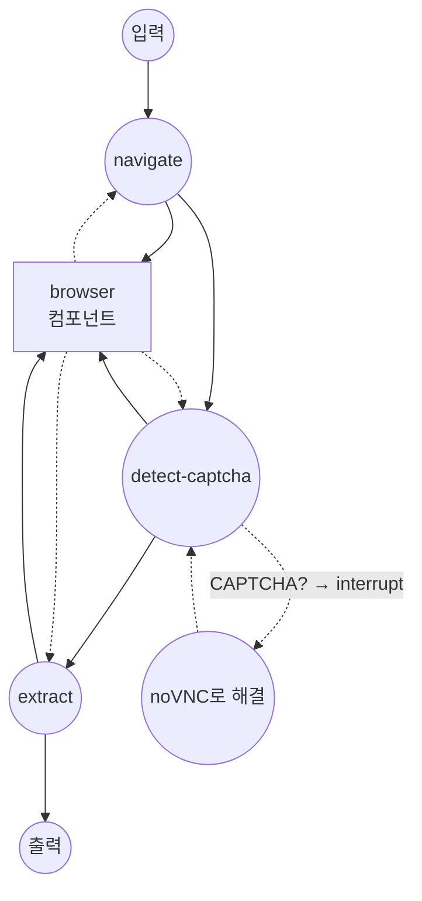
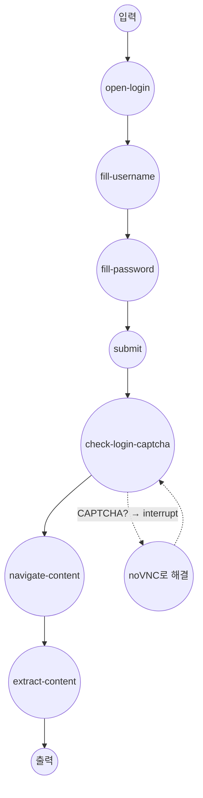

# Web Browser 예제

이 예제는 `web-browser` 컴포넌트를 사용한 헤드리스 브라우저 자동화를 보여줍니다. CAPTCHA 감지 및 noVNC를 통한 Human-in-the-Loop 해결 기능을 포함합니다.

## 개요

이 예제는 Docker 컨테이너 내에서 Chromium 기반 브라우저를 실행하며, 두 가지 워크플로우를 제공합니다:

1. **Scrape with CAPTCHA**: URL로 이동하고, CAPTCHA를 감지하면 noVNC를 통해 사람이 해결한 후 페이지 콘텐츠를 추출
2. **Login then Scrape**: 로그인 양식을 작성하고, CAPTCHA/MFA를 처리한 후 보호된 콘텐츠를 추출

주요 특징:

- **Docker System 모듈**: Chromium, Xvfb, x11vnc, noVNC, socat을 supervisord로 관리하는 단일 컨테이너
- **CDP (Chrome DevTools Protocol)**: CDP를 통해 Chromium과 통신하여 페이지 탐색, 양식 작성, 콘텐츠 추출 수행
- **noVNC 원격 데스크톱**: `http://localhost:6080/vnc.html`에서 브라우저 화면을 제공하여 수동 CAPTCHA 해결 가능
- **Human-in-the-Loop Interrupt**: CAPTCHA 감지 시 자동으로 일시 중지하고, 사람이 해결한 후 재개

## 준비사항

### 필수 요구사항

- model-compose가 설치되어 PATH에서 사용 가능
- Docker가 설치되어 실행 중

### 환경 구성

1. 이 예제 디렉토리로 이동:
   ```bash
   cd examples/web-browser
   ```

2. 추가 환경 구성 불필요 — Docker 이미지는 첫 실행 시 자동으로 빌드됩니다.

## 실행 방법

1. **서비스 시작:**
   ```bash
   model-compose up
   ```
   Docker 이미지를 빌드(필요 시)하고 브라우저 컨테이너를 시작합니다.

2. **워크플로우 실행:**

   **API 사용:**
   ```bash
   curl -X POST http://localhost:8080/api/workflows/scrape-with-captcha/runs \
     -H "Content-Type: application/json" \
     -d '{"input": {"url": "https://example.com"}}'
   ```

   **Web UI 사용:**
   - Web UI 열기: http://localhost:8081
   - 워크플로우를 선택하고, URL을 입력한 후 Run 클릭

   **CLI 사용:**
   ```bash
   model-compose run scrape-with-captcha --input '{"url": "https://example.com"}'
   ```

3. **CAPTCHA가 감지된 경우:**
   - 워크플로우가 자동으로 일시 중지
   - http://localhost:6080/vnc.html 에서 noVNC로 브라우저 확인
   - 수동으로 CAPTCHA 해결
   - API로 재개하거나 CLI에서 Enter 입력

4. **서비스 중지:**
   ```bash
   model-compose down
   ```

## 워크플로우 세부사항

### "Scrape with CAPTCHA" 워크플로우

**설명**: URL로 이동하고, CAPTCHA를 감지하면 noVNC를 통해 사람이 해결한 후 콘텐츠를 추출합니다.

#### 작업 흐름



#### 입력 파라미터

| 파라미터 | 유형 | 필수 | 기본값 | 설명 |
|----------|------|------|--------|------|
| `url` | string | 예 | — | 스크래핑할 대상 URL |
| `selector` | string | 아니오 | `body` | 콘텐츠 추출을 위한 CSS 셀렉터 |

#### 출력 형식

| 필드 | 유형 | 설명 |
|------|------|------|
| `content` | text | 페이지에서 추출된 텍스트 콘텐츠 |

### "Login then Scrape" 워크플로우

**설명**: 로그인 양식을 작성하고, CAPTCHA를 처리한 후 보호된 콘텐츠를 추출합니다.

#### 작업 흐름



#### 입력 파라미터

| 파라미터 | 유형 | 필수 | 설명 |
|----------|------|------|------|
| `login_url` | string | 예 | 로그인 페이지 URL |
| `username` | string | 예 | 사용자 이름 또는 이메일 |
| `password` | string | 예 | 비밀번호 |
| `content_url` | string | 예 | 로그인 후 스크래핑할 URL |
| `selector` | string | 아니오 | CSS 셀렉터 (기본값: `body`) |

#### 출력 형식

| 필드 | 유형 | 설명 |
|------|------|------|
| `content` | text | 보호된 페이지에서 추출된 텍스트 콘텐츠 |

## 컴포넌트 세부사항

### Browser 컴포넌트

- **유형**: `web-browser`
- **드라이버**: Chrome (CDP)
- **호스트**: `localhost:9222`
- **타임아웃**: 30초

#### 사용 가능한 액션

| 액션 | 메서드 | 설명 |
|------|--------|------|
| `navigate` | `navigate` | URL로 이동하고 네트워크 유휴 상태까지 대기 |
| `check-captcha` | `evaluate` | 페이지에서 CAPTCHA 요소 감지 |
| `click` | `click` | CSS 셀렉터로 요소 클릭 |
| `type-text` | `input-text` | 입력 필드에 텍스트 입력 |
| `screenshot` | `screenshot` | 스크린샷 캡처 (PNG) |
| `extract-text` | `extract` | CSS 셀렉터로 텍스트 콘텐츠 추출 |
| `extract-html` | `extract` | CSS 셀렉터로 HTML 콘텐츠 추출 |
| `get-cookies` | `get-cookies` | 브라우저 쿠키 전체 조회 |
| `evaluate` | `evaluate` | 임의의 JavaScript 실행 |

## 시스템 세부사항

### Docker 컨테이너 아키텍처

`web-browser-with-novnc` 시스템은 supervisord로 관리되는 단일 Alpine 기반 컨테이너에서 다음 서비스를 실행합니다:

| 서비스 | 포트 | 설명 |
|--------|------|------|
| Xvfb | — | 가상 프레임버퍼 (디스플레이 `:99`) |
| Chromium | 9222 | CDP 원격 디버깅이 활성화된 헤드리스 브라우저 |
| x11vnc | 5900 | 가상 디스플레이를 미러링하는 VNC 서버 |
| noVNC | 6080 | 웹 기반 VNC 클라이언트 |
| socat | 9223 | 외부 CDP 접근을 위한 TCP 프록시 |

**포트 매핑**: `9222→9223` (CDP), `6080→6080` (noVNC)

## 커스터마이징

### 화면 해상도 변경
`supervisord.conf`에서 환경 변수를 설정합니다:
```
ENV SCREEN_WIDTH=1920
ENV SCREEN_HEIGHT=1080
```

### 커스텀 폰트 추가
`Dockerfile`에 폰트 패키지를 추가합니다:
```dockerfile
RUN apk add --no-cache font-noto font-noto-cjk font-noto-emoji
```

### CAPTCHA 감지 수정
`check-captcha` 액션의 JavaScript 표현식을 사이트에 맞게 수정합니다:
```yaml
expression: >
  !!(document.querySelector('[id*=captcha]')
  || document.querySelector('.custom-challenge'))
```

## 문제 해결

### 일반적인 문제

1. **컨테이너 빌드 실패**: Docker가 실행 중인지 확인 (`docker info`)
2. **CDP 연결 타임아웃**: 컨테이너 시작에 수 초가 걸릴 수 있습니다. model-compose가 설정된 타임아웃 내에서 자동으로 재시도합니다
3. **noVNC 접근 불가**: 포트 `6080`이 사용 중인지 확인 (`lsof -i :6080`)
4. **CAPTCHA 미감지**: 대상 사이트에 맞게 `check-captcha` JavaScript 표현식을 커스터마이징하세요
5. **공유 메모리 오류**: 컨테이너가 Chromium 충돌 방지를 위해 `shm_size: 2gb`를 사용합니다. 필요 시 증가하세요
