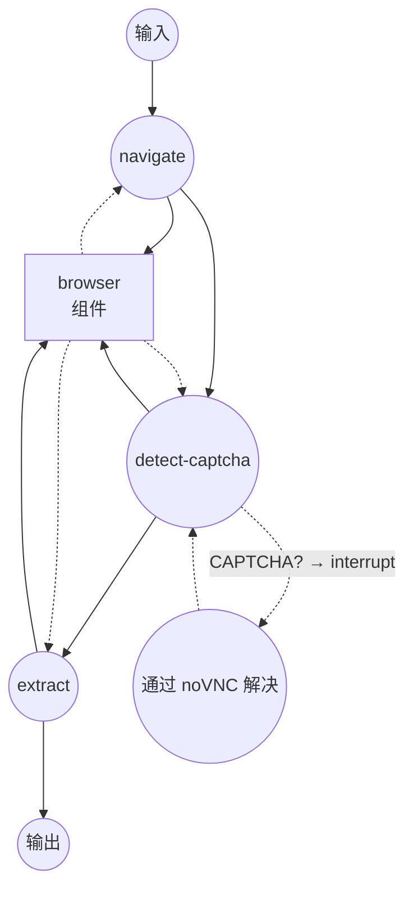
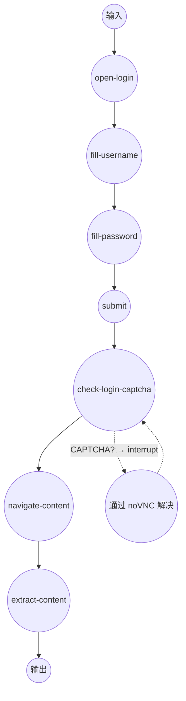

# Web Browser 示例

此示例演示使用 `web-browser` 组件进行无头浏览器自动化，包含 CAPTCHA 检测和通过 noVNC 进行的 Human-in-the-Loop 解决功能。

## 概述

此示例在 Docker 容器中运行基于 Chromium 的浏览器，并提供两个工作流：

1. **Scrape with CAPTCHA**：导航到 URL，检测 CAPTCHA，通过 noVNC 暂停等待人工解决，然后提取页面内容
2. **Login then Scrape**：填写登录表单，处理可能的 CAPTCHA/MFA，然后提取受保护的内容

主要特点：

- **Docker System 模块**：通过 supervisord 管理 Chromium、Xvfb、x11vnc、noVNC 和 socat 的单一容器
- **CDP (Chrome DevTools Protocol)**：通过 CDP 与 Chromium 通信，实现页面导航、表单交互和内容提取
- **noVNC 远程桌面**：在 `http://localhost:6080/vnc.html` 提供浏览器可视界面，用于手动解决 CAPTCHA
- **Human-in-the-Loop Interrupt**：检测到 CAPTCHA 时自动暂停，人工解决后恢复

## 准备工作

### 前置条件

- 已安装 model-compose 并在您的 PATH 中可用
- 已安装 Docker 并正在运行

### 环境配置

1. 导航到此示例目录：
   ```bash
   cd examples/web-browser
   ```

2. 不需要额外的环境配置 — Docker 镜像在首次运行时自动构建。

## 运行方式

1. **启动服务：**
   ```bash
   model-compose up
   ```
   构建 Docker 镜像（如需要）并启动浏览器容器。

2. **运行工作流：**

   **通过 API：**
   ```bash
   curl -X POST http://localhost:8080/api/workflows/scrape-with-captcha/runs \
     -H "Content-Type: application/json" \
     -d '{"input": {"url": "https://example.com"}}'
   ```

   **通过 Web UI：**
   - 打开 Web UI：http://localhost:8081
   - 选择工作流，输入 URL，点击 Run

   **通过 CLI：**
   ```bash
   model-compose run scrape-with-captcha --input '{"url": "https://example.com"}'
   ```

3. **如果检测到 CAPTCHA：**
   - 工作流自动暂停
   - 在 http://localhost:6080/vnc.html 通过 noVNC 查看浏览器
   - 手动解决 CAPTCHA
   - 通过 API 恢复或在 CLI 中按 Enter

4. **停止服务：**
   ```bash
   model-compose down
   ```

## 工作流详情

### "Scrape with CAPTCHA" 工作流

**描述**：导航到 URL，检测 CAPTCHA，通过 noVNC 暂停等待人工解决，然后提取内容。

#### 作业流程



#### 输入参数

| 参数 | 类型 | 必需 | 默认值 | 描述 |
|------|------|------|--------|------|
| `url` | string | 是 | — | 要抓取的目标 URL |
| `selector` | string | 否 | `body` | 用于内容提取的 CSS 选择器 |

#### 输出格式

| 字段 | 类型 | 描述 |
|------|------|------|
| `content` | text | 从页面提取的文本内容 |

### "Login then Scrape" 工作流

**描述**：填写登录表单，处理 CAPTCHA，然后提取受保护的内容。

#### 作业流程



#### 输入参数

| 参数 | 类型 | 必需 | 描述 |
|------|------|------|------|
| `login_url` | string | 是 | 登录页面 URL |
| `username` | string | 是 | 用户名或邮箱 |
| `password` | string | 是 | 密码 |
| `content_url` | string | 是 | 登录后要抓取的 URL |
| `selector` | string | 否 | CSS 选择器（默认：`body`） |

#### 输出格式

| 字段 | 类型 | 描述 |
|------|------|------|
| `content` | text | 从受保护页面提取的文本内容 |

## 组件详情

### Browser 组件

- **类型**：`web-browser`
- **驱动**：Chrome (CDP)
- **主机**：`localhost:9222`
- **超时**：30 秒

#### 可用操作

| 操作 | 方法 | 描述 |
|------|------|------|
| `navigate` | `navigate` | 导航到 URL 并等待网络空闲 |
| `check-captcha` | `evaluate` | 检测页面上的 CAPTCHA 元素 |
| `click` | `click` | 通过 CSS 选择器点击元素 |
| `type-text` | `input-text` | 在输入框中输入文本 |
| `screenshot` | `screenshot` | 截取屏幕截图 (PNG) |
| `extract-text` | `extract` | 通过 CSS 选择器提取文本内容 |
| `extract-html` | `extract` | 通过 CSS 选择器提取 HTML 内容 |
| `get-cookies` | `get-cookies` | 获取所有浏览器 Cookie |
| `evaluate` | `evaluate` | 执行任意 JavaScript |

## 系统详情

### Docker 容器架构

`chrome-with-novnc` 系统在单个基于 Alpine 的容器中运行以下由 supervisord 管理的服务：

| 服务 | 端口 | 描述 |
|------|------|------|
| Xvfb | — | 虚拟帧缓冲（显示 `:99`） |
| Chromium | 9222 | 启用 CDP 远程调试的无头浏览器 |
| x11vnc | 5900 | 镜像虚拟显示的 VNC 服务器 |
| noVNC | 6080 | 基于 Web 的 VNC 客户端 |
| socat | 9223 | 用于外部 CDP 访问的 TCP 代理 |

**端口映射**：`9222→9223` (CDP)，`6080→6080` (noVNC)

## 自定义

### 更改屏幕分辨率
在 `supervisord.conf` 中设置环境变量：
```
ENV SCREEN_WIDTH=1920
ENV SCREEN_HEIGHT=1080
```

### 添加自定义字体
在 `Dockerfile` 中添加字体包：
```dockerfile
RUN apk add --no-cache font-noto font-noto-cjk font-noto-emoji
```

### 修改 CAPTCHA 检测
更新 `check-captcha` 操作的 JavaScript 表达式以匹配特定网站的选择器：
```yaml
expression: >
  !!(document.querySelector('[id*=captcha]')
  || document.querySelector('.custom-challenge'))
```

## 故障排除

### 常见问题

1. **容器构建失败**：确认 Docker 正在运行 (`docker info`)
2. **CDP 连接超时**：容器启动可能需要几秒钟。model-compose 在配置的超时时间内自动重试
3. **无法访问 noVNC**：检查端口 `6080` 是否被占用 (`lsof -i :6080`)
4. **CAPTCHA 未检测到**：针对目标网站自定义 `check-captcha` JavaScript 表达式
5. **共享内存错误**：容器使用 `shm_size: 2gb` 防止 Chromium 崩溃。如需要可以增加
