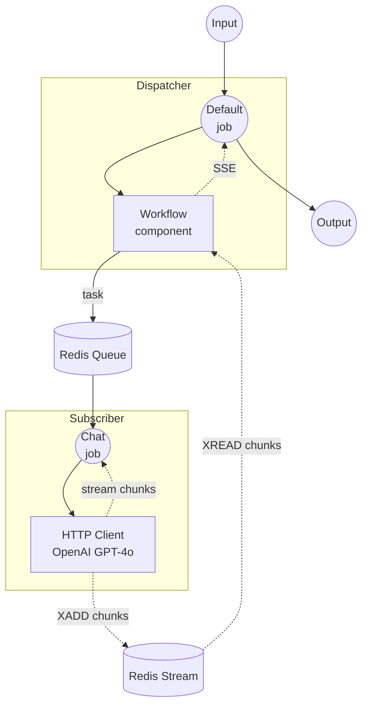

# Workflow Queue Stream 예제

이 예제는 Redis를 사용하여 분산 인스턴스 간에 워크플로우 출력을 스트리밍하는 방법을 보여줍니다. Dispatcher가 HTTP 요청을 받아 원격 Subscriber로 전달하고, Subscriber가 OpenAI 스트리밍 API를 호출하여 Redis Stream을 통해 청크 단위로 응답을 전달합니다.

## 개요

이 예제는 두 개의 별도 인스턴스로 구성됩니다:

1. **Dispatcher**: HTTP 요청을 받아 Redis 큐로 작업을 전달하고, SSE를 통해 결과를 실시간 스트리밍
2. **Subscriber**: Redis 큐에서 대기하며, OpenAI 스트리밍 API를 호출하고, Redis Stream에 청크를 기록

기본 `workflow-queue` 예제와 달리, 이 예제는 Subscriber에서 클라이언트까지 Dispatcher를 통해 토큰을 실시간으로 스트리밍합니다.

## 준비

### 사전 요구사항

- model-compose가 설치되어 PATH에 등록되어 있어야 합니다
- localhost:6379에서 Redis 서버가 실행 중이어야 합니다
- `OPENAI_API_KEY` 환경 변수가 설정되어 있어야 합니다

### Redis 설정

로컬 Redis 서버를 시작합니다:
```bash
redis-server
```

또는 Docker를 사용합니다:
```bash
docker run -d --name redis -p 6379:6379 redis
```

### OpenAI API 키

```bash
export OPENAI_API_KEY=sk-...
```

## 실행 방법

이 예제는 두 개의 별도 인스턴스를 실행해야 합니다.

1. **Subscriber 시작** (별도의 터미널에서):
   ```bash
   cd examples/workflow-queue-stream/subscriber
   model-compose up
   ```

2. **Dispatcher 시작:**
   ```bash
   cd examples/workflow-queue-stream/dispatcher
   model-compose up
   ```

3. **워크플로우 실행:**

   **API 사용 (스트리밍):**
   ```bash
   curl -N -X POST http://localhost:8080/api/workflows/runs \
     -H "Content-Type: application/json" \
     -d '{
       "input": {
         "prompt": "Write a short poem about the sea."
       },
       "output_only": true,
       "wait_for_completion": true
     }'
   ```

   **Web UI 사용:**
   - Web UI 열기: http://localhost:8081
   - 프롬프트를 입력합니다
   - "Run Workflow" 버튼을 클릭합니다

   **CLI 사용:**
   ```bash
   cd examples/workflow-queue-stream/dispatcher
   model-compose run --input '{"prompt": "Write a short poem about the sea."}'
   ```

## 컴포넌트 상세

### Dispatcher

#### Workflow 컴포넌트 (기본)
- **유형**: Workflow 컴포넌트
- **용도**: Redis 큐를 통해 원격 워커에 워크플로우 실행을 위임
- **대상 워크플로우**: `chat` (Subscriber에서 원격으로 해석)
- **출력**: SSE (Server-Sent Events)로 스트리밍

### Subscriber

#### HTTP 클라이언트 컴포넌트 (openai)
- **유형**: HTTP 클라이언트 컴포넌트
- **용도**: OpenAI GPT-4o 채팅 완성 API를 스트리밍 모드로 호출
- **출력**: `stream_format: json`을 통한 토큰 단위 스트리밍

## 워크플로우 상세

### 데이터 흐름



### 입력 파라미터

| 파라미터 | 유형 | 필수 | 기본값 | 설명 |
|---------|------|------|-------|------|
| `prompt` | text | 예 | - | GPT-4o에 보낼 채팅 프롬프트 |

### 출력 형식

SSE (Server-Sent Events)로 스트리밍되며, 각 이벤트에는 모델 응답의 텍스트 토큰이 포함됩니다.

## 커스터마이징

- **Redis 설정**: Dispatcher와 Subscriber 양쪽의 `host`, `port` 또는 `name`을 변경
- **모델**: Subscriber 컴포넌트의 action body에서 `model`을 변경 (예: `gpt-4o-mini`)
- **프로바이더**: OpenAI HTTP 클라이언트를 다른 스트리밍 지원 프로바이더로 교체
- **워커 확장**: 여러 Subscriber 인스턴스를 실행하여 동시 요청 처리
