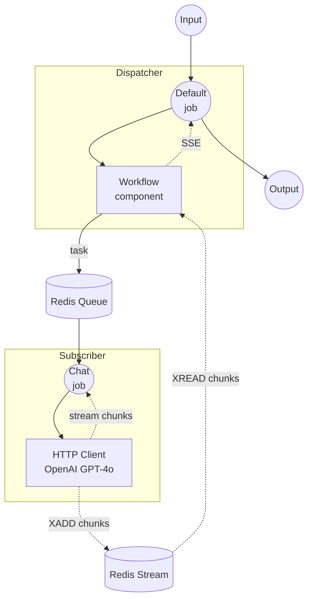

# Workflow Queue Stream Example

This example demonstrates how to stream workflow output across distributed instances using Redis. A dispatcher receives HTTP requests and forwards them to a remote subscriber, which calls the OpenAI streaming API and delivers chunks back through Redis Streams.

## Overview

This example consists of two separate instances:

1. **Dispatcher**: Receives HTTP requests, dispatches tasks to a Redis queue, and streams results back to the client via SSE
2. **Subscriber**: Listens on the Redis queue, calls OpenAI's streaming API, and writes chunks to a Redis Stream

Unlike the basic `workflow-queue` example which returns a single response, this example streams tokens in real time from the subscriber back to the client through the dispatcher.

## Preparation

### Prerequisites

- model-compose installed and available in your PATH
- Redis server running on localhost:6379
- OpenAI API key set as `OPENAI_API_KEY` environment variable

### Redis Setup

Start a local Redis server:
```bash
redis-server
```

Or using Docker:
```bash
docker run -d --name redis -p 6379:6379 redis
```

### OpenAI API Key

```bash
export OPENAI_API_KEY=sk-...
```

## How to Run

This example requires running two separate instances.

1. **Start the subscriber** (in a separate terminal):
   ```bash
   cd examples/workflow-queue-stream/subscriber
   model-compose up
   ```

2. **Start the dispatcher:**
   ```bash
   cd examples/workflow-queue-stream/dispatcher
   model-compose up
   ```

3. **Run the workflow:**

   **Using API (streaming):**
   ```bash
   curl -N -X POST http://localhost:8080/api/workflows/runs \
     -H "Content-Type: application/json" \
     -d '{
       "input": {
         "prompt": "Write a short poem about the sea."
       },
       "output_only": true,
       "wait_for_completion": true
     }'
   ```

   **Using Web UI:**
   - Open the Web UI: http://localhost:8081
   - Enter your prompt
   - Click the "Run Workflow" button

   **Using CLI:**
   ```bash
   cd examples/workflow-queue-stream/dispatcher
   model-compose run --input '{"prompt": "Write a short poem about the sea."}'
   ```

## Component Details

### Dispatcher

#### Workflow Component (Default)
- **Type**: Workflow component
- **Purpose**: Delegates workflow execution to a remote worker via Redis queue
- **Target Workflow**: `chat` (resolved remotely on the subscriber)
- **Output**: Streamed as SSE (Server-Sent Events)

### Subscriber

#### HTTP Client Component (openai)
- **Type**: HTTP client component
- **Purpose**: Calls OpenAI GPT-4o chat completions API with streaming enabled
- **Output**: Token-by-token streaming via `stream_format: json`

## Workflow Details

### Data Flow



### Input Parameters

| Parameter | Type | Required | Default | Description |
|-----------|------|----------|---------|-------------|
| `prompt` | text | Yes | - | The chat prompt to send to GPT-4o |

### Output Format

Streamed as SSE (Server-Sent Events), with each event containing a text token from the model response.

## Customization

- **Redis Configuration**: Change `host`, `port`, or `name` in both dispatcher and subscriber
- **Model**: Change `model` in the subscriber's component action body (e.g., `gpt-4o-mini`)
- **Provider**: Replace the OpenAI HTTP client with any other streaming-capable provider
- **Scale Workers**: Run multiple subscriber instances to handle concurrent requests
