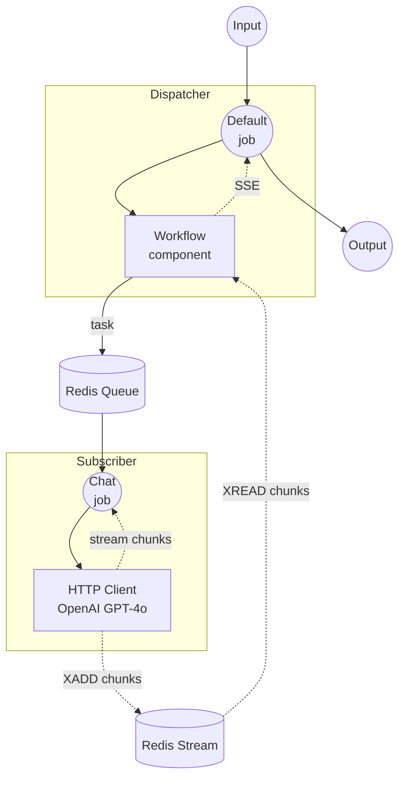

# Workflow Queue Stream 示例

本示例演示如何使用 Redis 在分布式实例之间流式传输工作流输出。Dispatcher 接收 HTTP 请求并将其转发到远程 Subscriber，Subscriber 调用 OpenAI 流式 API 并通过 Redis Stream 逐块传递响应。

## 概述

本示例由两个独立的实例组成：

1. **Dispatcher**：接收 HTTP 请求，将任务分发到 Redis 队列，并通过 SSE 将结果实时流式传输给客户端
2. **Subscriber**：监听 Redis 队列，调用 OpenAI 流式 API，并将数据块写入 Redis Stream

与基础 `workflow-queue` 示例不同，本示例通过 Dispatcher 将令牌从 Subscriber 实时流式传输到客户端。

## 准备工作

### 前置条件

- 已安装 model-compose 并添加到 PATH
- Redis 服务器在 localhost:6379 上运行
- 已设置 `OPENAI_API_KEY` 环境变量

### Redis 设置

启动本地 Redis 服务器：
```bash
redis-server
```

或使用 Docker：
```bash
docker run -d --name redis -p 6379:6379 redis
```

### OpenAI API 密钥

```bash
export OPENAI_API_KEY=sk-...
```

## 运行方法

本示例需要运行两个独立的实例。

1. **启动 Subscriber**（在单独的终端中）：
   ```bash
   cd examples/workflow-queue-stream/subscriber
   model-compose up
   ```

2. **启动 Dispatcher：**
   ```bash
   cd examples/workflow-queue-stream/dispatcher
   model-compose up
   ```

3. **运行工作流：**

   **使用 API（流式）：**
   ```bash
   curl -N -X POST http://localhost:8080/api/workflows/runs \
     -H "Content-Type: application/json" \
     -d '{
       "input": {
         "prompt": "Write a short poem about the sea."
       },
       "output_only": true,
       "wait_for_completion": true
     }'
   ```

   **使用 Web UI：**
   - 打开 Web UI：http://localhost:8081
   - 输入提示词
   - 点击 "Run Workflow" 按钮

   **使用 CLI：**
   ```bash
   cd examples/workflow-queue-stream/dispatcher
   model-compose run --input '{"prompt": "Write a short poem about the sea."}'
   ```

## 组件详情

### Dispatcher

#### Workflow 组件（默认）
- **类型**：Workflow 组件
- **用途**：通过 Redis 队列将工作流执行委派给远程工作节点
- **目标工作流**：`chat`（在 Subscriber 上远程解析）
- **输出**：通过 SSE（Server-Sent Events）流式传输

### Subscriber

#### HTTP 客户端组件 (openai)
- **类型**：HTTP 客户端组件
- **用途**：以流式模式调用 OpenAI GPT-4o 聊天补全 API
- **输出**：通过 `stream_format: json` 逐令牌流式传输

## 工作流详情

### 数据流



### 输入参数

| 参数 | 类型 | 必填 | 默认值 | 描述 |
|------|------|------|--------|------|
| `prompt` | text | 是 | - | 发送给 GPT-4o 的聊天提示词 |

### 输出格式

通过 SSE（Server-Sent Events）流式传输，每个事件包含模型响应的一个文本令牌。

## 自定义

- **Redis 配置**：修改 Dispatcher 和 Subscriber 两侧的 `host`、`port` 或 `name`
- **模型**：修改 Subscriber 组件 action body 中的 `model`（例如 `gpt-4o-mini`）
- **提供商**：将 OpenAI HTTP 客户端替换为其他支持流式传输的提供商
- **扩展工作节点**：运行多个 Subscriber 实例以处理并发请求
