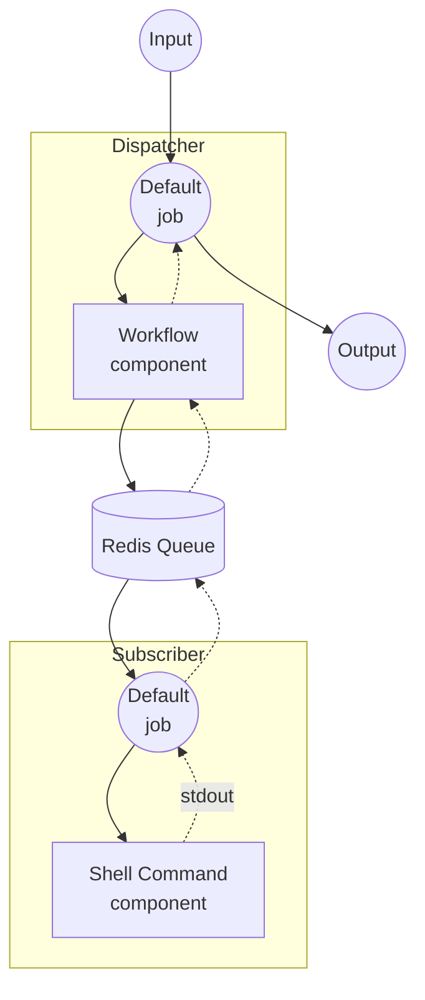

# Workflow Queue 예제

이 예제는 Redis를 메시지 큐로 사용하여 워크플로우 실행을 여러 인스턴스에 분산하는 방법을 보여줍니다. Dispatcher가 요청을 받아 원격 Subscriber로 전달하여 처리합니다.

## 개요

이 예제는 두 개의 별도 인스턴스로 구성됩니다:

1. **Dispatcher**: HTTP 요청을 받아 워크플로우 작업을 Redis 큐로 전달
2. **Subscriber**: Redis 큐에서 대기하며, 실제 워크플로우를 실행하고 결과를 반환

Dispatcher는 `workflow` 컴포넌트를 사용하여 로컬에 워크플로우 정의 없이 `echo` 워크플로우를 Redis를 통해 Subscriber에 위임합니다.

## 준비

### 사전 요구사항

- model-compose가 설치되어 PATH에 등록되어 있어야 합니다
- localhost:6379에서 Redis 서버가 실행 중이어야 합니다

### Redis 설정

로컬 Redis 서버를 시작합니다:
```bash
redis-server
```

또는 Docker를 사용합니다:
```bash
docker run -d --name redis -p 6379:6379 redis
```

## 실행 방법

이 예제는 두 개의 별도 인스턴스를 실행해야 합니다.

1. **Subscriber 시작** (별도의 터미널에서):
   ```bash
   cd examples/workflow-queue/subscriber
   model-compose up
   ```

2. **Dispatcher 시작:**
   ```bash
   cd examples/workflow-queue/dispatcher
   model-compose up
   ```

3. **워크플로우 실행:**

   **API 사용:**
   ```bash
   curl -X POST http://localhost:8080/api/workflows/runs \
     -H "Content-Type: application/json" \
     -d '{
       "input": {
         "text": "Hello from queue!"
       }
     }'
   ```

   **Web UI 사용:**
   - Web UI 열기: http://localhost:8081
   - 텍스트를 입력합니다
   - "Run Workflow" 버튼을 클릭합니다

   **CLI 사용:**
   ```bash
   cd examples/workflow-queue/dispatcher
   model-compose run --input '{"text": "Hello from queue!"}'
   ```

## 컴포넌트 상세

### Dispatcher

#### Workflow 컴포넌트 (기본)
- **유형**: Workflow 컴포넌트
- **용도**: Redis 큐를 통해 원격 워커에 워크플로우 실행을 위임
- **대상 워크플로우**: `echo` (Subscriber에서 원격으로 해석)

### Subscriber

#### Shell 명령어 컴포넌트 (echo)
- **유형**: Shell 컴포넌트
- **용도**: 제공된 텍스트로 echo 명령어 실행
- **명령어**: `echo <text>`
- **출력**: stdout을 통한 에코 텍스트

## 워크플로우 상세

### Dispatcher: "Echo via Queue" 워크플로우 (기본)

**설명**: Redis 큐를 통해 원격 워커에 작업을 전달합니다.

#### 작업 흐름



#### 입력 파라미터

| 파라미터 | 유형 | 필수 | 기본값 | 설명 |
|---------|------|------|-------|------|
| `text` | text | 예 | - | 원격 워커에서 에코할 텍스트 |

#### 출력 형식

| 필드 | 유형 | 설명 |
|------|------|------|
| `text` | text | 원격 워커에서 반환된 에코 텍스트 |

## 커스터마이징

- **Redis 설정**: Dispatcher와 Subscriber 양쪽의 `host`, `port` 또는 `name`을 변경하여 다른 Redis 인스턴스나 큐 이름을 사용
- **Subscriber 워크플로우 교체**: Shell 컴포넌트를 다른 컴포넌트(HTTP 클라이언트, 모델 등)로 교체하여 다른 방식으로 작업 처리
- **워커 확장**: 여러 Subscriber 인스턴스를 실행하여 작업을 병렬로 처리
- **워크플로우 추가**: Subscriber의 `workflows` 목록에 추가 워크플로우를 등록하여 다양한 작업 유형 처리
