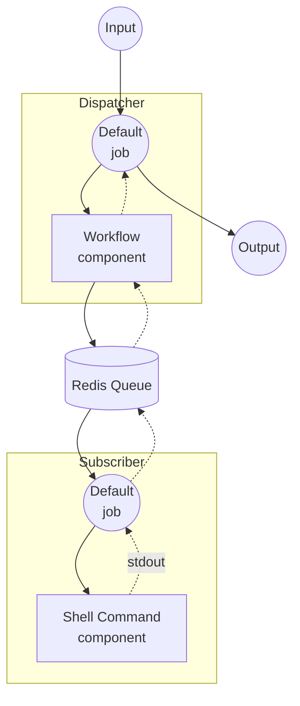

# Workflow Queue Example

This example demonstrates how to distribute workflow execution across multiple instances using Redis as a message queue. A dispatcher receives requests and forwards them to a remote subscriber for processing.

## Overview

This example consists of two separate instances:

1. **Dispatcher**: Receives HTTP requests and dispatches workflow tasks to a Redis queue
2. **Subscriber**: Listens on the Redis queue, executes the actual workflow, and returns the result

The dispatcher uses a `workflow` component to delegate the `echo` workflow to the subscriber via Redis, without having the workflow definition locally.

## Preparation

### Prerequisites

- model-compose installed and available in your PATH
- Redis server running on localhost:6379

### Redis Setup

Start a local Redis server:
```bash
redis-server
```

Or using Docker:
```bash
docker run -d --name redis -p 6379:6379 redis
```

## How to Run

This example requires running two separate instances.

1. **Start the subscriber** (in a separate terminal):
   ```bash
   cd examples/workflow-queue/subscriber
   model-compose up
   ```

2. **Start the dispatcher:**
   ```bash
   cd examples/workflow-queue/dispatcher
   model-compose up
   ```

3. **Run the workflow:**

   **Using API:**
   ```bash
   curl -X POST http://localhost:8080/api/workflows/runs \
     -H "Content-Type: application/json" \
     -d '{
       "input": {
         "text": "Hello from queue!"
       }
     }'
   ```

   **Using Web UI:**
   - Open the Web UI: http://localhost:8081
   - Enter your text
   - Click the "Run Workflow" button

   **Using CLI:**
   ```bash
   cd examples/workflow-queue/dispatcher
   model-compose run --input '{"text": "Hello from queue!"}'
   ```

## Component Details

### Dispatcher

#### Workflow Component (Default)
- **Type**: Workflow component
- **Purpose**: Delegates workflow execution to a remote worker via Redis queue
- **Target Workflow**: `echo` (resolved remotely on the subscriber)

### Subscriber

#### Shell Command Component (echo)
- **Type**: Shell component
- **Purpose**: Executes echo command with the provided text
- **Command**: `echo <text>`
- **Output**: The echoed text via stdout

## Workflow Details

### Dispatcher: "Echo via Queue" Workflow (Default)

**Description**: Dispatches a task to a remote worker through Redis queue.

#### Job Flow



#### Input Parameters

| Parameter | Type | Required | Default | Description |
|-----------|------|----------|---------|-------------|
| `text` | text | Yes | - | The text to echo on the remote worker |

#### Output Format

| Field | Type | Description |
|-------|------|-------------|
| `text` | text | The echoed text returned from the remote worker |

## Customization

- **Redis Configuration**: Change `host`, `port`, or `name` in both dispatcher and subscriber to use a different Redis instance or queue name
- **Replace Subscriber Workflow**: Swap the shell component with any other component (HTTP client, model, etc.) to process tasks differently
- **Scale Workers**: Run multiple subscriber instances to process tasks in parallel
- **Add Workflows**: Register additional workflows in the subscriber's `workflows` list to handle different task types
